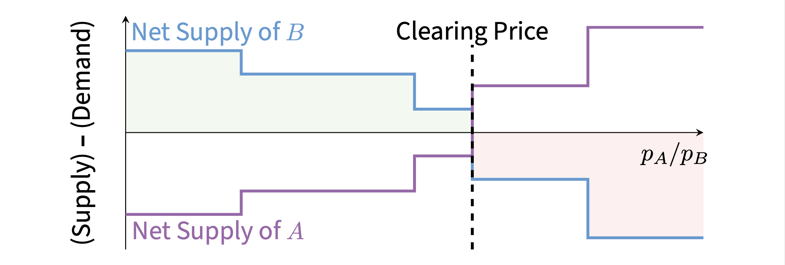

_June 2, 2025_

**Moral:** Mismatch between system architectures and user incentives leads to broken systems, inefficiency, and (if you can exploit it) profit.

## What Goes Wrong Building Exchanges on a Blockchain?

**What is a blockchain?**

1. A user broadcasts a transaction to the validators.
2. Validators run a consensus protocol to confirm the transaction.
3. Transaction executes on the state machine.

**Why is this design useful?**

- Run arbitrary logic inside the state machine: For example, an exchange.
- Simulate a neutral, “trusted third party”:
    - Ideally, don’t have to trust one entity to execute transactions correctly.
    - Spoiler: that’s only partially true.

**Example: An Exchange on a Blockchain**

**Where does this convenient story break down?**

1. Many users concurrently broadcast many transactions to the validators.
2. One validator proposes a new ordered list (a “block”) of transactions.
3. Validators run a consensus protocol to confirm the proposed block (consensus is generally expensive and slow (several network hops).
4. Transactions execute very slowly on the state machine.

**How does this break an exchange?**

- Manipulate ordering for profit
    - Historically called "Miner Extractable Value" or "MEV".
    - Illegal on regulated exchanges.
- On Ethereum: front-running widespread, most blocks produced by 2 or 3 entities.

- Any speed advantage can be profitable:
    - High-frequency trading.
    - Why? Making decisions later is like seeing the future.
    - E.g., compare with price on Binance/Coinbase.
- Most chains: one block per 0.5s to 12s (each consensus protocol has its own nuances).
- Proposer can put their transaction attop of block.

**What makes a blockchain exchange so computationally expensive?**

- Worst-case sequential workload.
- Heterogenous hardware, software sandboxing blocks optimization.
- Today’s decentralized exchanges do more work than traditional exchanges
    - Pseudonymity requires atomic settlement.
    - Many decentralized exchanges offer atomic multi-hop trades.

**Example: Wall Street's Shortcut Is Delayed Settlement**

Settlement risk prevents open access.

**Example: Multi-Hop Trades & Cyclic Arbitrage**

**What can we do differently?**

- Off-chain matching, like Wall Street (Off-chain matching with on-chain settlement is likely coming soon).
- Simplify computation (Automated market-making)
- Auction for top-of-block trade [Adams, Moallemi, Reynolds, Robinson 2024]
- ...

**Detour: Automated Market-Makers**

- Specify a full “trading strategy”, defined by a curve
- What are the tradeoffs of this (passive) mechanism?

## How Can We Design Exchanges to Run Well on a Blockchain?

**Many problems result from a mismatch between abstract design and implementation: can we use a different system design?**

- What might a state machine (exchange) that uses the blockchains block structure look like?
- **Key requirement:** A deterministic state machine that executes unordered blocks of commutative transactions.

**Problem:** Ordering determines pricing in an exchange.

**Solution:** A Different Pricing Mechanism

- Input: Set of Open Offers
- Step 1: Compute Valuations
- Step 2: Trade with Exchange at Valuation Quotients
    - Meaningless units
    - No pairwise matching!
- “Clearing” if no debt.

**Why is this useful?**

- Computational Performance: A deterministic state machine that executes unordered blocks of commutative transactions.
- Key: Every offer trades by itself, at batch prices.
- Target: Millions of open offers, a batch every couple of seconds.

**Theorem:** Arrow and Debreu, 1954

There always exists a unique\(^\star\) set of valuations \(\{p_A\}\) that clears the market.

**Why Uniform Clearing Valuations?**

Economic Performance:

- No In-Batch Front-Running
    - Everyone gets the same rates
    - Open question: MEV and low-latency advantage?
- Optimal Trade Routing & Eliminate Cyclic Arbitrage

> “... I am receptive to more flexible, competitive solutions that could be adopted by trading venues. These could include frequent batch auctions or other mechanisms designed to minimize speed advantages."—SEC Chair Mary Jo White, June 5, 2014

- The cost of batch trading is latency
- Active research area (2-asset case)
    - [Budish, Crampton, and Shim, 2015]
    - [Aquilina, Budish, and O’Neill, 2022]
    - [Indriawan, Pascual, and Shkilko, 2024]
    - [Lee, Riccò, and Wang, 2023] [Jagannathan, 2019]
    - ...

**Background:** Arrow-Debreu Exchange Markets

- \(N\) agents, \(M\) (divisible, fungible) goods.
- Agent \(i\) has endowment \(e_i \in \mathbb{R}_{\geq 0}^M\) and quasi concave utility \(u_i : \mathbb{R}_{\geq 0}^M → \mathbb{R}\).
- The “Market” specifies prices \(\{p_j\}_{j \in [N]}\)
- Each agent sells their endowment to buy \(x_i \in \mathbb{R}_{\geq 0}^M\) that maximises their utility.
- \(p \cdot e_i \geq p \cdot x_i\).
- \((p, x)\) is equilibrium if all assets conserved (or price is 0).

We need to compute an equilibrium efficient at scale.

**Theorem:** Arrow and Debreu, 1954

<s>There always exists a unique\(^\star\)</s> set of valuations \(\{p_A\}\) that clears the market.

- May not exist.
- May not be unique.
- May not be computationally tractable to find (PPAD-complete).

**Correspondence with Exchange Markets**

- Offer to sell \(e\) units of \(M\) for \(Y\), at a minimum price \(r > 0\).
- Equivalent: maximize \(u(x,y) = r \cdot x + y\) subject to \(p \cdot x + y \leq p \cdot e\).
- Key points
    - Linear utilities
    - Non zero minimum prices
    - Sparse utilities

**Theorem:** There always exists an equilibrum, and all equilibria share the same exchange rates or there is no trading activity.

**How Can We Compute Equilibria At Scale?**

- 2-asset case (easy): Binary Search.
- Many-asset case: Many curves, high-dimensional search space.

Classic theory problem

- Iterative processes (Tâtonnement [CMV05])
- Convex programs ([DGV13])
- Network flows, iterative auctions ([DPSV04], ...)
- Interior point methods ([Ye08])

**Fast Equilibria Computation**

- Geoff's team's approach: Tâtonnement (basedon[CMV05])
- Iteration runtime \(O (\#assets ^2 \cdot \log(\#offers ) )\)
    - Incrementally sort offers by limit price
    - \(\approx 100μs\) per iteration, \(\approx 1000\) iterations
    - Memory access pattern is extremely cache-friendly

**Approximate Equilibria Computation**

- Exact calculation is intractable (infinite precision)
- Wem ust be careful:
    - We cannot mint money
    - We cannot make invalid trades
    - We cannot ...

**2 Acceptable Approximations**

- Demand Smoothing: Smooth thresholds
    - Reduces iterative oscillation
    - Experiments use \(2^{-10} \approx 0.1\%\)

- Transaction Fees: Charge small percentage fee
    - Range of approximate clearing prices, not single point
    - Experiments use \(2^{-15} \approx 0.003\%\)

**Accounting for Approximation: Prices into Trades**

\(max\) Trade Volume (at Tâtonnement’s Prices):

\[
  \displaystyle max \sum_{\Alpha,\Beta} p_{\Alpha} x_{\Alpha \Beta}
\]

\(s.t.\) Correct (Smoothed) Offer Execution:

\[
  \displaystyle s.t. \; p_{\Alpha} L_{\Alpha \Beta} (\frac{p_{\Alpha}}{p_{\Beta}}) \leq p_{\Alpha} x_{\Alpha \Beta} \leq p_{\Alpha} U_{\Alpha \Beta} (\frac{p_{\Alpha}}{p_{\Beta}}) \; \forall \Alpha,\Beta
\]

Assets Conserved (After Fees):

\[
  p_{\Alpha} \sum_{\Beta} x_{\Alpha \Beta} \geq (1 - fee) \sum_{\Beta} p_{\Beta}x_{\Beta \Alpha} \; \forall \Alpha
\]

**Overall Performance**

- Linear Scalability (contention with background work (logging))
- Log Dependence on \(\#offers\)

**Tradeoff: Batch Latency**

- Cost of batch exchange model is trade latency: If we’re already paying for consensus latency, the marginal cost is 0.
- Does this latency matter?
    - This is a policy question, not a technical question
    - Good policymaking requires mapping out the entire designs pace

**Implementation**

- Self-contained replicated state machine:
    - [https://github.com/scslab/speedex](https://github.com/scslab/speedex)
    - \(\approx 30,000\) LOC (C++20)
- Planned (then cancelled? then uncancelled and cancelled again? unclear) deployment in Stellar (a public blockchain):
    - [https://github.com/gramseyer/stellar-core](https://github.com/gramseyer/stellar-core)
    - Required only \(\approx 2,000\) LOC (C++17)
    - Commutative semantics and economic improvements valuable on their own: This is the only piece that needs a coordinated upgrade (“hardfork")
    - Implement scaling later, as needed (much easier)

**Constraints from the Stellar Implementation**

- Limiting factors on scaling number of assets:
    - Tâtonnement iteration runtime
    - A fewhundred is probably fine
    - Linear program runtime (Off the shelf solver becomes a problem around \(\approx 80\) assets
- Hard (legal) constraint: Can’t charge trading fees
- Need absolute runtime guarantee

**Accounting for Stellar’s Constraints**

- Run Tâtonnement as normal, then solve this (different) LP
- Cannot enforce lower bound on \(x_{AB}\) (cannot guarantee LP feasibility)—Also allows guaranteed runtime bound
- Linear program without fees is “totally unimodular”:
    - \(p_{\Alpha} x_{\Alpha \Beta} \rightarrow y_{\Alpha \Beta}\)
    - Much faster to solve (flow problem)

**Everything Else in an Exchange**

- Asset transfers
- Replay prevention
- Signatures
- Double-spends
- ...

**Example:** Payments

**Reading from a Snapshot:** What if two transactions write to the same location?

**Typed State Changes: What if a balance becomes negative?**

**Preempt constraint conflicts when assembling new blocks**

Efficient reserve-commit process (2-phase commit)

“Snapshot Reads” + “Conflict-sometimes-Replicated Data Types”

**Detour: Smart Contracts**

- We can give these tools to a smart contract-Not just for purpose-built applications
- For example: Lending markets and collateral deposits
- Groundhog [Ramseyer-Mazières, 2023]-Context: this is Geoff's day job
- Open question: What applications need purpose-built mechanisms, and what do not?

## Recap

**Incentive (Mis)alignment in Blockchain Exchanges Recap**

- Mismatch between blockchain abstaction and implementation
- Especially bad for implementing an exchange (Arbitrage spam, front-running, MEV, ...)
- How can we redesign an exchange to fit on a blockchain?
- Different computational model: State machine on unordered batches of transactions
- Exchange needs a different pricing mechanism (Compute Arrow-Debreu equilibria efficiently)

**Moral:** Mismatch between system architectures and user incentives leads to broken systems, inefficiency, and (if you can exploit it) profit.

