_May 12, 2025_

This is a guest lecture offered by Kshipra Bhawalkar (Lane), Research Scientist
Market Algorithms, Google Research.

## Motivation: Optimizing Sponsored Search Ads

If you do a Google search, you will find different elements on the results page:

- **Knowledge Panel:** wikipedia-level information about what you are searching for.
- **Local Results:** to help you find stores to go buy the products.
- **Web Search Results:** for places that will tell you more about what you are looking for.

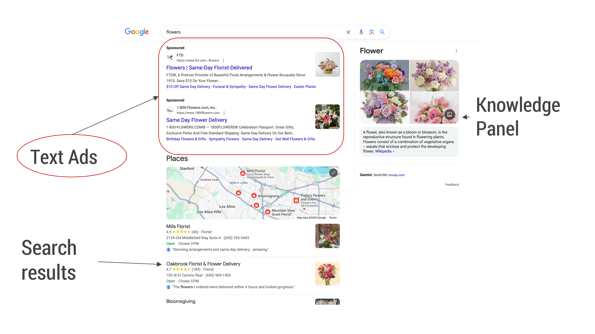

Most prominently, there are a few text ads, that are placed there to fund the rest of the page: this is 3-digit billion dollar a year business that allows us to access free search results. In particular, our ability to search for the most esoteric queries that nobody would advertise for is funded by commercial queries.

**How does Google (or other companies) select the ads that go along with the sponsored search results?**

These ads have actually gone through a few different versions as people's browsing habits, and the way the organic search results were displayed, changed.

- In the 2000s, these ads used to be a bunch of blue links: just a headline URL and some text.
- Nowadays if you go to Google.com, you see ads that are richer.
- In the future, as LLMs enable more and more innovation, there might be other kinds of ads that might show up as the search page itself changes.

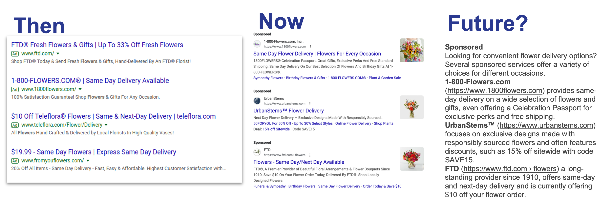

**How do the algorithms and auctions for selecting ads evolve with changing presentation?**

## Past: Position Auctions

Let's start with position auctions, which is the simplest model of search ads that had existed for many years.

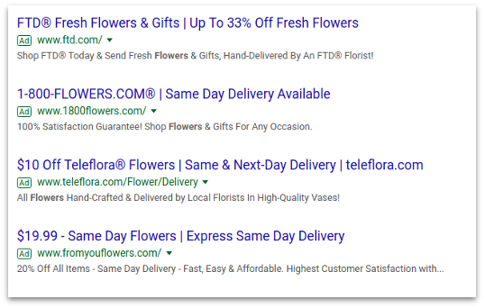

If you went to Google.com in 2000, what you used to get is what is known as "ten blue links." All of the search results looked very similar, with a headline, a URL, and 1-2 lines of text describing the pages to you. Then, you could read the description to decide if you wanted to click on a specific page or not.

At the top, the first couple of links might be ads. These ads always went in fixed positions, and the format of these ads always matched what the search results were shown with it. The main parameter was the fixed positions in which the ads could show.

We can think of it as an optimization problem, where we want to show at most \(k\) ads, where \(k\) might be equal to \(3\) or \(4\), and our goal is to show ads that best match the intent of the user:

1. The search engine asks the advertiser how much they value the user clicking on their website.
2. The advertiser reports a value \(v_i\) per click for the user.
3. The search engine estimates the probability \(pCTR_{i,j}\) of the user clicking on the ad in position \(j\).
4. The search engine maximizes the social welfare \(\displaystyle \sum_{i} v_i \; pCTR_{i,j}\), i.e. the value that both advertisers and user get out of this match.
  
So, how do we decide? How much should the advertiser want to pay to match the user?

This is like a weighted matching problem. But if we assume that the click through rates are separable, which means that for every advertiser, their click-through rate in a particular position is a function of the advertiser's specific click-through rate and a position effect, which we'll call the position normalizer, then this problem becomes much simpler and we can solve it using a simple algorithm.

**Optimization Problem**

- Assume: Separable \(pCTR\): \(pCTR_{i,j} = pCTR_i \cdot pos \text{-} norm_j\).
- Goal: Maximize \(\displaystyle \sum_{i} v_i \; pCTR_{i,j}\).
- Algorithm:
    - Rank ads by \(eCPM_i = v_i \cdot pCTR_i\).
    - Show \(j\)-th ad in position \(j\).

What is that simple algorithm? We just rank the ads by their \(eCPM\), which is a product of their value and clic-through rate, and then just show each ad in the corresponding position. So, at least in the position option case, under a fairly reasonable assumption, we could decide which ad goes there fairly efficiently by just sorting the ads and showing them in that order.

However, there is another challenge here: we are asking the advertisers how much they want their ad to be shown. If we were not charging any payments, then everybody would say "$1M dollars!" Each advertiser always wants their ad to be always be shown, because they value all users equally, and Google is just giving them traffic for free. Thus, Google has to charge the advertiser for the value they report, to align incentives, otherwise they will just report ridiculous values.

**Example: Goto.com/Overture Auction (1997-2003)**

When Internet ads were coming up, there was a company called Goto.com, which later became Overture and then was acquired by Yahoo! They started with a First Price auction format, which has some obvious issues.

| Ad   | Bid    | Position  | Payment   |
|------|--------|-----------|-----------|
| 1    | $10    | 1         | $10       |
| 2    | $8     | 2         | $8        |

In this example we have two advertisers. They have bids of \(\$10\) and \(\$8\). With the First Price auction, everyone pays what they bid. So the first one will pay \(\$10\), and the second one will pay \(\$8\). But there is an obvious manipulation for any one of them.

| Ad   | Bid    | Position  | Payment   |
|------|--------|-----------|-----------|
| 1    | $8.01  | 1         | $8.01     |
| 2    | $8     | 2         | $8        |

Suppose the first advertiser instead lowers their bid to a little bit above \(\$8\), such as \(\$8.01\). They are still in the same position, but now their payment is a lot lower. This is definitely a win for the advertiser and they should always try to do this.

When Google came along, it was kind of known that there was this obvious manipulation opportunity for the advertisers, and advertisers were exploiting this. That led to a lot of system instability for Overture, because their advertisers would keep constantly trying to keep changing their bid.

Google engineers wanted to do something different to fix this issue. They started charging the second price, which is the minimum bid at which a given ad still wins the same position. This actually extends the Second Price auction format or the VCG mechanism to multiple positions, even though the people who were around at that time report that they came at it from first principles.

**Example: Generalized Second Price (GSP) Auction**

Suppose we are now running an auction and we are going to rank these ads by click-through rate. For simplicity, in this example, we are assuming that all the click-through rates are equal to \(1\), so we are just ranking ads by bids.  There is still a position effect: if you show an ad in the higher position, it gets more click. That is represented by the position normalizer column.

Suppose we have four advertisers A, B, C, and D, bidding \(\$10\), \(\$8\), \(\$2\), and \(\$0.01\) respectively. Then, A will win the three positions, and each one of them will pay the next highest bid: A pays \(\$8\), B pays \(\$2\), and C pays \(\$0.01\). That is already the most obvious incentive to lower your bid to find the best threshold where you can still win.

| Pos  | pos-norm  | Winner    | Payment   |
|------|-----------|-----------|-----------|
| 1    | 0.8       | A         | $8        |
| 2    | 0.5       | B         | $2        |
| 3    | 0.1       | C         | $0.01     |

Are we done yet? Is there any more reason for an advertiser to manipulate their bid, or is this auction truthful?

We have to set some parameters here to think through this. Let's focus on advertiser A, and suppose their value per click is \(\$10\). What they are optimizing is a quasi-linear utility which is the click-through rate times value-per-click minus cost-per-click. Right now, with the current bids, A is winning position \(1\), and their utility would be: \(0.8 \cdot (10 - 8) = 1.6\). Is there a way for a to do better, i.e. is there a different way for A to get a better utility?

If A bids anything less than \(\$10\) dollar, they end in position 2, and their utility \(0.5 \cdot (10 - 2) = 4\), which is definitely better. This happens more generally in GSP where there's an incentive to lower your bid to find the place where you get a good trade off.

**Question: Is the value of A constantly 10, or can it hypothetically move down for position 2 or 3?**

Their value-per-click is the same, but because their click-through rate is changing, their utility will change. That is based on the \(pos-norm\) regularizer, which is changing the actual value.

Now that we have seen an example, let’s unravel the theory on how to design good auctions. Economists have thought hard about general auction design and how to make design auctions that are truthful, where the participants are incentivized to report their true preferences for goods. So in the position auction bidding, we want to design an auction where the advertisers report their true value for click.

A mega giant hammer in economics is the VCG auction. This is a very general result that allows us to come up with a truthful auction in lots of different settings. It is also very simple to discuss.

**VCG Auction**

We want to choose the best of ads to show to maximize social welfare.

**Payment Rule:** For each ad \(i\) show, charge the externality.

In other words:

\(Payment(i) = (best \; efficiency \; without \; i) - (Efficiency \; of \; ads \; other \; than\; i \; in \; selection)\).

Technically, this is the exact formula we saw earlier. The payment we charge for each participant is their externality, which is how much they are taking away from others by winning. The way we calculate this externality is by asking what would have happened if this advertiser was not there, and then subtract from that what everybody else is getting when they are actually there.

VCG _in general_ might not be easy to implement, but _in the case of position auctions_, because of the algorithm we described earlier, where we just rank ads and select the best ones, it is actually very easy to implement. Let's see what happens in our example.

**Example: VCG Position Auction**

Assume the same advertisers and bids as in the previous example:

| Pos  | pos-norm  | Winner    | Payment   |
|------|-----------|-----------|-----------|
| 1    | 0.8       | A         | $8        |
| 2    | 0.5       | B         | $2        |
| 3    | 0.1       | C         | $0.01     |

To calculate the payment for A:

1. We find the best allocation without A: if A goes away, all the other advertisers move up, so B goes in position \(1\), C goes in position \(2\), and D goes in position \(3\). That gives the first term in the formula, i.e. the social welfare of showing B, C, and D in positions \(1\), \(2\), and \(3\).
2. We subtract from it what B and C were getting in the original allocation:  B in position \(2\) and C in position \(3\).
3. We can rearrange to make it look right in terms of individual advertisers bids, i.e. how much are they gaining or losing relative to when A is present or not.

This gives us:

\(Paymen(A) = (0.8 \cdot 8 + 0.5 \cdot 0.2 + 0.1 \cdot 0.01) - (0.5 \cdot 8 + 0.1 \cdot 2) = (0.8 - 0.5) \cdot 8 + (0.5 - 0.1) \cdot 2 + 0.1 \cdot 0.01 = 2.301\).

There is actually another way of coming up with auctions, which is a classic result from Myerson, i.e. a general characterization for designing truthful auctions.

**Myerson (1981):**

For single parameter settings, an auction is truthful if and only if the allocation \(x_i\) is monotone and the payment has a specific form:

\(p_i(b_i, b_{-i}) = b_i x_i (b_i, b_{-i}) - \int_0^{b_i} x_i(z, b_{-i})dz\)

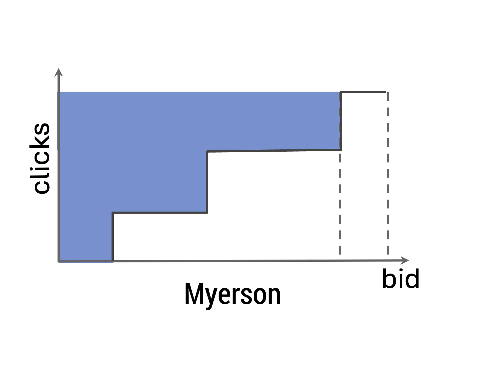

A single parameter setting that the participants only have one-dimensional preferences, and a monotone allocation rule means that when somebody reports a higher preference, i.e. they place a higher bid, they get a higher position and more clicks. Then, the payment is given by an integral (Myerson derives this by using some inequalities that we need to satisfy to make sure that nobody would want to game this system).

This rule is charging the area above the curve, so we can draw a curve which plots how the allocation is changing as the bids goes up. The curve is a step function, because in position auctions, you go from winning position \(3\) to \(2\) to \(1\): as you bid higher and higher you go to higher and higher positions. So, you get more click-through rate.

Let's go back to our example:

Once again, assume the same advertisers and bids as in the previous example:

| Pos  | pos-norm  | Winner    | Payment   |
|------|-----------|-----------|-----------|
| 1    | 0.8       | A         | $8        |
| 2    | 0.5       | B         | $2        |
| 3    | 0.1       | C         | $0.01     |

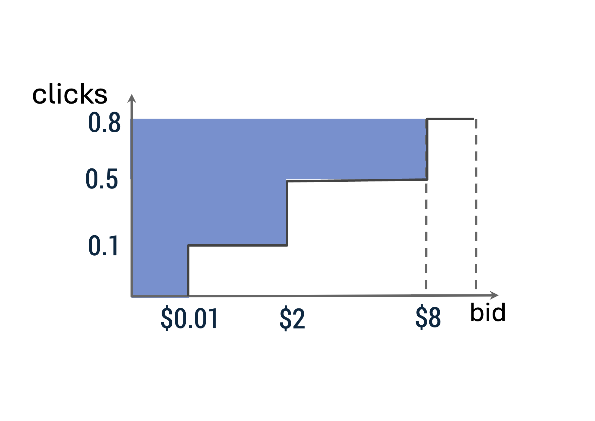

\(Paymen(A) = (0.8 - 0.5) \cdot 8 + (0.5 - 0.1) \cdot 2 + (0.1 - 0) \cdot 0.01 = 2.301\).

This is the same result as with VCG.

**GSP is _not_ truthful**

We saw that Myerson and VCG are two different ways of getting truthful auctions We even verified, at least on one example, that these two do the same thing.

Below, the picture on the left is what Myerson does, and the picture on the right is what GSP does.

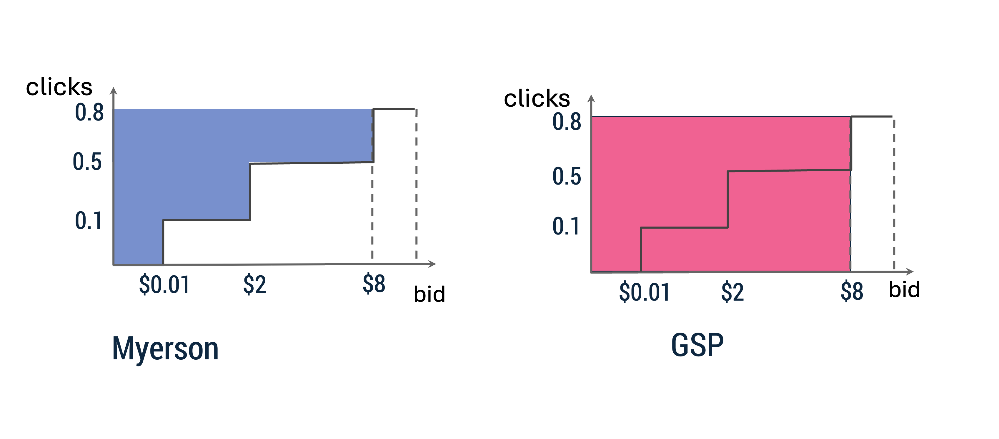

Instead of charging this area above the curve, GSP is greedy and charges the big rectangle. Even though, by lowering the bid, the advertiser would get fewer clicks, we disregard that and charge them a very high price for all of their clicks. That is why the prices are much higher with GSP than they would be with Myerson/VCG.

Meta/Facebook decided to use VCG and that is the right thing to do. It is definitely easier to start using VCG from scratch, because switching from GSP to VCG is hard, as it causes revenue to go down.

Then on the other end of the spectrum, display ads, which are ads that show up on websites when you visit them, use First Price auctions, for historical reasons, given the complexity of the display ad ecosystem.

**Position Auction Conclusion**

Historically:

- Goto.com/Overture/Yahoo used First Price auctions.
- Google introduced GSP auctions.
- Others, including Meta, have implemented a VCG-ish auctions.
- Display ads tend to use First Price auctions.

Some research papers on this topic:

- Edelman, Ostrovsky, Schwartz (2007)
- Aggarwal et al. (2007)
- Varian (2007)
- The Economics of Internet Search (Varian, 2006)

**Question: How important is truthfulness for these auctions?**

There are layers here. First Price can be obviously bad, because advertisers can experiment with their bids, and they can lower their bids to get the same thing but cheaper, so there is an obvious manipulation opportunity to game. With GSP-like auctions, it is not obvious how to manipulate the bids, and the participants need to think about the margins that they need to tolerate, so the click-cost trade-off is still there, but the advertisers still need to estimate how much value they put on the clicks, and that might change.

**Question (follow-up): Who is estimating that?**

There are some manual advertisers who are doing it themselves, they look at the Adwords interface, and they try to find the sweet spot by looking at plots in the interface.

There are also fancier products, like auto bidders, where advertisers can just input their average cost, and the outbidding system (which is run by Google), will try to optimize for them. Truthfulness remains helpful, because the autobidder can do a uniform bid and get the best value.

**Question: Are platforms incentivized to model each user’s behavior and intent to optimize click-through rate, so that the platform can charge the most?**

The better we can estimate the probability of click, the better we are matching the advertiser to the user, even though it does not always translate into more revenue.

For instance, if there are two advertisers, like Nike and Adidas, but the user likes Nike and not Adidas, then there is no pricing pressure to charge more to Nike, which is why revenue does not always follow. That said, definitely, the more accurately we can estimate the click-through rate, the greater the efficiency.

## Present: Rich Ad Auctions

These days, if you go to Google.com, you get more complicated layouts of ads, which can show ad extensions, site links, seller ratings, promotions, which can change the probability of the user clicking on the ad. It is also a better value for the advertiser because the user might actually go buy the product. 

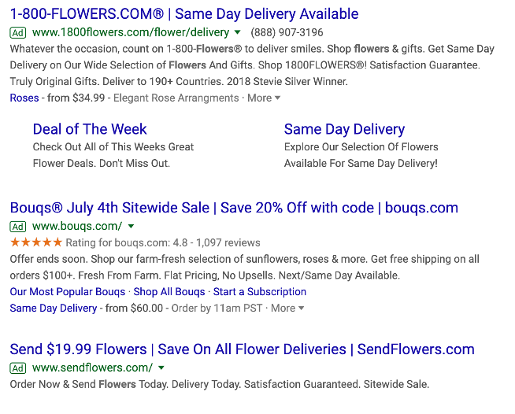

However, these extensions also take more space, and we want to make the best use of all the space that the user looks at on Google.com.

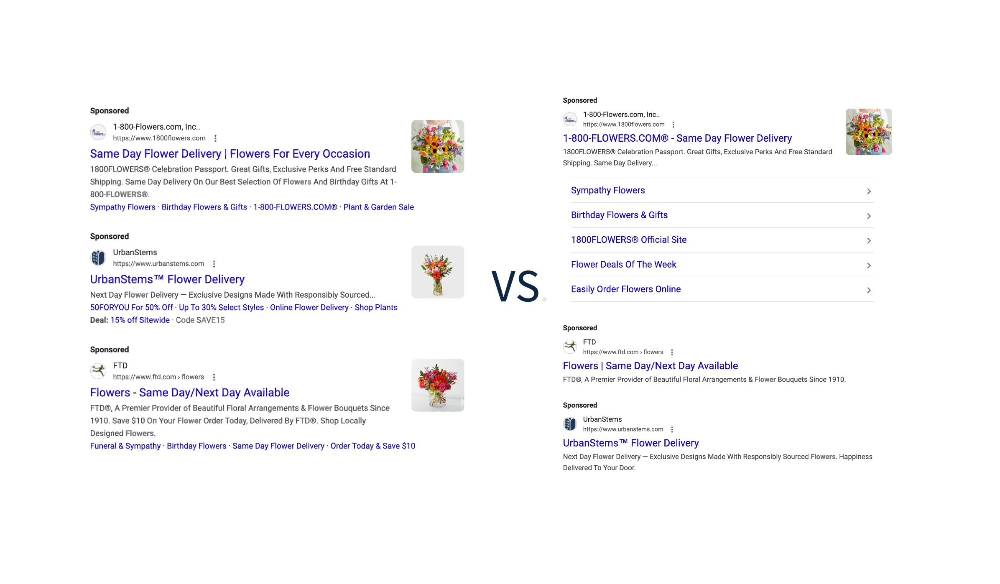

We bound the total amount of space that we control to find the best set of ads that fit within that space. For instance, we may need to decide what to do, when, for the same advertiser, we can either show a small or a large ad.

**Optimization Problem**

Constraints:

- Only one ad \(j(i)\) per selected advertiser.
- Total space bounded by \(\displaystyle \sum_i h_{j(i)} \leq H\).

Goal: Choose the set of rich ads to maximize the social welfare \(\displaystyle \sum_i v_i \; clicks_{j(i)}\)

We can extract the theoretical question that we are trying to solve here from the setting:

- We have a number of advertisers.
- Each advertiser has a few different ads that they have provided us.
- We are required to show only one ad per advertiser because we don't want to show two ads for, say, flowers.com, in the same view (that would not be a good user experience).
- The total amount of space occupied by these ads has to be bounded.
- Our goal is to still to maximize social welfare, to maximize the value of matching these advertisers to the users.

This problem is actually hard to solve optimally: it is known as a **Multiple-Choice Knapsack Problem**, and it is NP-hard.

Computer scientists have spent a lot of time trying to understand which problems are hard to solve, and they came up with a class called NP, which are problems that we don't know if they are hard to solve, but we don't know how to solve them either. There is a conjecture \(P=NP\) (or not), which is \(\$1\) million problem.

As long as we don't know where this conjecture goes, we don't know how to solve this problem in a reasonable amount of time, especially as the instance grows large. In this case, the number of ads per advertiser can go on the order of thousands, and, because we can do many combinations of these ad extensions, the number of ads that show up to an auction in the worst case can also be on the order of thousands.

One more practical constraint for showing these ads is that we cannot do anything worse than \(n \cdot \log(n)\). A polynomial n-fourth \(O(n^4)\) algorithm is not practical, because whenever you go to Google.com, we need return the result at the worst in 200 milliseconds. That is including the time to retrieve old ads from various systems and run the auction. So, the auction itself gets less than 10 milliseconds to run.

In other words, this problem is theoretically and practically hard to solve. So, how should we solve this problem?

Let's take a little diversion and consider a simpler problem: the Knapsack Problem.

**The Knapsack Problem**

- You have a snack budget and you are going on a road trip.
- You go to a convenience store and you want to buy as many snacks as possible. - Each snack has some value (how happy it makes you).
- There is a cost for purchasing each snack.

You want to find a set of snacks that maximize the total value you get for this, subject to the constraint that the total cost of your snacks that you're purchasing is less than your budget, say, $100.
This problem is still in NP hard, but over the next few slides, we'll look at a simple algorithm for solving this problem.

A problem may be NP-hard, and yet, we still have to solve it because we are building something in real life. This Knapsack Problem needs to be solved, and an approach is to use an approximation algorithm.

What is approximation algorithm? It is a heuristic/an algorithm that gives us a solution that might not be optimal, but that we can accept if we can prove some approximation guarantee, such as that we will get at least half of the best solution possible. That is a really good guarantee to have because, no matter what instance shows up tomorrow, you're at least getting a reasonable amount of value. Of course, the closer we can make this approximation to \(1\), the better, but sometimes it is not possible.

**Theorem:** We can solve the Knapsack Problem in polynomial time to obtain a 2-approximation, i.e. \(Value(ALG) \geq \frac{Value(OPT)}{2}\).

**Knapsack Approximation Algorithm**

1. Sort items in the bang-per-buck = value/cost order.
2. Select items until knapsack is almost full (i.e. the next item will overflow).
3. Consider the last item by itself.
4. Pick the higher of steps 2 and 3.

The algorithm is very simple. It basically sorts the items by bang-per-buck: you're not just going to greedily pick by value, but instead, take the ratio of the value and cost, and pick in that order. We'll keep doing this until the knapsack is almost full, and once the next item cannot fit in the bag anymore, it will overflow. We will consider this last item by itself, and we are going to pick the better of this bang-per-buck order, or this last item by itself.

Note that Step 3 here is required because sometimes there might be a single item, that is very large but doesn't have a good bang-for-buck (i.e. a very large item with a very high value), and we want to make sure we don't miss it.

Let's look at an example.

**Example: Knapsack Approximation**

We have \(3\) items and the knapsack capacity is \(2\):

| Value  | Cost   | Bang-per-buck  |
|--------|--------|----------------|
| 18     | 1      | 18             |
| 21     | 1.2    | 17.5           |
| 30     | 2      | 15             |

The optimal solution in this case is to pick the last item which has a lot of value.

What does the algorithm do?

- It considers the ratio of value divided by cost, which is the order the item are shown here.
- It adds the items one at a time until the knapsack is full. It turns out that we have to stop just after the first item, because the next item would overflow the knapsack.
- It considers that last item by itself, which is the \((21, 1.2)\) item.
- It picks whichever is the highest, i.e. the \((21, 1.2)\).

We see that \(21 \geq \frac{30}{2}\), to this result satisfies our guarantee of achieving half of the optimal solution.

How can we prove that this algorithm is actually a good one? We can capture what the optimal solution looks like—we are not going to solve it, but we can mathematically represent it using an integer program.

**2-Approximation of The Knapsack Problem**

Let \(v_i\) be the value of item \(i\), \(c_i\) be the cost of item \(i\), and \(x_i\) denote whether we selected item \(i\) or not.

We want to maximize our value, which is \(\displaystyle \sum_{items} v_i \cdot x_i\).

We also know that the sume of the costs of the items cannot exceed our budget \(B\), so \(\displaystyle \sum_{items} c_i \cdot x_i \leq B\).

In addition, any item can only be selected at most once, and we cannot select fractional items in the original problem, but we can relax it into a linear program, such that \(0 \leq x_i \leq 1\).

This program selects all items with \(\frac{v_i}{c_i} \geq \lambda\) for some \(\lambda \geq 0\), and only the last item is added fractionally.

We see that:

\(Value(ALG)\)

\(= max \; \{Value(bang \text{-} for \text{-} buck \; solution), Value(last \; item)\} \)

\(\geq \frac{Value(bang \text{-} for \text{-} buck \; solution) + Value(last \; item)}{2}\)

\(\geq \frac{Value(linear \; program)}{2}\)

\(\geq \frac{Value(OPT)}{2}\)

_**Note:** Linear programs in general can be solved in polynomial time, so we can solve them pretty fast, even though they might give us a fractional result. However, for proving approximation guarantees for these algorithms we should always use them. They can be a good tool for being able to reason about what the optimal solution looks like, and thinking about how we can approach it._

So, that was for the Knapsack Problem, but the rich ad problem is a bit more complicated: it is _Multiple-Choice Knapsack Problem_. In addition to the knapsack constraint of packing these ads, we also have the constraint that we are only allowed to choose one ad per advertiser.

There is in fact a similar result, which comes from Sinha and Zoltners's paper from 1978, where they again characterize the optimal solution for the linear program. It does allocation using incremental bang-for-buck, and then they can show that that kind of algorithm will give you a 2-approximation.

**Theorem:** Sinha, Zoltners '78

 We can optimize social welfare within a factor of \(2\), i.e. \(Value(ALG) \geq \frac{Value(OPT)}{2}\).

**Key takeaway:** We cannot solve the Multiple-Choice Knapsack Problem optimally.

**Can we solve the Rich Ad Auction problem with VCG?**

Recall that VCG solves the same optimization problem many times. First, it solves the optimization problem to find the best set of ads to show, and then, for each of the ads that you have selected, it solves the optimization problem one more time without this advertiser to calculate the payment. In other words, VCG requires us to solve the same optimization problem again and again. However, as we have seen, this particular optimization problem is hard to solve. Therefore, we cannot use to solve the Rich Ad Auction problem.

One of the lessons from reality is that advertisers are strategic along many different domains, rather than a single paramter. For instance, advertisers can be strategic about which ads they give to us to show, especially if it helps them.

Suppose an advertiser has a small, a medium and a large ad, but for whatever reason, they say I don't have the medium ad anymore; so we can either show the small ad or the large ad, and if that can somehow give them a better outcome,
maybe the large and gets shown. Thus, they get a lot more space by withholding the medium ad than by providing it to us, and that is also something we want to guard against.

**Example:** Is there a way for the advertiser that owns the \(21\) and the \(70\) value ads to force the auctioneer to choose the outcome on the right?

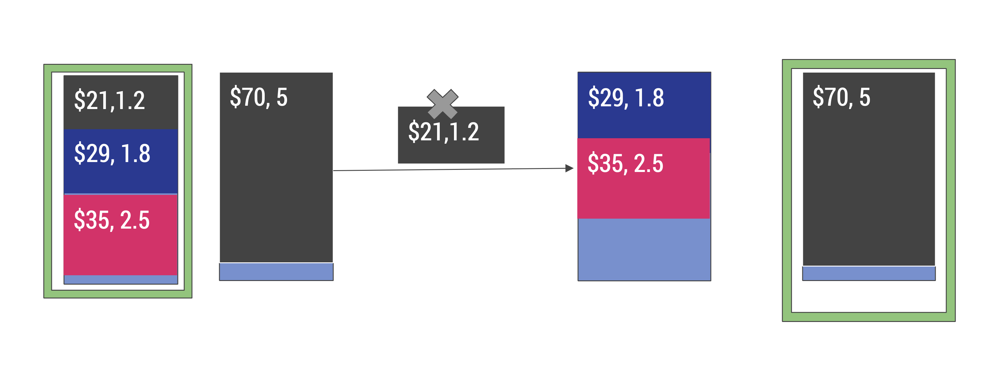

If the advertiser just removes the small ad, then the auctioneer will be forced to choose between the other two ads and the one large ad, and they will actually choose the one larger. This is the simplest example where we can start seeing that this strategic dimension of which ads to provide starts to matter.

Generally, the more the advertiser gives us, the more flexibility for us to make the best use of their assets to show to the user. So, we want to incentivize advertisers to give us as many assets as possible. If we are running an auction that incentivizes advertisers to remove some of their assets because they are hurting some other assets that are more promising than that, that is bad auction design. This is another reason why truthfulness matters.

One of the tricks we can use to solve the Rich Ad Auction problem is to leverage Myerson's Lemma.

**Myerson's Lemma**

If we can design allocation rules that are monotone over the values \(v_i\), and the advertisers provide a set of ads \(A_i\), we can design payment rules that will make the auction truthful.

Note that neither the integer optimization algorithm and nor the Sinha-Zoltner'76 algorithm are monotone over a set of rich ads. So, is there a monotone algorithm to solve this problem?

**Lemma:** Allocating in bang-per-buck order is monotone. 

Allocating in bang-per-buck order is independent of which ads are present, so doesn't change based on the subset of ads.

We can find another approximation algorithm for the Multiple-Choice Knapsack Problem, which uses randomization to preserve monotonicity.

**Theorem**

The following randomized monotone algorithm that allocates in bang-per-buck order with probability \(\frac{2}{3}\), and otherwise picks the single highest-value ad, provides a 3-approximation to the fractional optimal solution and is monotone.

**Rich Ad Auctions Recap**

- New auctions with different layouts of ads create computational challenges.
- Advertisers have time to be strategic about which assets to provide, which creates a new strategic dimension to consider.
- In practice, we rely on more involved heuristics used to get as close to optimal as possible.

Some research papers on this topic:

- Aggarwal et al. '22
- Harris et al'17, 
- Hartline et al'18

## Future: Auctions for LLM generated ads

Let's speculate a bit about what the future of search ad auctions on Google.comcom might look like. We all have heard that large language models are changing everything, and we might wonder how will search ads change with them?

One way they might change is we can use large language models to generate ads on the fly.
So we could just have the models themselves, summarize different advertisers, uh,
content and choose the space that's available effectively and also tailor the format
of the ads to match whatever summary organic content we are showing to the user.

In a paper published last year, some of Kshipra Bhawalkar's colleagues looked at how can we use LLMs to generate these ads that better align with the context, and and how we should we run auctions for these ads.

The key inspiration here is Retrieval-Augmented Generation (RAG). LLMs in general can hallucinate (they might make up things), and RAG has been a way to make sure that they are grounded.

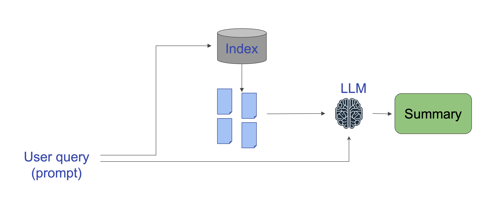

RAG usually works by retrieving a bunch of documents, such as web pages, and then asking the LLM to summarize those documents instead of outputting something from its memory. In that way, it stays true to the ground sources and answers the user's queries.

You can see this in action when you go to Google.com Nowadays, you get this AI overview, which generates a summary of some of the top results that is generated using RAG.

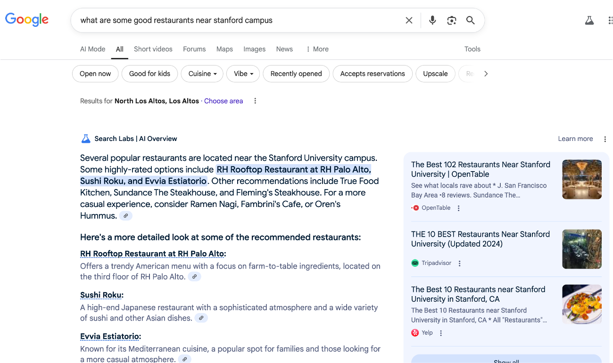

Can we do the same with ads? Can we take the advertisers' assets and their bids, and let the LLM generate an ad summary that tells the user what the best products are for whatever they are searching for?

It is more complicated because we want the advertiser to be able to specify how much they value being shown to the user. So, they will use their bids to influence how much space they are given  or how their content is presented. We also want use payments to make sure that advertisers are incentivized to report their true value for being shown to the user.

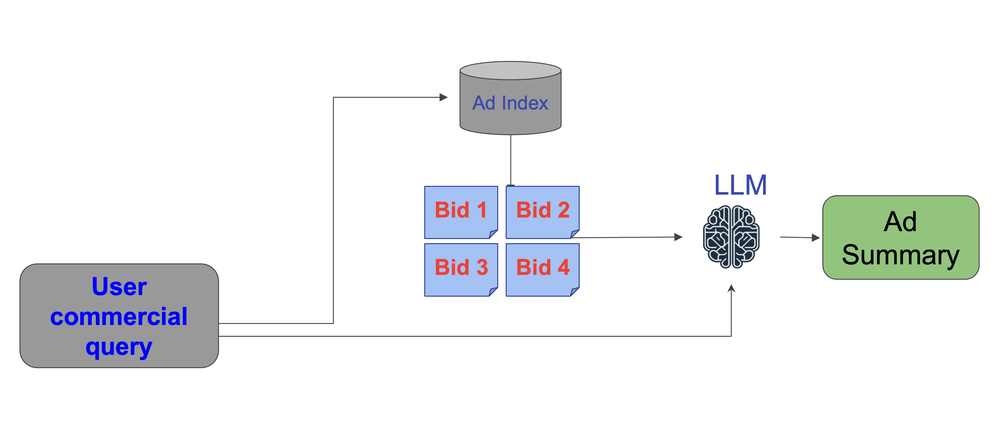

**Can't we just let the LLM do it all, i.e. take the advertisers bids, figure out who gets how much space, and how much to charge them?**

That is actually hard:

- We don't know how to do this.
- LLMs are neither interpretable nor controllable, and there are alignment issues (we cannot make sure that they are staying true to the best way of presenting the information to the user).
- LLMs cannot provide good monotonicity guarantees or incentive guarantees to the auctioneer.

Instead, we generalize position auctions and rich ad auctions, to design auctions with large language models: this is called the Factorized Auction Model.

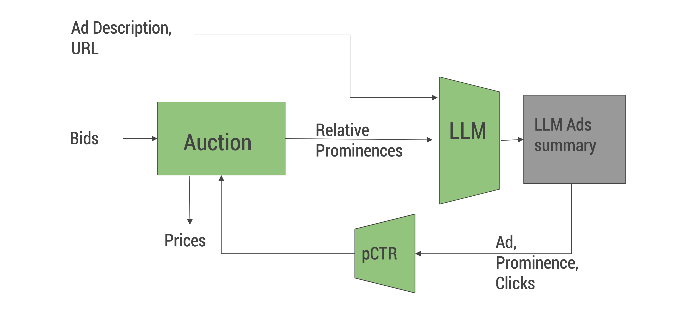

We are factorizing the auction: modules are divided into different parts, where each part will be easier to understand, so we can make sure we can provide good guarantees for it.

There is:

- An **auction module** that takes the bids from the advertisers and decides who gets how much space, and then also decide to what prices they should be charged.
- An **LLM module** that takes this space considerations, and adds the description and URL of the ad to content from the advertisers' website, and then generates the summary.
- A **feedback loop** in the form of click-through rate, where we learn from showing these ads to the user how they are liking it, how much prominence is useful for a given advertiser, and feed that back for running their auctions.

The nice thing about breaking everything up into pieces is:

- The auction part is a classic auction: it maps the bids and visitors to prominences, which is just a scalar number, and it also calculates CPCs (Cost Per Clicks). We can provide good guarantees for this because this is not a black box anymore we know exactly what is going on. 
- The LLM part is still non-trivial because we need to fine-tune the lLLM's output to make sure that it respects the prominences that we specify, and that it makes the best use of that space for convincing the user to click on this ad. It might not work out of the box, but we can train the model to do that.
- The feedback loop is all about learning the model as a function of prominence as opposed to as a function of “This is the exact ad that was shown to the user.” And so there is a little bit of indirection there.

With all the above, we could have an auction for LLM-generated ads that comes with good guarantees about its optimization and incentive compatibility.

**Factorized Approach: Properties**

- Separates out the work between auction and LLM through prominences.
    - Auction does not know the summary, LLM does not know the bids.
    - Product/Business can choose what kinds of summaries are useful for the users.
- Strictly generalizes the current position (or rich-ad) auction.
    - Prominences: Permutations, i.e. the winning ads, their order (and potentially their formats).
    - “LLM”:  Place winning ads (with allocated formats) in the given order.
    - pCTR model: predict position-aware CTR.

**Theorem: Incentive Compatibility**

If the auction allocation function is monotone and the LLM is monotone (it converts higher prominence to higher clicks), then the combination is monotonic and can be made truthful.

**Theorem: Welfare Maximization**

If also, the pCTR_Model function is unbiased, then the auction can choose a welfare-maximizing outcome.

**Theorem: Universality**

Any combined ML+auction model can be represented in the factorized model.

**Example: Dynamic Word-length Summary**

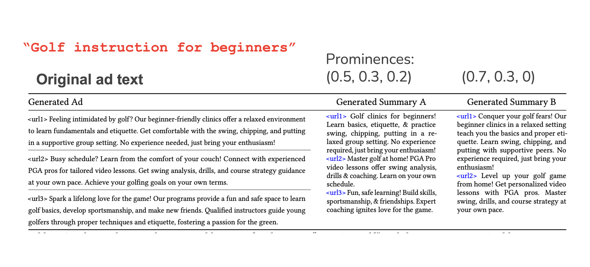

Suppose we ran an auction with three advertisers who could show ads for "golf instruction for beginners."

We are allowing them to have different space or different positions on the page:

- The summary on the left is showing all three advertisers with similar amounts of space allocated to all of them.
- The summary on the right is showing only the top two advertisers, and the top one in particular is getting the lot of space.

Depending on what the bids were for these three advertisers, we might allocate the summary on the left or the summary on the right. Then, the LLM will generate something.

This is where the business side comes in: if you look at this and think that nobody is going to click on the ads, then we can make sure that the LLM does a retune to do as good a job as possible with that. Then, the auction can be optimized separately to come up with good mapping of bids to prominences.

As mentioned, we can provide incentive compatibility and welfare maximization guarantees. That requires knowing about how the prominences will map through click-through rates, because the social welfare cares about click-through rate (and not so much about prominence). However, if the factors have some specific format, like we assumed earlier—there is a advertiser component, a condition component, a prominence component—it is reasonable to assume that that is a concave function. So, as you get more and more space, you are not able to get more value it: maybe it is like a polynomial-exponential function of some sort prominence raised to \(\beta\).

**Optimization with Continuous Ads**

Factorized CTR model:

\(pctr_i^{final} = pctr_i \cdot pos_norm_i \cdot f(Prom_i)\)

where

\(f(Prom_i) = Prom_i^{\beta} \; for \beta \in (0,1]\).

If it is this format, or a general concave format with nice differentiability, we can actually obtain a closed-form solution for what is the right way to allocate these ads.

**Case Study: Dynamic Word-length Summary**

Auction component: Generalized Proportional Allocation (GPA), where the relative prominence is proportional to the power of:

\(ecpm \approx bid \cdot base \_ pctr \cdot position \_ normalizer\).

The formula is simple: we just give each ad a location that is proportional to their eCPM, which is the bid times the pCTR and a position optimizer. Indeed, we want to sort the ads in the same order as we did with position auctions. Then, we can show that if the pCTR has a nice format, then this kind of allocation is welfare-maximizing.

**Optimization Perspective: The “LLM advantage”**

LLMs can aim for the best ad allocation under total space constraint:

| Current (Rich Ads) | Future? (LLM-Generated Ads) |
|-----------------------------------------|-----------------------------|
| Predefined set of fixed formats (sizes) | LLM summarized ads, Dynamically generated prominences (sizes) |
| Combinatorial optimization & auction design | Continuous optimization |

Previously, we talked about rich ad auctions: we spent a lot of time figuring out how to optimize them because they had some fixed sizes, so we had a packing problem that we were trying to solve.

With LLM-generated ads, some of these challenges go away, because now we can think of it as like a fractional problem: no matter how much space is available, we will find the best ad to go into that space. With this extra freedom, maybe our optimization problem might become easier.

- We are solving a linear program instead of an integer program.
- From an auction design perspective, if we can get closer to the optimal allocations, then a lot of our auctions considerations become simpler : maybe we can run VCG, and no longer need Myerson-like auctions.

**LLM-Generated Ads Recap**

- LLMs unlock new opportunities for flexible ads (generated on the fly).
- How to accomplish that is an interesting problem: challenges around alignment, optimization, incentives remain.

Some research papers on this topic:

- Dubey et al' 24
- Duetting et al' 23
- Hajiaghayi et al' 24
- Mordo et al' 24

## Recap

**Incentives in Sponsored Search Auctions Recap**

Internet Advertising brings together:

- Economics (Vickrey Auction, VCG, Myerson Lemma).
- Computer Science (Approximation algorithms, Approximate Auction, Price of Anarchy)

The evolving Internet creates many opportunities/challenges for Computer Science, Economics, and Mathematics.

**Question: We talked a little bit about how we can incorporate ads into our lives. For people who are using Claude or ChatGPT via the chat interface, how do you think that might be? How do you think that might change?**

Right now you have subscription tiers where you get more access. So, subscription is definitely one model. It might be that that could be sufficient.However, for folks who don't want to invest that money or commit to paying, ads have a nice property that allows them to pay with their attention  to get access to those results. If the AI chatbots that exist right now and are not showing any ads want to reach all the people in the world, then it is conceivable that providing an ad-supported tier might be the way to go at some point.

