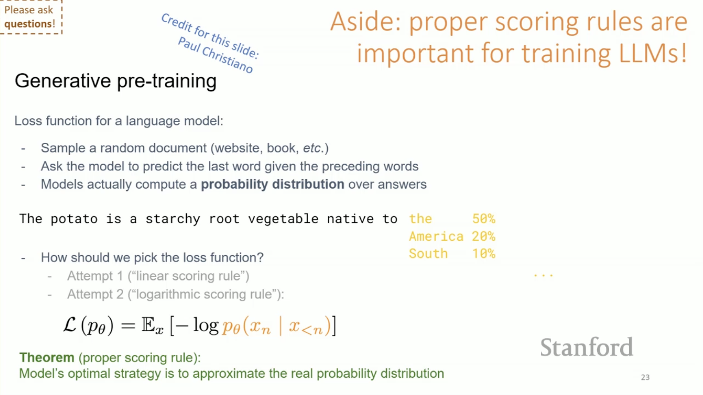

_May 7, 2025_

Say that Weather.com predicts a 40% chance of rain:

- If it rains, will we say that the forecast was wrong?
- What if it doesn't rain?
- Is Weather.com more accurate than other weather websites?

In other words: how can we evaluate this forecast of 40% chance of rain?

## Scoring Rules

**Definition: Scoring Rule**

For a given input, including:

- A realized event \(i\) in the outcome space \(O\), i.e. "rain/no rain."
- A probability distribution \(q\) over \(O\), i.e. "\(40\%/60\%\)."

A scoring outputs a score \(S(q,i)\), i.e. how much we are paying Weather.com.

In other words, a scoring rule takes the function of a probabilistic forecast and quantifies how good it was.

**Example: Linear Scoring Rule**

Imagine that we pay Weather.com based on the outcome vs. the forecast:

- If it rains, we are going to pay them how much probability they put on “rain.”
- If it doesn’t rain, we are going to them how much probability they put on “doesn’t rain.”

Let \(q_i\) be the probability that \(q\) assigned to event \(i\).

Intuitively, if Weather.com gives a higher probability to “rain” and it actually “rains”, the score should be higher.

Example TBC.

What does it mean to get it right when Weather.com forecasts 40% “rain” and it rains? It would be helpful if there was a definitive answer, like “It is going to rain tomorrow.” However, the forecast is not perfect, and it is helpful that Weather.com says there is a 40% chance of rain, to determine whether we should take an umbrella or not.

Eric also showed an example on Monday where an LLM makes up stuff they don’t know to seem like they have confidence in something even though they have no idea.

So, we want to encourage the forecaster to honestly report the probability of the event.

**Example: Linear Scoring Rule (Cont'd)**

If the model predict a 40% chance of rain, how can we maximize the (expected) score?

The score is calculated as the probability forecast that it rains times the payment if it rains, plus the probability forecast that it doesn’t rain times the payment if it doesn’t rain:

- If the forecast is 40% chance of rain, the expected score is \(0.4 \cdot 0.4 + 0.6 \cdot 0.6 = 0.52\).
- However, if the forecast is 0% chance of rain, then the expected score becomes \(0 \cdot 0.4 + 1 \cdot 0.6 = 0.6\).

In other words, the forecaster has an incentive to _not_ report the probability truthfully, and deviate to the optimal forecast that says there is 0% chance of rain (since the expected score is greater).

With a linear scoring rule, the model is incentivized to tell us 1 or 0, even when it has a lot of uncertainty (it really doesn’t know in the case of 40%/60%).

For instance, here, since 40% is less than 50%, so the model will say that it will not rain (probability 0%). So, this is not a proper scoring rule.

**Lemma:** With \(S_{linear}\), extreme reports (0% or 100%) are always optimal.

Again, this is like the problem Eric described with LLMs, where the after-training is done by humans who give thumbs up and thumbs down, which encourages overconfidence.

**Definition: Proper Scoring Rule**

A scoring rule \(S\) is proper if it is _strategyproof_, i.e. the true distribution maximizes the expected score.

What we want, in the context of this lecture, is proper scoring rules, i.e. scorings that are strategy proof, where truthful reporting of the probability forecast that you learn is the best response.

**Definition: Strictly Proper Scoring Rule**

A scoring rule \(S\) is proper if it is _strictly strategyproof_, i.e. the true distribution is the unique argmax of the expected score.

What is the difference between a proper scoring rule and a strictly proper scoring rule?

- Proper scoring rule: If everything you do gives you a score of 0, then reporting truthfully gives you a score of 0, but it is not the only strategy that gives a score of 0, so this is a proper scoring rule, but not a strictly proper scoring rule.
- Strictly proper scoring rule: There is a unique best response.

**Example: Quadratic Scoring Rule**

_**Note:** The quadractic scoring rule is also called the Brier scoring rule._

Consider \(S_{quadratic} = q_i - \frac{1}{2} \sum q_j^2\).

**Intuition:** \(S_{quadratic}\) is the same as the \(S_{linear}\) with a "regularizer" term to penalize extreme forecasts.

This encourages the forecaster to assign higher probability to more likely events, while penalizing extreme forecasts (the regularizer is the sum of all probabilities, squared).

For instance:

- If we have an extreme report of \(1\), the sum is going to be \(1\), so we are going to subtract \(\frac{1}{2}\).
- However, if we have equal reports of \(50/50\), then the sum is going to \(0.25 + 0.25 = 0.5\), and we are subtracting half of that, which is \(0.25\).

In other words, we are subtracting _less_ when the forecast is _more even_.

**Example: Quadratic Scoring Rule (Cont'd)**

Back to our weather forecast example:

- If the forecast is 40% chance of rain, the expected score is \(0.4^2 + 0.6^2 - \frac{1}{2}(0.4^2 + 0.6^2) = 0.26\).
- However, if the forecast is 0% chance of rain, then the expected score becomes \(0.6 - \frac{1}{2}(0^2 + 1^2) = 0.1\).

Here, we see that we get a better expected score if we report the true forecast rather than the extreme forecast.

**Lemma:** The quadratic scoring rule is strictly proper.

**Proof:**

Say \(p\) is the true probability distribution (i.e. the forecaster's belief).

The expected score \(E_{i \approx p} [S(i,q)] = \sum p_j q_j - \frac{1}{2} \sum q_j^2\) is a strictly concave function in \(q\).

Therefore, this function has a unique maximizer, which we can find by setting the derivative with respect to \(q_j\) to 0:

\(0 = \frac{\partial}{\partial{_{q_j}}} E_{i \approx p} [S(i,q)] = p_j - q_j\).

We see that \(p_j - q_j = 0\), which means that \(p_j = q_j\).

In other words, the optimal response to the quadratic scoring rule is indeed to predict the true probabilities.

**Example: Logarithmic Scoring Rule**

Consider \(S_{log}(q,i) = log (q_i)\).

_**Note:** The logarithmic scoring rule is also called the Good scoring rule, after I. J. Good, a British statistician, logician, and computer scientist. It is indeed a good scoring rule, but that is not the reason why it is called the Good scoring rule._

**Intuition:** The log function is an increasing function, so if we bet higher on the realized outcome (with a higher q_i), then we get a higher score.

However, this still disincentives overconfident reports, because in the extreme case, if we say that an event never happens (it has a probability of 0), and it does happen, then we get a score of negative infinity.

**Example: Logarithmic Scoring Rule (Cont'd)**

Back to our weather forecast example:

- If the forecast is 40% chance of rain, the expected score is \(0.4 \cdot log(0.4) + 0.6 \cdot log(0.6) = -0.29\).
- However, if the forecast is 0% chance of rain, then the expected score becomes \(0.4 \cdot log(0) = - \infty \).

Here, we see that with a true report, the expected score here is \(-0.29\). If we report 0% when there is still a 40% chance of rain, then the expected score is negative infinity, which is a very bad prediction to make.

**Lemma:** The logarithmic scoring rule is proper.

**Proof:**

Say \(p\) is the true probability distribution (i.e. the forecaster's belief).

Then, here again, we differentiate the expected score function with respect to \(q_j\) and set it to 0:

\(0 = \frac{\partial}{\partial{_{q_j}}} E_{i \approx p} [S(i,q)] = \frac{\partial}{\partial{_{q_j}}} [p_j \cdot log(q_j)] = \frac{p_j}{q_j}\).

Oops! \(\frac{p_j}{q_j}\) is never equal to \(0\).

**Example: _Normalized_ Logarithmic Scoring Rule**

Just for the purposes of the proof, let's consider  \(S_{log}(q,i) = log (q_i) - \sum q_j\).

**Claim 1:** The _normalized_ logarithmic scoring rule is proper.

**Proof:**

Again, say \(p\) is the true probability distribution (i.e. the forecaster's belief).

Then, we differentiate the expected score function with respect to \(q_j\) and set it to 0:

\(0 = \frac{\partial}{\partial{_{q_j}}} E_{i \approx p} [S(i,q)] = \frac{\partial}{\partial{_{q_j}}} [p_j \cdot log(q_j) - q_j] = \frac{p_j}{q_j} - 1\).

_**Note:** \(\sum q_j = 1\) because \(\sum q_j\) is the sum of all probabilities, which is always equal to \(1\)._

This time, we see that the partial derivative is zero exactly for \(p_j = q_j\).

**Claim 2:** If \(S\) is a proper scoring rule, then \(S' = S + c\) for any constant \(c\) is also proper.

**Proof:**

We add the same constant \(c\) to the score of any \(q\), so the optimal \(q\) doesn't change.

**Proof (Cont'd):**

By Claim 1 and Claim 2, the logarithmic scoring rule is proper.

**Scoring Rules Recap**

- The idea of a scoring rule is to look at the probability distribution of a given forecast, as well as the actual outcome, and we want to give some score about whether the forecast was good or not, and this is the way to quantify how good the forecast was.
- When we quantify how good the forecast was, we want to think about ways to quantify it that make truthful reporting strategy proof, i.e. we want to incentivize truthful reporting, i.e. we want (ideally strictly) proper scoring rules.
- The linear scoring rule is not proper, while the quadratic and logarithmic scoring rules are.

Although this is not our main focus in this lecture, proper scoring rules are super important for training language models, in particular because language models predict distributions. On that note, here is a slide from last year's lecture on AI alignment:

## Market Scoring Rules

So far, we have seen two extreme alternatives:

- Scoring rules, on the one hand, apply with a single forecaster, are strategyproof, and usually require to pay the forecaster.
- Prediction markets, on the other hand, apply when we want to benefit from the wisdom of the crowd (they actually completely fail with a single forecaster), are subject to the no-trade theorem, and tend to operate on zero-sum trades of contract bundles (some prediction markets actually make a profit from fees).

Now, we want to cosnider something in the middle, in the hope of getting the best of both worlds: **market scoring rules**.

**Definition: Market Scoring Rules**

- Fix a strictly proper scoring rule \(S\).
- Initialize \(q^O\) as some probability distribution over the outcome space \(O\). For instance, \(q^O\) may be the uniform distribution (in contrast, if you can look at the history, you can initialize with some prior distribution based on history).
- At each time step \(t\), anyone can update the distribution for \(q^{t-1}\) to \(q^t\). For instance, a forecaster may be new to the market or have learnt new information.
- At the end of the market, some outcome \(i \in O\) is realized: we pay \(S(q^t,i)-S(q^{t-1},i)\) to the forecaster who made the \(t\)-th update.

**Example**

- Let \(S_{log}(q,i) = log(q_i)\).
- Initialize \(q^O\) as the probability that it will rain with a chance of 50%.
- At each time step \(t\), anyone can update the distribution for \(q^{t-1}\) to \(q^t\). For instance, a forecaster may be new to the market or have learnt new information.
- Once outcome \(i \in O\) is realized: we pay \(S(q^t,i)-S(q^{t-1},i)\) to the forecaster who made the \(t\)-th update.

Here is what happens:

- Before Alice arrives, the (initial) probability of rain is \(0.5\).
- Alice says that it is already May, so she thinks that the probability of rain is in fact only \(0.25\).
- Then, Bob comes, and he saw what Alice said, but there are many clouds in the sky, so he moves the probability to \(0.75\).
- Finally, Carlos arrives, and he is even more confident that it is going to rain, so he moves the probability to \(0.9\).

How should we pay the forecaster?

- If it rains, Alice has to pay \(1\) for making a worse prediction, Bob receives \(1.6\) and Carlos gets \(0.3\).
- If it does not rain, then Alice receives \(0.6\), while Bob needs to pay \(1.6\) and Carlos needs to pay \(1.3\).

_**Note:** The order in which we go matters, timing is important, or if something happens and changes what everyone thinks, then the first person to move the market has an advantage._

If there was no Bob, but just Alice moving \(0.25\) in one direction, and then Carlos moving to\(0.9\) in the other direction, then the payments for Carlos are just the sum of what the payments for Bob and Carlos were above.

Each person can shift the market a lot, but they are exposing themselves to losing a lot of money (the bigger the shift, the bigger the risk and the reward).

**Quesiton: What happens to incentives if other forecasters change their minds based on what you did?**

Here, we are going to analyze incentives assuming that each forecaster makes a prediction, and their turn is done. However, in practice, people practice what is called the “pump and dump” trick, where they buy a lot of stocks, make sure everyone knows about it, which increases the price when everyone jumps on the wagon, and then the person who is doing the “pump and dump” sells the stocks for a profit. We do not have a good mathematical model for how forecasters react to how one forecaster updates the forecast.

**Definition: Sybil-Attack**

Exploiting a mechanism by pretending to participate as many agents.

**Definition: Sybil-Proof**

Robust to Sybil-attacks.

**Claim:** Market scoring rules are sybil-proof-ish.

Specifically, market scoring rules are robust to sybil-attacks as long as all copies forecast immediately after each other.

An agent may run a Sybil-attack by making copies of themselves (with bots) to pretend they are more than one person.

The reason why market scoring rules are sybil-proof-ish is because, if one agent is taking one order, and breaking it down into a series of consecutive orders, then it is exactly the same as if it still was exactly one order.

More generally, forecasters will receive the same payoff for moving the market belief in one shot vs. consecutive increments.

The market scoring rule is really a market that is using a scoring rule (so maybe it should have been called the scoring rule market), rather than a rule for scoring the market.

**Question: Is there a rule for scoring the market?**

Yes, but one problem is that those rules tend to be really not sybil-proof. For instance, in blockchain, there are a lot of websites that keep track of activity that happen in some blockchains, and so the blockchain operators figured it out, and they started generating a lot of fake activity to appear like up-and-coming blockchains.

**Question: Can each forecaster can observe the predictions of the forecasters before them?**

Yes, and that is very important, because they are paying the difference between the forecast and what they are updating the forecast to.

**Question: Should we be getting closer to the truth as more forecasters join?**

The big questions is how do we aggregate the fact that some forecasts were made all over the place, in no specific order. So, in theory, all together, the forecasters should be getting closer to the truth, but there is not a good model to aggregate what happens.

There is a public no-trade theorem, because if all the public information has been aggregated, then the forecast is already reflecting that, but if a forecaster has private information, then they are trading with the house, who is “paying them” to bring in the new information.

**Definition: Bounded Market Maker's Loss**

The total payout to forecasters is:

\[
  \underset{t=1}{\sum^T} S(q^t,i) - S(q^{t-1},i) = S(q^T,i) - S(q^0,i)
\]

You may have to pay forecasters (unlike prediction markets):

- Paying is reasonable in exchange for useful information.
- Positive payment (in expectation) is necessary to avoid no-trade theorems.
- You actually make a profit if your original forecast was better.

The total payout is bounded–it doesn’t scale with number of forecasters. For instance, it is at most \(log(O)\) when using the logarithmic scoring rule with \(q^O\) is the uniform distribution.

Said otherwise, the total payout is bounded by the difference between the score of the original forecast and the final forecast. Regardless of the number of forecaster, the total payout is bounded, because the most it can go to is someone exactly predicting the right outcome. So, even with an unbounded number of forecasters, the total payout remains bounded.

**Lemma:** For any fixed order of forecasters, reporting true beliefs is the unique optimal strategy for every forecaster.

**Proof:** The \(t\)-th forecaster chooses \(q^t\) that maximizes \(S(q^t,i)-S(q^{t-1},i)\).

Since \(S(q^{t-1},i)\) does **_not_** depend on \(q\), the optimality of the true forecast follows from the strategyproofness of the scoring rule.

In other words, since every forecaster has no control over the score of the pervious forecast(s), they just want to maximize the score of the new forecast, which means just maximizing their own profits, and this is strategyproof.

The dynamic game is harder to analyze/model, as forecasts may affect other forecasters’ beliefs (think info cascades):

- In theory, your forecast now can strategically throw off the market.
- The “more wrong” the market is, the more opportunity to profit.
- But this requires a reliable model of how your forecast affects others.

**Market Scoring Rules Recap**

- Market scoring rules apply to any number of forecasters. This is useful for markets of moderate size, which is common in corporate forecasts.
- Marker scoring rules are also strategyproof with a fixed order, but their dynamic strategic manipulation is hard to implement.
- The payout is bounded and does not depend on the number of forecasters.

## Automated Prediction Market Makers

In simple prediction markets like IEM, one problem is that liquidity providers risk unfavorable trades with more informed traders:

- Large bid-ask spread to cover risk (low liquidity).
- Poor information aggregation, e.g. anywhere between 5%-40% (in the example of LeBron James potentially joining the Chicago Bulls).

One solution to this problem is called automated market makers (AMM).

**Definition: Automated Market Makers (AMM)**

- The market maker ( “bookie”) posts zero (or low) spread buy/sell prices.
- Forecasters can always trade with the market maker.

In a prediction market with AMM:

- There are contracts, like in IEM, for instance:
    - D-contract that pays $1 if Democratic candidate wins.
    - R-contract that pays $1 if Republican candidate wins.
- The AMM (“house”) offers: buy/sell D-contract for price \(P_D\) (respectively R-contract for price \(P_R\)).

How should the AMM set prices? Using market scoring rules! Actually, this is one answer, and we will discuss more answers later in the quarter.

_**Note:** AMM knows nothing about the actual event we are trying to predict!_

In a market scoring rule-based automated market maker (MSR-AMM), buy/sell prices should be dynamic to ensure bounded total payout. As more forecasters buy D-contracts, market “expects” the Democratic candidate to win, which only incentivizes next D-contract purchase if a forecaster is even more confident than market.

The concrete goals of an MSR-AMM are to:

- Look and feel of a prediction market, where:
    - Forecasters trade D-contracts and R-contracts (although now forecasters can also trade with the market maker).
    - After elections: each D-contract pays $1 if the Democratic candidate wins (ditto for R-contracts).
- Make payments (contract cost + payout) exactly as in market scoring rule (forecasters incentives are also exactly the same).

Let's consider an MSR-AMM with two outcomes (\(D\) and \(R\)) and an initial market belief \(q^O = 50/50\).

Bundles of (D-contract + R-contract) are worth exactly \(\$1\). Buying/selling a bunch of such bundles doesn’t indicate change in market belief, since the belief only depends on the _difference_ between the number of D-contracts and R-contracts sold.

At the beginning of market, given that \(q^O = \frac{1}{2}\), prices of D-contracts and R-contracts are equal (50¢ each).

As the difference between the number of D-contracts and the number of R-contracts approaches \(\infty\), the market belief approaches 100% probability that the Democratic candidate wins. So, the price of D-contracts should approach \(\$1\), while the price of R-contract should approach \(\$0\).

The market belief is derived from prices: If prices \(P_D + P_R = 1\), are an equilibrium (at time \(t\)) for the market, then the market’s current belief is that the Republican candidate will win with probability \(q_R^t = P_R\). Otherwise, forecasters want to buy more/less R-contracts.

Now, fix some (strictly proper) scoring rule \(S\), and consider that no contracts are sold yet. If buying \(x_D\) D-contracts moves the market belief from \(q^O\) to \(q^t\), their their cost (i.e. the cumulative price forecasters pay the market maker) should satisfy:

\[
C(x_D,O) - x_D = S(q^t,i_D) - S(q^O,i_D)
\]
          
where:

- \(x_D\) is the contract payout if the Democratic candidate wins, and
- \(S(q^t,i_D) - S(q^O,i_D)\) is the market scoring rule payment if the Democratic candidate wins.

If buying \(x_D\) D-contracts moves the market belief from \(q^O\) to \(q^t\), their their cost should also satisfy:

\[
C(x_D,O) = S(q^t,i_R) - S(q^O,i_R)
\]

This means that the price from cost of 1 R-contract is:

\[
C(x_D,x_R +1)-C(x_D,x_R) \approx \frac{\partial C(x_D,x_R)}{\partial x_R} 
\]

In other words, the costs should statisfy:

\[
C(x_D,O) - x_D = S(q^t,i_D) - S(q^O,i_D)
\]

and 

\[
C(x_R,O) - x_R = S(q^t,i_R) - S(q^O,i_R)
\]

With a logarithmic rule AMM, we have:

\[
C(x_D,x_R)=ln(e^{x_D}+e^{x_R})-ln(2)
\]

and the price of a marginal D-contract is:

\[
q_D(x_D,x_R) = \frac{e^{x_D}}{e^{x_D}+e^{x_R}}
\]

With this formula, if we do the right math, it looks and feel like a prediction market, but it has the same properties (strategy-proof-ishness and sybil-proof-ishness) and the same expected payout as a market scoring rule (the payout is bonded: we may lose money to trader, but not too much money).

**Important Takeaway:** With an AMM, traders always have someone to trade with, and one way to determine the prices is using a market scoring rule.

## Recap

**Scoring Rules, Market Scoring Rules, and Automated Prediction Market Makers Recap**

- One caveat with prediction markets is that they may have low liquidity, due to:

    - No-trade theorems.
    - Questions that require special knowledge/classified information (e.g., in corporates or government agencies).
    - A Catch-22, where poor liquidity leads to a thin market, which leads to even worse liquidity, etc.

- In the extreme case of a single forecaster, proper scoring rules provide the incentives. More generally, we can have an automated market maker based on a proper scoring rule.

- For a given input, including a realized event \(i\) in the outcome space \(O\), i.e. "rain/no rain", and a probability distribution \(q\) over \(O\), i.e. "\(40\%/60\%\)", a scoring outputs a score \(S(q,i)\), i.e. how much we are paying Weather.com.

- A scoring rule \(S\) is proper if it is _strictly strategyproof_, i.e. the true distribution is the unique argmax of the expected score.

- The quadratic scoring rule \(S_{quadratic} = q_i - \frac{1}{2} \sum q_j^2\), and the logarithmic scoring rule \(S_{log}(q,i) = log (q_i)\), are strictly proper.

- The market scoring rule payment to each forecaster is \(S(q^t,i) - S(q^{t-1}\).

- In a logarithmic rule AMM, the price of a marginal \(i\)-contract is \(\frac{e^{x_i}}{\sum e^{x_j}}\).

