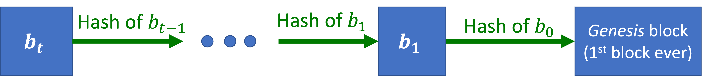
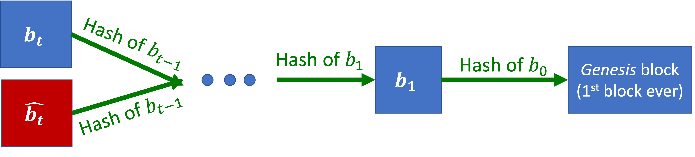
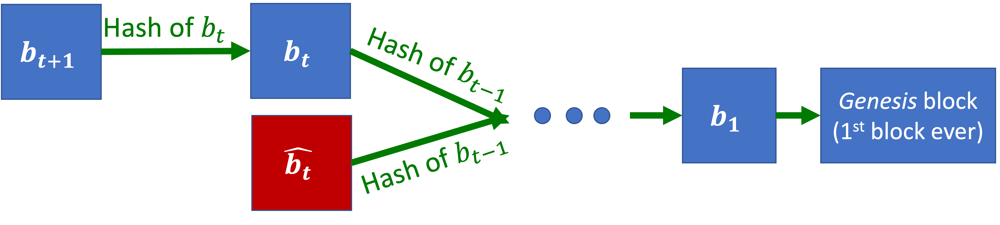
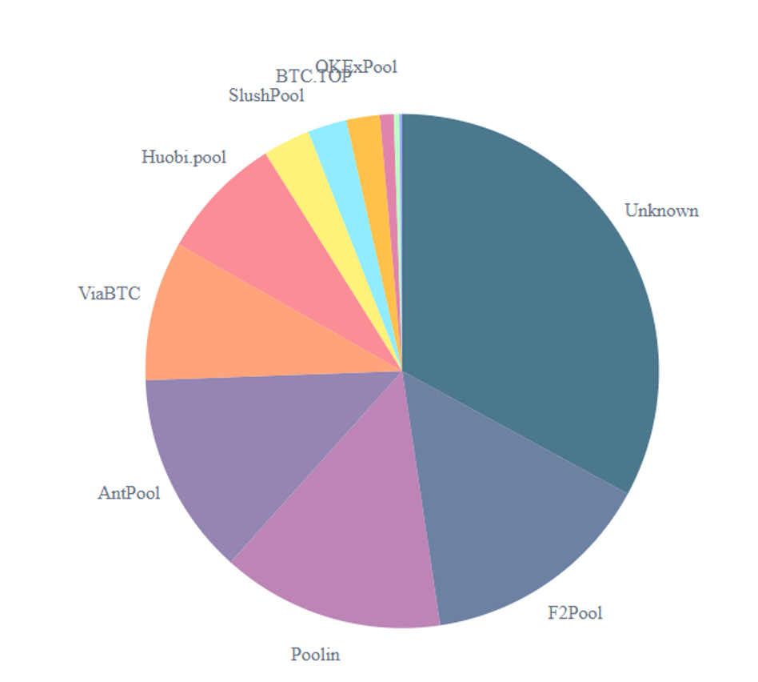
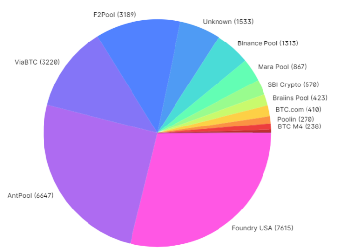
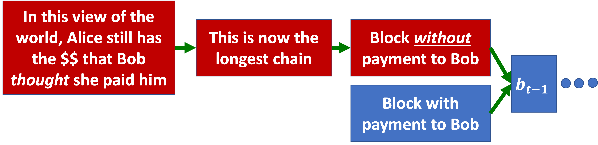
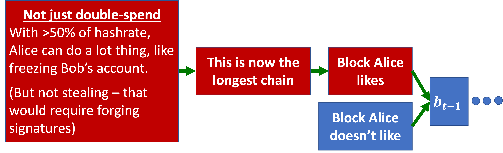
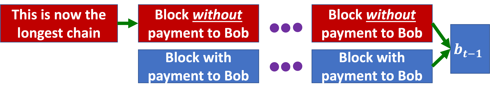

_May 14, 2025_

**Note:** The goal of this lecture is **_not_** to offer investment advice.

## Cryptographic Preliminaries

Today, we will need some very minimal crytography concepts (primitives).

**Definition: Digital Signatures \((public \_ key, secret \_ key)\)**

To show that I agree with statement \(x\), I can \(y \leftarrow sign(x, secret \_ key)\).
Anyone who has my \(public \_ key\) can \(verify(x, y, public \_ key)\) to make sure it was really me who signed \(x\).

(Formally: Whoever signed \(x\) had \(secret \_ key\)).

**Definition: Cryptographic Hash Function \(H\)**

- Given \(a\), it is easy to compute \(H(a) = b\).
- Given \(b\), the fastest way to find \(a\) is by trying every/random inputs.
    - Even if you know some bits of \(a\), the only way to find the missing bits is by trying every combination.
    - If you want something that agrees with \(b\) on the first \(k\) bits, you need \(2k\) tries in expectation. (Aka random is still the fastest way.)

## Decentralized, Permissionless Crypto-Money

Per the lecture slides: "This is intended to be a slow introduction for those of you who have never seen blockchains."

**Example:** Alice pays Bob \(\$1\).

With a wire transfer from her bank account:

- Alice’s bank verifies that she has \(\$1\) in her account.
- After the transfer, the bank \(-\$1\) off her account.

Do we really need a bank for that? In particular, without a bank, how can we be sure that Alice ever had \(\$1\)?

- Alice can tell Bob the entire history of her \(\$1\):
> “\(\$1\) was minted, then paid to \(02847\), who paid it to \(42975\), who paid me”

- Alice can use cryptographic proofs (digital signatures) to show that this story is true.

How can we be sure that Alice hasn’t already spent this \(\$1\)?

**Key point:** It is much easier to prove that something happened than didn’t happen!

So, the way to solve this is that, when Alice spends money, she tells the whole world about it. Next time she spends money, we can check the entire history of payments, and make sure Alice didn’t already spend this money.

This brings us to the concept of a ledger.

**Definition: Ledger**

An ordered history of transactions.

Why do we need a ledger? So that when Alice pays Bob \(\$1\), we can verify that she hasn’t already paid the same \(\$1\) to someone else.

**Desiderata: Decentralized Ledger**

The ideal ledger meets the following requirements:

- **Decentralized:** Not controlled by any single entity (it continues to work even if a bank is hacked, no entity can halt trades, e.g., when Citadel asked Robin Hood to halt trades of GameStop stocks).
- **Consensus:** Either everyone believes that Alice payd Bob, or everyone believes that she didn’t.
- **Permissionless:** Anyone can join (or leave) at any time
    - This is a major source of technical difficulty (for instance due to adversarial participants trying to hack the system).
    - What are the motivations? Extreme decentralization, and permissionless success stories (content on the Internet, i.e. Wikipedia, YouTube, FB).

In a permissionless system, a “majority of the users” is meaningless, because I can always create more copies of myself (i.e. launch a Sybil attack). Some alternatives that are harder to copy in a digital world include:

- Proof-of-Work: “1 CPU = 1 vote”
- Proof-of-Stake: “1 coin = 1 vote”
- Proof-of-Space: “1 bit (storage) = 1 vote”

_**Note:** There is a lot of research going on into how to come up with a "Proof-of-Humanity."_

## The Bitcoin Protocol

**Definition: Blocks**

The ledger is constructed as a chain of blocks (aka a blockchain!).

Each block contains:

- Some (digitally-signed) payments/transactions,
- A (cryptographic) hash of the previous block,
- A nonce (for now, we consider this to be just a padding string–more coming soon).

**Question: If the blockchain is decentralized, who owns the storage?**

Everyone who participates keeps a copy of the blockchain on their own machine, i.e. everyone who participates needs to have enough space to keep track of everything that ever happened in the history of the blockchain.

**Example: Blockchain**

In order to verify the \((Alice \rightarrow Bob, \$1)\) payment in block \(b_t\):

- Verify that Alice signed the payment (using `Alice.public_key`),
- Verify that Alice received this $1 in some previous block,
- Verify that Alice hasn’t spent it.

In order to verify block \(b_t\):

- Verify all the transactions,
- Verify that it correctly hashes block \(b_t - 1\),
- Verify the nonce (see below).

**Definition: Proof-of-Work (PoW)**

A nonce is valid if the hash of the entire new block (including all payments, the hash of previous block, and the nonce) has \(k\) leading zeros.

The probability to find to find a valid nonce is: \(Pr[valid \; nonce] = \frac{Number \; of \; hashes \; tried}{2^k}\).

**Proof-of-Work:** If you find a valid nonce, it proves that you tried a lot of hashes and got lucky.

Miners compete to find the first valid nonce and create (mine) the new block. The winner gets a reward (encoded as a transaction in the new block). \(k\) is adjusted dynamically, so that it takes all the miners in the world about \(10\)
minutes in expectation to find the next valid nonce.

When Alice wants to pay Bob, she sends the signed transaction to all miners.
Then Alice (and Bob) wait for a miner to include this transaction in a new block.

**Question: What does Proof-of-Work actually offer?**

You always want to create a new block because you get a reward (a lot of money) for creating that block. The point of PoW is to show that the miner who wins tried really hard to find the nonce. Why do we want them to try really hard? Because without the PoW, miners could just write a million new blocks.

We want to have a sense of majority, that people agree that we have consensus. Pointing to a block means that we agree with the content of that block, and finding a valid nonce is a puzzle that slows you down.

In the case of a digital world record, a “majority of people” does not make sense (because people can duplicate themselves to have an outsize influence), so instead, we ask for a majority of compute power, i.e. a majority of hash rate. So, when a majority of compute belongs to people who agree with a block, they will point to something that extends that block.

**Question: If it takes 10 minutes to write a new block, and there are a million transactions that need to be verified in that time, how is there enough block to validate them?**

Bitcoin has a severe limitation of the rate of transactions it can process. So, will Bitcoin ever replace credit cards? No, because Visa can process so many millions of transactions per second, while Bitcoin can only have so many bytes per block to include transactions. Other protocols are working really hard to scale a process that can process a lot more transactions.

_**Note:**_

- _The **mempool** is essentially a temporary storage area for unconfirmed transactions on the Bitcoin blockchain network. When a user initiates a cryptocurrency transaction, such as sending bitcoin to another user, the transaction is broadcast to the network and temporarily held in the mempool._
- _To get into the mempool, you need to make sure that a transaction is digitally signed correctly. Maybe Alice wants to pay Bob and wants to pay Charlie, but she has only \(\$1\), so each of those transactions individually is valid, and they can both go into the mempool, but which one is going to go into the block is something that the miner chooses._

**Definition: Fork**

Occasionally, two miners find valid nonces at (essentially) the same time. They create two different blocks, so we no longer have consensus. This is a fork.

**Definition: Longest Chain Rule**

Miners have a protocol for deciding which branch the next block should extend (hash), i.e. \(b_t\) or \(\hat b_t\). Famously, they should try to extend the longest-chain available, i.e. above they should prioritize \(b_{t+1}\) or \(\hat b_t\).

**Question: What happens if two miners find a valid nonce at the same time?**

Branches are called forks, they happen sometimes, potentially due to a network delay (so the two miners do not hear about each other), and they are a headache, because we want to be in consensus, with everyone agreeing.

**Question: How do you recover from a fork?**

By taking the longest chain, this is the longest chain rule, so we take the branch of the fork that has the longest chain.

**Question: What happens to all the transactions in the branch that is not chosen?**

It is like they never happened.

**Question: What if you pay someone, they give you a new Tesla, and then the block goes out?**

Usually, we wait some time, such as 6 blocks in Bitcoin (this is a rule of thumb), which is about an hour, since we create one block every 10 minutes, and then it is very unlikely that someone has a different view of the chain.

**Question: Why are people incentivized the extend the longest chain?**

Because if everyone else is extending the longest chain, they are more likely to agree with you. If you mine a block and it does not extend the longest chain, then you do not get the reward for the miner.

**Question: What if there are two equal length chains?**

The rule says that you should extend whichever one you heard of first. Probably there is a tie for one or two blocks, but after a while, there will be a block that everyone sees and wants to extend.

**Question: What if miners are just wrong and do not verify transactions correctly?**

Then, you won’t extend their block, and they are going to lose a lot of money, so there is some kind of equilibrium where they want to run the same algorithm as everyone else.

**Attack Recap**

The blockchain is secure against the following attacks:

- Steal money attack: Nobody can create a payment from my account without the account’s `secret_key`.
- Double-spend attack: Alice can’t send the same \(\$1\) to both Bob and Charlie because a transaction is added to the ledger only after it is verified with respect to entire history of transactions.
- Sybil attack: No one miner can take control by creating many accounts–a majority of compute power is necessary.

## Issues With Big Miners

When Bitcoin started in the 2000’s, everyone had a computer in their home, so each individual miner could represent a fraction of the total computer of the network. Hence the original utopic idea of increasingly distributing compute power to "the people."

Since then, it has been less and less of that, partially because a lot of computers have moved to the cloud, so it is still decentralized, but most miners are on AWS (if AWS goes down, the blockchain collapses).

In addition, solving hash functions is hard, but we can create special hardware that is really energy efficient to reduce the electricity you need to try all the nonces. So, professional miners makes it less worth it to run on your own computer, because you would not cover your electricity bill.

Some miners also own a power plant, or operate in a country where electricity is cheap.

All of this makes blockchains less and less decentralized. But the really big thing that happened is something called mining pools.

**Definition: Mining Pool**

Professional miners organize together to reduce variance in gains from mining rewards (and also to influence crypto-politics).

A mining pool is like an organization that pools a bunch of miners together.
Since there is only a new block every 10 minutes, you can go years without mining a new block, spending all this money, so it is not a safe investment. Therefore, miners started to get together in pools, and some of those pools are very large.

**Examples: Mining Pools**

According to [blockchain.info/pools](https://www.blockchain.com/explorer/charts/pools):

- In 2021, the biggest four pools represented half of Bitcoin:

- In 2024, the biggest two pools represented half of Bitcoin:

**Example: 51%-Attack**

If Alice has over 51% of all mining resources (hashrate), she can pay Bob, write it in the blockchain, and then fork a new chain suffix that doesn’t include that block.

More generally:

**Example: Double-Spend Attack _without_ 51% of Hashrate**

Imagine that Alice has \(\alpha < 0.5\) of the hashrate. She can still try to do the double-spend attack, and hope she gets lucky:

In practice, it is recommended that Bob waits \(d > 1\) blocks before accepting a payment.

The attack succeeds if Alice mines \(d+1\) blocks without the payment to Bob before anyone else can mine 1 block extending \(d\) blocks with the payment to Bob.

Thus: \(Pr⁡["Attack \; succeeds" ] = \alpha^{(𝒅+𝟏)}\)

## Big Miners in Practice

In 2014, the GHash.io mining pool exceeded 51% of the Bitcoin hashrate. Instead of executing a 51% attack, they encouraged miners to leave the pool. Why? In order to prevent (actually to stop) a drop in the value of Bitcoin.

For smaller coins (with a lower total hashrate), this is a bigger issue. If there is a lower barrier to reach 51% of the hashrate, and attackers do not care about a drop in value of a small coin, they can divert a lot of mining power for a short time period. Allegedly, 51% attacks happened (multiple times) to “Ethereum Classic.”

## Recap

**Blockchain:**

- The **ledger** stores all transactions to prevent **double-spending**.
- It is implemented as a **chain** of **blocks** created by **miners**.
- Miners need **Proof-of-Work** to write blocks to avoid **Sybil attacks**.
- The **ongest chain rule** disambiguates inconsistent blocks (**forks**).

**Big Miners**

- The original, decentralized utopian vision contrasts with the current, concentrated power of mining pools.
- Causes for this change include specialized hardware, electricity costs, cloud computing, and reward variance.
- Mining pools are groups of miners organizing together to pool revenue.
- Attacks only require a large hashrate for some period of time.

**Attacks**

- A **51%-attack** allows double spending, and freezing accounts, but not stealing money.
- An \(\alpha\)-fraction **double-spend** attack succeeds with probability \(\alpha^{k+1}\.

