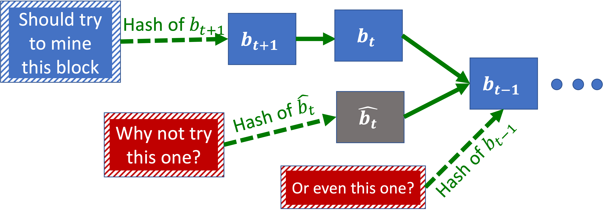
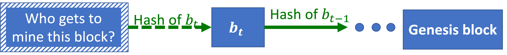
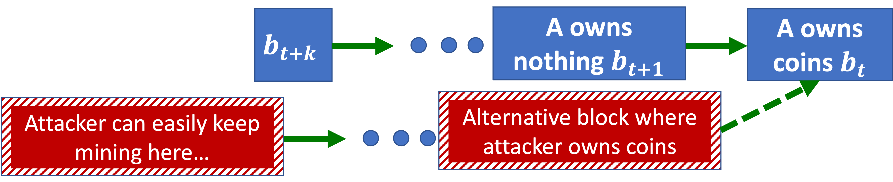
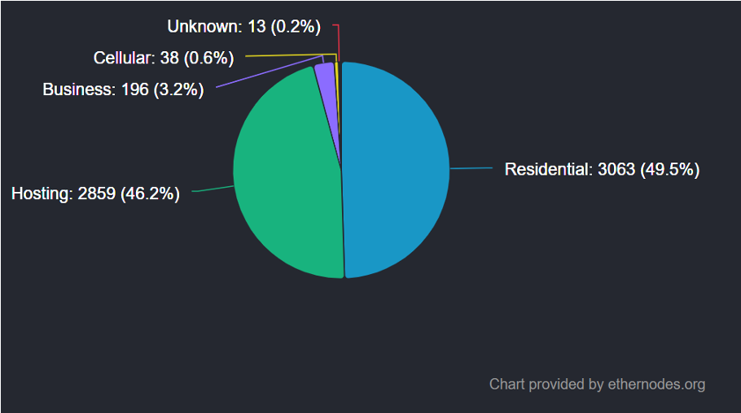
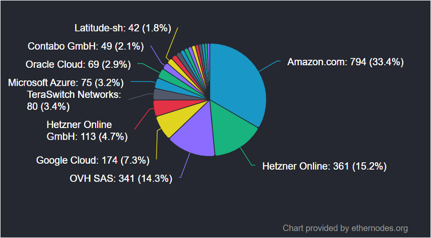

_May 21, 2025_

_**Note:** Throughout this lecture, we talk about “miners” who create new blocks. In Ethereum’s Proof-of-Stake, there are “proposers” and “validators” (there are also “builders”), and neither are called “miners”._

## Context

**Big Miners Recap**

In theory, big miners (e.g. miners whose hash power exceeds 50% or 33%) can have serious incentive issues with the Proof-of-Work protocol, including, notably 51%-attacks.

In practice:

- **Bad News:** It is relatively cheap to attack smaller blockchains by temporarily diverting a large amount of compute resources.
- **Good News:** When the GHash.io mining pool passed 50%, it encouraged miners to leave instead of misusing its power. Why? Because pool leaders and miners were invested in the success of Bitcoin.

Continuing this train of thought:

- With big miners, Proof-of-Work/longest chain rule incentives are fragile.
- So far, everything has been mostly OK because mining pools and miners were invested in the success of Bitcoin.
- In other words, in Proof-of-Work, a miner’s hash power is just a proxy for how much they care about the success of the cryptocurrency.
- This is not a very robust proxy if mining tech can be repurposed.
- Even more so with smaller blockchains.

Thus, why use a proxy? Why not directly sample miners based on their stake in the cryptocurrency?

This is the idea behind the Proof-of-Stake (PoS) protocol.

**Definition: (Vanilla) Proof-of-Stake Protocol**

At each iteration:

1. Sample a random coin.
2. Ask its owner to create the next block.

The intuition behind the (vanilla) Proof-of-Stake protocol is this:

- If someone has a lot of coins, they want the cryptocurrency value to go up.
- If they don’t (have a lot of coins), they are unlikely to be sampled to mine the next block.

The upside is that PoS miners are directly invested in the success of the blockchain:

- PoW miners’ stake are fragile when mining resources can be repurposed.
- PoW miners’ incentives are somewhat misaligned (e.g. probably want higher mining rewards).

The downisdes include:

- PoW is bad for the environment (e.g. a larger carbon footprint than Argentina).
- It is much harder to get PoS right (details coming up).

After many delays, on September 15, 2022, Ethereum switched from PoW to PoS (i.e. “The Merge”). It is harder to switch from PoW to PoS Bitcoin because Bitcoin doesn’t have a “governance” mechanism for changing the protocol.

In addition to the cryptographic preliminaries from [last lecture](https://thibaudclement.github.io/cs269i/lecture-11/), here are some new minimal crytography concepts we need to understand PoS.

**Definition: Pseudo-Random Function**

A pseudo-random function is a deterministic function for which you can share the code, that "looks" like a random function (to computationally bounded algorithms).

**Definition: Verifiable Delay Function \(f\)**

Similar to hash functions, with a verifiable delay function, given \(a\), it is easy to verify that \(f(a) = b\).

Unlike hash functions, parallelizations does **_not_** speed-up finding \(a\).

**Definition: Cryptographic Commitment Scheme**

- Input: a secret \(x\) and a random string \(r\).
- Protocol:
    - Today: Alice sends \(c = Commit(x,r)\).
    - Tomorrow: Alice sends \(x,r\).
- Guarantees:
    - Bob can verify that \(c = Commit(x,r)\).
    - It is computationally intractable to find \(x',r'\) such that \(c = Commit(x',r')\).

Given these cryptographic magic at our disposal, how do we generate randomness in a decentralized, permissionless, strategyproof, consensus protocol?

Here are some naïve ideas and why they fail:

- **Ask \(t\)-th miner to choose \((𝑡+1)\)-th miner “at random:"** This is not strategyproof at all, because a miner can choose themselves.
- **Use a pseudo-random function of entire \(t\)-th block:** This is not strategyproof either, because the \(t\)-th miner can manipulate some aspects of the block (including transactions).
- **Rely on external random events like stock prices or weather:** This is not decentralized, since the final decision needs to be channeled through the stock market/a weather reporter. It is not (really) strategyproof either, because for enough, someone can manipulate the stock market—and even the weather.
- **Leverage existing decentralized coin-flipping protocols from cryptography:** This is not permissionless—but still potentially useful (more coming up).

## Why Is Proof-of-Stake So Hard?

We will now explain subtle but serious problems that have plagued a lot of the early candidates of PoS.

How long should we wait if the coin owner sampled to generate the next block has a network delay?

What if...

- They are rebooting their machine?
- They lost their secret key?
- They are maliciously trying to slow down the network?

One approach is to offer each owner a timeslot when they can submit their next block. If they snooze they lose. Note that this can lead to forks: for instance, Alice submitted a block, but Bob didn’t see it. In turn, this raises the question of how we handle forks in PoS.

**Definition: Nothing-at-Stake**

In PoW, miners are (hopefully) incentivized to only extend the longest chain. However, in PoS, miners can try, for free, to extend every block: this is the idea of Nothing-at-Stake.

**Definition: Predictability Attacks**

One plausible way to generate (pseudo)-randomness is to select the \((t+1)\)-th miner based on a pseudo-random function of \((Genesis \; block, t+1)\).

This generates some **predictability**, because Miners know in advance when it will be their turn to create blocks.

Why is predictability a problem?

- In unpredictable blockchains (e.g. PoW), each small miner has a small probability of launching a successful double-spending attack, so they are unlikely to try to double-spend.
- In predictable blockchains, there is some miner who knows that they can double-spend.

**Definition: Long Range Attacks**

- An attacker buys (almost) _all_ the coins at time \(t\), which is registered on block \(b_t\).
- Then, the attacker sells their coins at time \(t+1\).
- By \(t+k\), the buyer(s) of the coins are satisfied and pay the attacker off chain. At that point, the attacker is no longer "staked" in the value of the coin.
- The attacker can then fork a new chain from \(b_t\): in this view of the world, they still own the coins, so they can mine much faster.

In other words:

- **Nothing-at-Stake:** Miners are incentivized to try to extend every chain, not only the longest chain. This makes it harder to resolve forks.
- **Predictability Attacks:** If we know who the next miner is, it is easier to collude with them/attack them/bribe them/etc.
- **Long Range attackS:** The attacker starts mining from an old block where they owned coins. A variantconsists in buying/hacking old cryptographic keys of people who used to own coins.

These attacks don’t apply to Proof-of-Work: why?

- **Nothing-at-Stake:** Miners use their computational power to hash different nonces–together with the hash of the block they want to point to. They can't try pointing to different blocks with the same compute resources.
- **Predictability Attacks:** Finding who will mine the next block requires finding a nonce that works with that miner’s key, which is at least as hard as mining the next block itself. In fact, it is even harder because we don’t know which nonces miners will try. Hence PoW blocks are very hard to predict.
- **Long Range attackS:** Rewriting the history of the blockchain doesn’t change how much compute resources a miner actually has/had.

## Approaches to Proof-of-Stake

In this section, the intention is to offer a taste of some high-level ideas. This is not a recipe for PoS blockchains, because functioning PoS protocols tend to use a complicated combination of these.

**Definition: Slashing**

Slashing means “slashing away” coins from miners who misbehave, as a form of fine.

**Example:** We may consider mitigating the Nothing-at-Stake problem by slashing miners who produce blocks pointing to conflicting blocks.

Some caveats with slashing include:

- We need other miners to vote on who is misbehaving.
- Apparent misbehaviors could be caused by network issues—maybe that is acceptable, since network issues also cause miners to lose blocks in PoW.
- Miners need to place slash-able coins in escrow.

**Definition: RANDAO**

An over-simplified RANDAO protocol may look like this:

- Alice and Bob each select a secret random bit, and  send each other _cryptographic commitments_ of these bits.
- Alice and Bob send the actual bits and verify them against the commitment \(Output = XOR(Alice’s \; bit, Bob’s \; bit)\).

Note that, for any fixed Alice’s bit, if Bob’s bit is random, the output is random. This very efficient, because it requires only 1 truly random party. However, a challenge is that, when Bob sees Alice’s bit, he can decide to abort, which can bias the output.

**Definition: Verifiable Delay Functions (VDF)**

In a Verifiable Delay Function:

- The “Delay” requires a long time to compute and parallelization doesn’t help.
- “Verifiable” means that it is easy to verify that the function was computed correctly.

**Examples:**

1. Let's say that we choose tomorrow’s miners using a VDF of today’s closing stock prices. Because of the delay, we don’t know how to manipulate the stock prices until trade closes.

2. We may combine a VDF with a RANDAO: We may require that Bob sends his true random bit before he has time to compute the VDF and decide if he should abort.

**Definition: Byzantine Coin-Flipping Protocols**

Conisder the Byzantine Generals Problem:

- \(n\) Byzantine generals try to coordinate an attack on a defended city.
- \(t\) of the generals are traitors and send adversarially confusing messages.
- Goal: \(n-t\) generals need to agree on the timing of the attack. Ideally, we sample the time at random so the enemy can’t prepare to defend.

In the context of a PoS protocol, we may apply a similar idea to select a random coin instead of a random attack time. A lot of research has been done in this direction since the early 80’s.

Byzantine Fault-Tolerant (BFT) protocols can reach consensus on random bits. They require a fraction of the parties to honestly participate in the protocol, such as \(\frac{2}{3}\).

- By definition, BFT protocols are _not_ permissionless (since they require a “\(\frac{2}{3}\)-fraction of parties” to participate honestly). Note that, in some sense, PoS is not really permissionless anyway (given that a coin is a form of permission).
- This type of interactive protocols may be challenging to scale:
    - We may randomly select a small committee (“sortition”) of active Byzantine generals: The committee then selects the next committee to replace it using a Byzantine protocol.
    - This requires participants to continuously be online: We need to slash them if they go offline for too long.

Important consideration: When can we truly consider a block **final**? This brings us to the notion of "finality" and "checkpoints."

**Definition: Subjectivity**

In pure permissionless, longest chain rule-based protocols, we are never 100% sure that the chain we see is really the longest one out there.

Perhaps it is acceptable to wait \(1\) hour to ensure a block is final before selling a Tesla for Bitcoins. However, it may not be acceptable to wait \(1\) hour to buy pizzas with Bitcoins (there may be a long line of Pizza-hungry customers).

If \(\frac{2}{3}\) of holders of coins agree (using a BFT protocol) on a block, we may consider it final—and, now, we can sell pizza on the blockchain again!

Here is how we may mitigate long-range attacks using finality:

- We set up parameters so that an attacker selling their stake (“unstaking”) takes longer than the gap between checkpoints. (Currently in Ethereum, unstaking takes a few days, sometimes longer).
- We treat finalized checkpoints as “new genesis blocks”–and we ignore earlier forks.

## Last Few Thoughts…

**Definition: Staking**

Although exact details vary, staking usually involves the following:

- Network participants lock a “stake” (\(X\) cryptocurrency coins).
- They are chosen to create the next block with a probability proportional to their stake \(X\).
- They receive fees for each time they create a block.

**What is staking good for?**

1. Aligning incentives of miners (i.e. proposers and validators) with cryptocurrency.
2. Preventing Sybil attacks: A participant can make many clones of their computer program, but they can’t change the total amount of money those clones have.
3. Slashing: If miners misbehave, we can “slash” their stake, i.e. give them a fine.
4. Raising money for a blockchain: Staking may be considered equivalent to buying stocks (this is a hot legal question).

On a separate note, “mining” for Proof-of-Stake is computationally cheap, but requires robust servers with a reliable internet connection. If PoS occures mainly on the cloud, is it still “decentralized”?

Alternatively, participants may consider **stake delegation**: Instead of running their own miner on AWS, they may lend someone their coins and let them mine for them:

- Coin holders receive rewards proportional to the number of coins they (the _delegee_ takes a small fee).
- This is convenient, as this does not require a CS degree from Stanford.
- This is liquid, since coin holders can stake small amounts and withdraw anytime.

Some questions to ponder include:

- What are the incentives of delegee?
- Do they care if a coin holder get slashed?
- Do they care if the coin value drops?

## Recap

**Proof-of-Stake Recap**

**_Protocol_**

At each iteration:

1. Sample a random coin.
2. Ask its owner to create the next block.

**_PoS vs. PoW_**

- Upsides:
    - PoS miners are directly invested in the success of the blockchain
    - PoW miners’ stake are fragile when mining resources can be repurposed, and PoW miners’ incentives are somewhat misaligned (e.g. probably want higher mining rewards).

- Downisdes:
    - PoW is bad for the environment (e.g. a larger carbon footprint than Argentina).
    - It is much harder to get PoS right (details coming up).

**_PoS Attacks_**

- **Nothing-at-Stake:** Miners are incentivized to try to extend every chain, not only the longest chain. This makes it harder to resolve forks.
- **Predictability Attacks:** If we know who the next miner is, it is easier to collude with them/attack them/bribe them/etc.
- **Long Range attackS:** The attacker starts mining from an old block where they owned coins. A variantconsists in buying/hacking old cryptographic keys of people who used to own coins.

**_PoS Techniques_**

- **Slashing**: Taking away coins from miners who misbehave (Incentivize following the protocol, staying online, etc.).
- **RANDAO**: Protocol for generating randomness together (Let’s have a coin flipping party?).
- **Verifiable Delay Function (VDF)**: Slow even with parallelization (Mitigate manipulating sources of randomness).
- **Byzantine Protocols**: \(\frac{2}{3}\) of miners (weighted by stake) agree on the new block (Then we are really sure about this block–we can call it “finalized”).
- **Finalized blocks** / **Checkpoints**: Mitigate long-range attacks.

