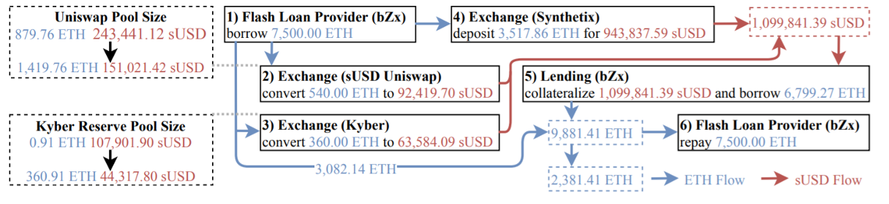
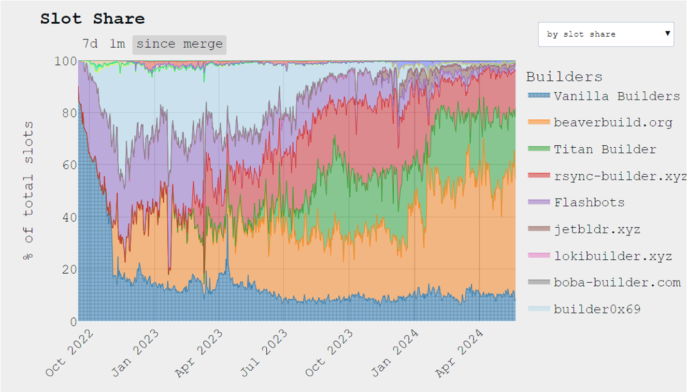
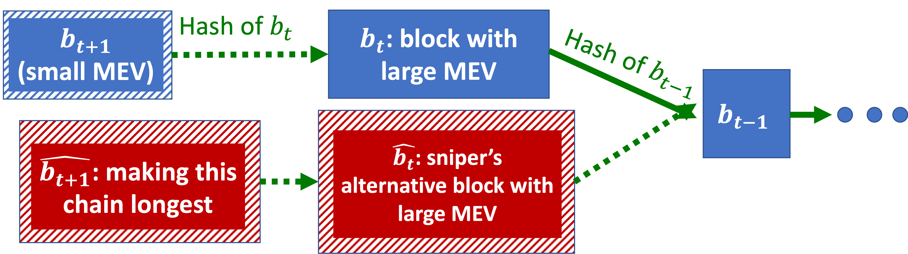
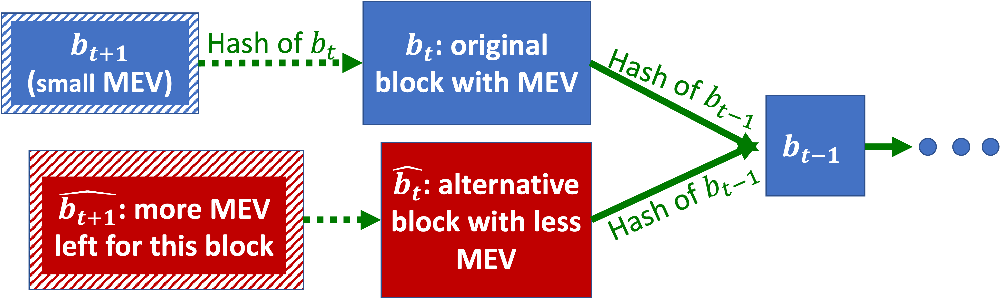
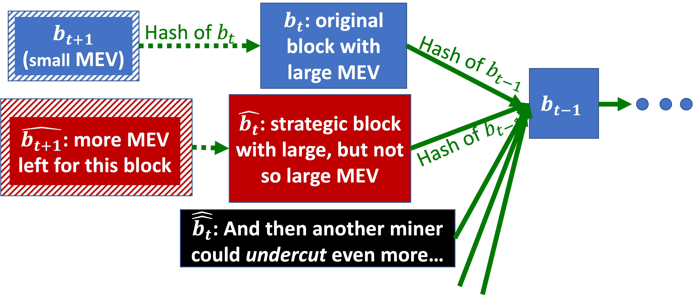
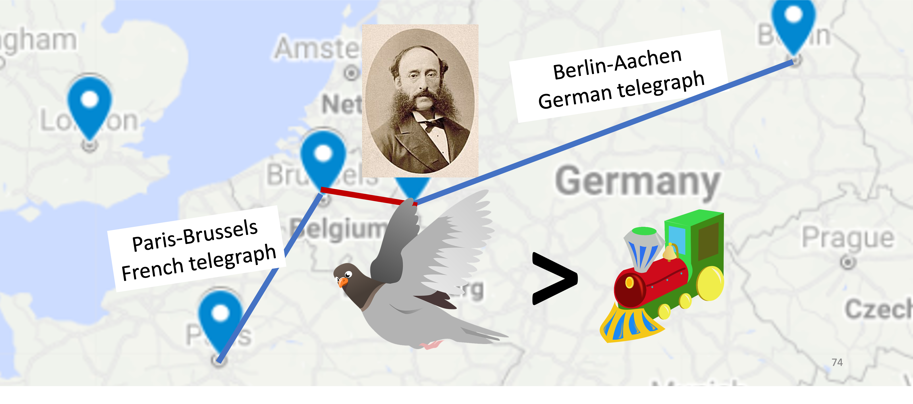
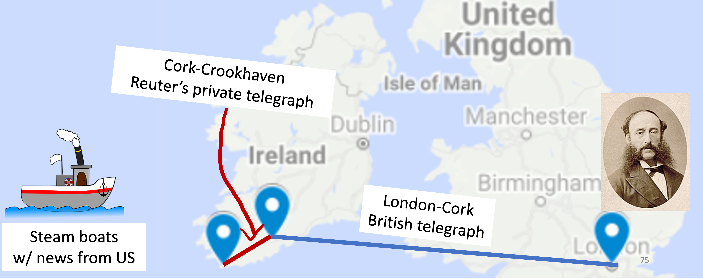
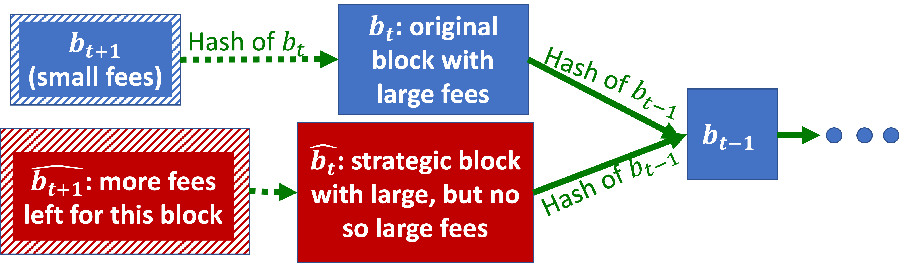

_May 26, 2025_

**Blockchain Recap (So Far)**

Main goal: Maintain a ledger (i.e. a history of events that we all/mostly agree on) that is:

- Decentralized: Messages are delayed/dropped (no uniform time)
- Permissionless: Users join, leave, come back at any time

Risks of Sybil attacks require alternatives to “majority”:

- Vanilla Proof-of-Stake (PoS) protocol: At each iteration:
    - (1) Sample a random coin;
    - (2) Ask its owner to create the next block.
- Proof-of-Work (PoW): At each iteration:
    - (1) Miners compete to invert a hash function;
    - (2) First miner to succeed creates new block

**Market Failures Recap**

A **market failure** occurs when a market fails to converge to an optimal outcome.

We have seen five types of market failures:

1. Externalities (side effects on other parties)
2. Transaction costs
3. Thinness (flow of buyers/sellers too small)
4. Timing issues
5. Information asymmetry

**No-Trade Theorems Recap**

**Public information no-trade theorem:** If the market already aggregated all available public information, there is no point in trading.

**Public+Private information no-trade theorem:** Alice will only want to buy at current price if she has private information:

- If Alice wants to buy, she probably has private information.
- Bob doesn’t want to sell Alice.
- Even if Alice learns private information, she can’t use it.

## Flashboys 1.0

**Example: The High-Frequency Trading (HFT) Speed Arms Race**

In 2010, Spread Networks opened new $300M fiber optics from NY to Chicago. Why? Because it is (almost) a straight line, which brings latency down from 16ms to 13ms.

Who needs 3ms saving in latency? In comparison, a blink of the eye is less than 100ms. Answer: Low latency High Frequency Traders (HFT) race to beat each other.

There was a joke at the time saying that Spread Networks's fiber optics would soon be obsolete, when someone digs a tunnel, thus “avoiding the pesky curvature of the earth.”

Ironically, in 2011, latency time down to 10ms using microwaves! It turns out that air refracts slightly better than glass.

**Is Spread Networks a market failure?**

A hypothesis may be that investing \(\$300\)M for saving 3ms (for only one year) represents social waste, because someone is paying this \(\$300\)M, yet no one is much happier.

Maybe Spread Networks made so much money that they were happy, but they would have been happier to take the same money from HFTs without paying \(\$300\)M for new fiber optics.

Here are some externalities to consider:

- When the first HFT buys bandwidth from Spread Networks, they’re happy because they expect to make a lot of money by being faster than their competitors. Spread Networks is also happy because they sold bandwidth.
- However, the other HFTs are sad because they’re now slower than 1st HFT.
- We reach a market equilibrium when all HFTs buy bandwidth.
- As a result, none of them are happy.
- The total negative externality is greater than or equal to \(\$300\)M.

**Should we consider an even larger market failure?**

HFTs make a lot more than $300M a year. Yet, they just buy and sell stocks (securities) and make money out of it! Does anyone else benefit from having them?

## A Stock Market Model

We will slowly build up an increasingly elaborate model. Yet, even at the end of this lecture, we will still abstract out many important aspects.

Let's model a market for fungible (i.e. interchangeable) shares of one company.

Main model points:

- Stock exchange rules: continuous limit order book.
- Players:
    - Naïve investors
    - Liquidity providers
    - Snipers
- Stock “value” (and how it changes)

**Continuous Limit Order Book Recap**

Definitions:

- Bid: highest buy order
- Ask: lowest sell order

Rules:

- Buy/sell orders can arrive at any time.
- Trading happens whenever a new buy order is greater than the ask (or a new sell order less than the bid).

Two kinds of orders:

- Marketable orders already have a match in the book.
- Resting (non-marketable) orders are waiting to be matched.

**Definition: Naïve Investors**

Homer just received his paycheck. He wants to buy 1 stock to save for retirement.
Abe is retired. He wants to sell 1 stock to pay for health insurance.
Homer can buy 1 stock from Abe!

Problem (Market thinness): Homer gets his paycheck on the 10th, while Abe’s insurance fees due on the 1st.

we need liquidity providers!

_**Note:** No-trade theorems don’t apply with naïve investors (Investing for retirement doesn’t make sense for prediction markets)._

**Liquidity Providers Recap**

Liquidity providers buy low now and sell high later (or: sell high now and buy low later).

Liquidity providers leave bid/ask resting orders on the order book.

Naïve investors can buy/sell at any time by trading with liquidity providers. When they buy+sell, liquidity providers earn the spread. That means that the naïve investors lose this spread. Spread is the part of naïve investors transaction costs.

**Definition: Stock Value**

The “true” value of the stock represents investors’ aggregate belief of how much it would pay in the future, e.g., how much dividends it will ever pay, discounting for risk and time.

At equilibrium, the true value is between the bid and the ask. Otherwise, investors could buy/sell more stocks.

Various events can change the stock’s value (i.e. change investors’ aggregate belief):

1. **Correlated stocks (securities):**
    - If someone buys gold in Chicago, the price of gold in NYC goes up.
    - ES and SPY are two ways to invest in S&P 500.
2. **The 2013 Fed Robbery:** The Federal Reserve frequently announces changes in monetary policy. On 2013, September 18th, 2:00:00 PM, when the Fed made an exciting announcement, more than \(\$5\) billion traded within 100 milliseconds. This was controversial, as it means that markets in NYC and Chicago reacted faster than speed of light.
3. **Twitter (now X):** The timing of tweets is much less regulated than Fed Reserve's announcements. For instance, the stock market moved when Trump tweeted "covfefe" in 2017. Are NLP models robust enough to make this kind of call in a few microseconds?
4. **Reddit:** The timing of posts is also much less regulated than Fed Reserve's announcements, as suggested by the impact of `r/wallstreetbets` on the GameStop stock price in 2021.
5. **Hacks:** In 2024, The @SECGov X account was compromised, and an unauthorized tweet was posted, falsely announing that the SEC had approved the listing and trading of spot Bitcoin exchange-traded products, which moved the price of Bitcoin.

**Definition: Snipers**

Snipers wait for a change in a stock value and rush to trade with liquidity providers’ resting orders.

When a stock value changes, liquidity providers rush to cancel (or update) their resting orders before getting sniped.

Being slightly faster than a competitor is worth a lot of money. Many races are won by a margin of less than 10 μs.

Luck also helps: sometimes, a slower order is accepted due to randomness in the stock exchange’s computer!

Putting it all together:

- Naïve investors rely on trading with resting orders by liquidity providers (especially in thin markets).
- When a stock value changes, snipers and liquidity providers race to update/snipe resting orders. This is risky and costly for liquidity providers.
- Liquidity providers increase the spread to make up for sniping risk.
- An increased spread means increased transaction costs for naïve investors.

## Fixes for These Market Failures?

Can the following speed bumps resolve speed arm races and reduce risk for liquidity providers?

Naïve attempts do not work:

- Symmetric speed bumps (i.e. all orders get delayed by the same amount):
    - Don’t solve speed arm races.
    - Don’t solve sniping risk for liquidity providers.
- Random speed bumps (i.e. each order gets delayed by some random amount):
    - Mostly solve speed arm races (when the random delay is greater than the speed difference).
    - Make sniping risk worse, as one liquidity provider may compete with many snipe attempts.

Better proposals exist:

- Sniper-only speed bumps (i.e. only delay sniping orders, which is technically a speed bonus to cancelling resting orders):
    - Give liquidity providers time to react to value-changing events.
    - Solve speed arm races.
    - Solve liquidity providers’ sniping risk.
        - Reduce their expected cost.
        - Liquidity providers can afford a smaller spread.
        - Reduce transaction costs for naïve investors.
- Frequent batch auctions:
    - We batch orders for some short interval (e.g. 100 ms).
    - For each batch, we find the market clearing price.
    - Advantage: everyone has time to react to value-changing-events.
    - Orders are prioritized by price instead of arrival time.    

## Flashboys 2.0

Things get even wackier on the blockchain.

**Definition: Smart Contracts**

So far we talked about blockchains that record payments (“transactions”).Ethereum and other blockchains (but not Bitcoin) support smart contracts:

- Smart: Can run complex computer code (ideally Turing-complete).
- Contract: Both parties agree to terms (and sign).

**Example: Loan**

1. Alice pays Bob \(\$1\).
2. 300 blocks from now, Bob will pay Alice \(\$1.1\).

**Example: Collateralized Loan**

This is more realistic:

1. Alice pays Bob \(\$1\) and Bob sends the contract a collateral.
2. 300 blocks from now, if Bob hasn’t paid yet, Alice can take the collateral.

In practice, some concreate instances of smart contracts include:

- Non-Fungible Tokens (NFTs).
- Shareholders votes: Once a month, every stock owner can cast a vote to decide on the next dividend.
- Gambling.
- Games (e.g., CryptoKitties).

In the collateralized loan example, it is crucial that "Alice pays Bob \(\$1\)" and "Bob sends the contract a collateral" happen simultaneously. Otherwise, Bob could abort after receiving the money. These are atomic transactions.

**Definition: Atomic Transactions**

Either all steps of the transaction are executed successfully, or all steps are cancelled.

**Example: Flash Loan**

No collateral is needed when:

1. Alice pays Bob \(\$1\).
2. Bob pays Alice \(\$1.1\) back in the same block.

**Definition: Decentralized Finance (DeFi)**:

- Supports trading of cryptocurrencies, stocks, contracts, derivatives, etc.
- Is a popular application of smart contracts

Some variants, such as limit order book (IDEX, Paradex, Etherdelta, ...) and Automated market makers (Uniswap, Bancor) can be automated as decentralized smart contracts.

**Punchline:** Extreme sniping opportunities exist in decentralized finance.

## Sniping++ on DeFi

**Definition: Arbitrage**:

Simultaneously buying low in market L and selling high on market H.

In centralized finance (e.g. NYSE), the arbitrageur takes some risk: if they buy low first, the price on market H may drop by the time they sell.

In contrast, DeFi allows for risk-free atomic arbitrage by bundling "buy low on market L" and "sell high on market H" into a single atomic transaction. The transaction will execute only if both transactions go through!

Additional arbitrage opportunities in DeFi include:

- Cryptocurrency prices are highly volatile (some markets update slower/faster).
- More information is broadcast to everyone (including arbitrageur): the full code and state of smart contract automated market makers is available, which makes it easier to discover exploitable bugs.
- It is easy to amplify arbitrage using huge collateral-free flash loans.

**(Extreme) Example: bZx attacks**:

3 times in 2020, hackers/arbitrageurs found bugs in DeFi lending platform bZx.
They stole about \(\$350K\), \(\$600K\), and \(\$8M\) (the last sum has allegedly been recovered by bZx).

In short: bZx used the wrong ETH-sUSD price when computing the collateral, so the borrower was better off just walking away with the borrowed ETH. 

Notice that this complex chain of trades was all executed in a single block because the borrower had to return the flash loan!

**Definition: Front-Running**:

Alice sees that Bob is on his way to buy a lot of shares of Stock XYZ. This transaction will increase the price of XYZ. So, Alice runs in front of Bob to by the available shares before the price increase (or, even better: Alice sells XYZ to Bob at a higher price).

Front-running is generally illegal in centralized finance, but in DeFi, everyone sees Bob’s order when it’s broadcast to miners.

An extreme form of front-running is when miners are also traders:

- Suppose an arbitrageur finds a highly profitable risk-free trade. The arbitrageur broadcasts this transaction to miners. Then a miner can execute same trade from their own account instead.
- The miner still includes the arbitrageur’s transaction in their block (for a high fee), but after the miner’s transaction. The miner’s transaction uses up the liquidity on the profitable trade.

## Miners’ Extractable Value (MEV)

In centralized finance, speed arms race to get to the top of the order book. In DeFi, arbitrageurs compete to have the highest transaction fee to get to the top of the next block. We run auctions for “gas” (space in block), because transaction ordering influences MEV.

**Punchline:** Miners can extract a lot of value.

**Miners’ Rewards Structure**:

- Miners (PoW or PoS) can receive a flat reward for each block they “mine”.
- Miners also earn custom tips (“transaction fees”), or more generally MEV

Originally, block rewards were greater than MEV, but important trends are changing this:

- Block rewards are decreasing:
    - On Bitcoin: built-in block rewards are halving every ~4 years
    - On Ethereum: historically, block rewards have generally been decreasing (more complicated)
- MEV is increasing: 
    - There is more competition to be included in limited block space
    - More sophisticated DeFi means more sophisticated front running, etc.
    - Flashbots, etc: special networks that auction space in MEV-optimized blocks

In September 2020, fees surpaased block rewards on Ethereum for the first time. Due to transaction fees and MEV, not all blocks are the same.

## Fee sniping, selfish tie-breaking, and undercutting

**Definition: Fee-Sniping Attack**

Miners prefer to mine an alternative \(\widehat{b_t}\) that includes the large MEV

With \(\alpha\)-fraction of hash power, we have:

\[
Pr[2 \; blocks \; to \; make \; new \; chain \; longest] = \alpha^2.
\]

The attack pays off whenever:

\[
  \alpha^2 \cdot "largeFees" > \alpha \cdot"smallFees"
\]

The success probability is even higher if other miners try to attack instead of extending \(b_t\).

**Definition: Selfish Tie-Breaking**

Given equal-length chains (\(b_t\), \(\widehat{b_t}\)):

- In the default blockchain protocol, we tie-break in favor of the block we saw first.
- However, strategic miners favor the block that leaves more MEV on the table. Note: this deviation is strategic even for small miners!

**Definition: Undercutting**

Undercutting is essentially fee sniping + selfish tie-breaking:

- The \(\widehat{b_t}\) block steals most large MEV, but leaves some for extension \(\widehat{b_{t+1}}\).
- Miners use selfish tie-breaking to incent other miners to join their fee sniping attack.

Some ideas that have been considered to mitigate these issues:

- Transaction fees distributed between the miners of the next \(k\) blocks (e.g. \(k=100\)).
- Capped transaction fees.
- “Burn” transaction fees (instead of allocating them to miners).

**What is a fundamental problem that all these proposed mitigation have?**

Users with high-priority transactions can incent miners with side payments (or miners directly extract MEV).

## “Flashboys 0.0”

**Example: 19th Century Speed Arms Race**

- 1816: Israel Beer Josaphat born in Kassel (present Germany). 
- 1830’s: He moves to Goettingen, hangs out with Gauss who was inventing the telegraph.
- 1845: He converts to Christianity (Protesant), changes name to Paul Julius Reuter.
- 1850: He uses Aachen-Brussels pigeon carrier to communicate stock prices between Berlin and Paris (pigeons were faster than trains).
- 1851: A Aachen-Brussels telegraph line is built, so Reuter moves to London.

- 1863: Reuter constructs a private telegraph link from Cork to Crookhaven (current population: 59). Why? Because it is the first place to catch news traveling from new world by steam boats.
- 1865: Reuter is the first in Europe to learn about Lincoln’s assassination. His contacts in the stock markets knew about it hours before anyone else!

Considering Reuters vs Spread Networks:

- The Reuters News Agency quickly became a leading source for news to the general public (in 1865, there were “only” 12 days of latency to learn about Lincoln’s assassination).
- Will Spread Networks cables eventually find uses outside financial markets speed race?

## Recap

**High-Frequency Trading Recap**

- Naïve investors rely on trading with resting orders by liquidity providers (especially in thin markets).
- When value changes, snipers and liquidity providers race to update/snipe resting orders: this is risky and costly for liquidity providers.
- Liquidity providers increase spread to make up for sniping risk.
- Increased spread means increased transaction cost for naïve investors.

**High-Frequency Trading Recap**

- Naïve investors rely on trading with resting orders by liquidity providers (especially in thin markets).
- When value changes, snipers and liquidity providers race to update/snipe resting orders: this is risky and costly for liquidity providers.
- Liquidity providers increase spread to make up for sniping risk.
- Increased spread means increased transaction cost for naïve investors.

Interventions include:

- Naïve (symmetric/random) speed bumps don’t resolve sniping cost.
- Sound proposals
    - Sniper-only speed bumps (fairly specific to fungible good market design).
    - Frequent batch auctions (batching is a generally useful design principle).

**Smart Contracts & DeFi Recap**

- Smart Contracts:

    - Smart: Can run complex computer code (ideally Turing-complete).
    - Contract: Both parties agree to terms (and sign).
    - Example: Implement an automated market maker or limit order book as a smart contract in DeFi.

- Atomic transaction:

    - Either all steps of the transaction are executed successfully, or all steps are cancelled.
    - Example: In a flash loan, Alice pays Bob \(\$1\), Bob will pay Alice \(\$1.1\) in the same block, with no collateral needed.

**Miners’ Opportunities in DeFi Recap**

- Arbitrage: Simultaneously buying low in market L and selling high on market H.
- Even more arbitrage opportunities with DeFi:
    - Risk-free atomic arbitrage
    - Highly volatile cryptocurrencies
    - Explicit information broadcast to arbitrageur
    - Huge collateral-free flash loans available
- Front-running: Alice sees that Bob is on his way to buy a lot of shares of Stock XYZ. Alice runs in front of Bob to by the available shares before the price increase.
- Competition to get to top of the block vs speed arms race. Miners enjoy increasing transaction fees, or steal transactions for themselves.
- Transaction fees distort miners’ incentives:
    - Fee-sniping: create alternative block \(\widehat{b_t}\) to steal high-fee transactions from \(b_t\).
    - Undercutting: The \(\widehat{b_t}\) block steals most large MEV, but leaves some for extension \(\widehat{b_{t+1}}\). Miners use selfish tie-breaking to incent other miners to join their fee sniping attack.

