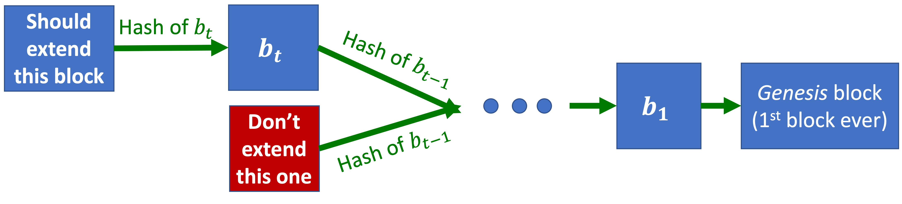
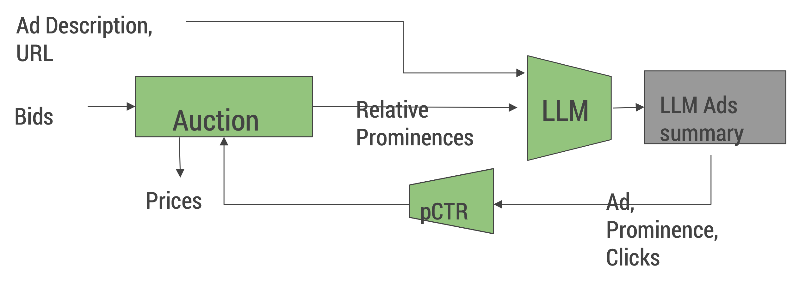

_June 4, 2025_

## Nostalgic Review of CS269i

**Course Goals Recap**

- Learn to think about incentives
    - Frameworks and language: mechanisms, strategyproof, equilibria, …
    - Practice, practice, practice: see/understand/discuss a lot of examples
    - Practice, practice, practice: ask good questions!

- Exposure to great ideas from economic theory: Stable matching, welfare theorem, proper scoring rules, VCG auction, Proof-of-Work

- Theory-vs-applications case studies
    - How can theory inform practice? 
    - What are the gaps that you should think about before applying theory?   

### Frameworks and language: mechanisms, strategyproof, equilibria, …

**Definition: Mechanism**

Soliciting inputs, running an algorithm, and taking actions.

>"A procedure for making a decision or taking an action, as a function of what people want (i.e., of participants’ preferences).”

**Key point:** What (agents believe) we do with agents’ inputs affects these inputs.

**Example: Mechanism**

- Soliciting inputs: Ranking of dorms.
- Running an algorithm: For each student in random order, find favorite available dorm.
- Taking actions: Assign rooms.

We’ve seen a LOT of mechanisms since:

- Matching mechanisms (Lectures 1-2): **The Draw**, Deferred Acceptance.
- Auctions (Lecture 8 + guest lecture!): 1st price, **2nd price**, all-pay, GSP, **VCG**.
- Crowdsourcing (Lectures 9+10): **Proper scoring rules**, prediction markets.
- Fair division (Lecture 14): I-cut-you-choose, **Dominant Resource Fairness (DRF)**.

We analyzed them: the ones in **bold** above are strategyproof, the others are not.

**What happens when there’s no dominant strategy?**

<strong>Definition: External Regret</strong>

External Regret = \( \underset{i}{\max} \underset{t}{\sum} r_{i,t} - \underset{t}{\sum} r_{ALG(t),t} \)

<strong>Definition: Swap-Regret (Internal Regret)</strong>

Swap-Regret = \( \underset{\Phi : [n] \to [n]}{\max} \underset{t}{\sum} (r_{\Phi(ALG(t)),t} - r_{ALG(t),t}) \) where \(\Phi\) maps each action to another action.

<strong>Algorithm: Follow The Regularized Leader (FTRL)</strong>

On day \(t\), choose distribution \(x\) maximizing \(\underset{t}{\sum} (r_{x,t} - \frac{1}{\eta}\varphi(x))\) where:

- \(r_{x,t}\) provides the historical performance,
- \(\eta\) balances randomness and history,
- \(\varphi\) is the regularizer, which penalizes unbalanced distributions.

<strong>Definition: Nash Equilibrium</strong>

Each player samples independently from distribution; nobody has incentive to deviate from distribution.

<strong>Definition: Correlated Equilibrium</strong>

A correlated distribution of actions that every player would rather follow.

<strong>Definition: Stackelberg Equilibrium</strong>

1. Follower’s strategy is optimal given Leader’s strategy
2. Leader’s commitment is optimal

<strong>Definition: Bayesian Nash Equilibrium</strong>

- \((Mixed = randomized)\) strategy for each Alice.
- \((Mixed = randomized)\) strategy for each Bob.

Alice and Bob drawn at random.

**Equilibrium:** For each Alice, strategy is optimal in expectation over Bobs + their strategies.

**Game Theory in repeated games**

<strong>Definition: Tit-for-Tat Strategy</strong>

- In Stage 1, upload.
- In Stage \(i\), do whatever Marv did in Stage \(i-1\).

<strong>Definition: Grim Trigger Strategy</strong>

- If there was ever a time when Marv didn’t upload, don’t upload.
- Otherwise, upload.

### Stable matching, welfare theorem, proper scoring rules, VCG auction, Proof-of-Work

<strong>Definition: Blocking Pair</strong>

Given a match \(M\), the pair (doctor \(i\), hospital \(j\)) forms a blocking pair if they prefer each other to their current assignments in \(M\).

<strong>Definition: Stable Matching</strong>

A matching \(M\) is stable if there are no blocking pairs. Equivalently, for every unmatched pair \((i,j)\), either:

- Doctor \(i\) prefers Hospital \(M(i)\) over Hospital \(j\), or;
- Hospital \(j\) prefers Doctor \(M(j)\) over Doctor \(i\).

<strong>Theorem: First Welfare Theorem</strong>

If \((p,M)\) is a competitive equilibrium, then \(M\) is a matching that maximizes social welfare:

\[
\forall M' \; \underset{i}{\sum} v_{i,M(i)} \geq \underset{i}{\sum} v_{i,M'(i)}
\]

<strong>Definition: Vickrey-Clarke-Groves (VCG) Auction</strong>

1. Solicit bidders’ valuation functions 
2. Find welfare-maximizing allocation (assuming bids are truthful): \(X\).
2. Same as \(\#2\), but without bidder \(i\): \(X^{-i}\).
3. \(i\) pays \(i\)’s externality (negated): \(\displaystyle p_i (X) = \sum_{k \neq i} b_k (X^{-i}) - b_k(X)\).

<strong>Theorem:</strong> The VCG auction is truthful.

<strong>Proof:</strong>

Bidder \(i\)’s goal is to maximize:

\(\displaystyle v_i(X) - p_i(X) = v_i(X) + \sum_{k \neq i} b_k(X) - \sum_{k \neq i}b_k (X^{-i})\)

Note that \(\sum_{k \neq i}b_k (X^{-i})\) is not in \(i\)’s control.

The auction chooses the \(X\) that maximizes welfare, i.e. \(\displaystyle b_i(X) + \sum_{k \neq i} b_k(X)\).

**Definition: Proof-of-Work (PoW)**

**Proof-of-Work:** If you find a valid nonce, it proves that you tried a lot of hashes and got lucky.

Miners compete to find the first valid nonce and create (mine) the new block. The winner gets a reward (encoded as a transaction in the new block).

Miners should try to extend the longest-chain available, i.e. they should prioritize \(b_{t+1}\) or \(\hat b_t\).

**Definition: Vanilla Proof-of-Stake (PoS) protocol**

At each iteration:

1. Sample a random coin.
2. Ask its owner to create the next block.

PoS miners are directly invested in success of blockchain:

- PoW miners’ stake fragile when mining tech can be repurposed.
- PoW miners’ incentives somewhat misaligned (e.g. probably want higher mining rewards).

PoW is bad for the environment (larger carbon footprint than Argentina), but it’s much harder to get PoS right.

### Exposure to great ideas from economic theory

Econ Nobel prizes we covered in CS269i

- Deferred Acceptance algorithm for Stable Matching (Lecture 2).
- Nash equilibrium + Correlated equilibrium (2 prizes in Lecture 4).
- Coasian bargaining – auction off public goods (Lecture 5)—This is one way for coping with Externalities.
- Market for Lemons / information asymmetry (Lecture 5)
    - At equilibrium, sellers of good cars may leave the market (only lemons left).
    - Implications for grades, insurance, clickbaits.
- Myerson’s revenue maximizing auction (Lecture 8)—Second price + reserve.
- VCG auction (HW / Bhawalkar’s guest lecture)—Pay your externality.

Note that ideas from bullet points 1, 5, and 6 went into the FCC spectrum auction (Milgrom+Wilson ‘20 Nobel Prize).

**Definition: Second-Price Auction With Reserve Price**

- Each bidder submits a bid \(b_i\).
    - Let \(i^\star\) be the bidder with the highest bid \(b_{i^\star}\).
    - Let \(b^{(-i)} = \underset{j \neq i^\star}{max}\) be the second-highest bid.
- If \(b_{i^\star} \geq p(D)\), then \(i^\star\) receives the items and pays \(max{b^{(-i)}, p(D)}\).
- If \(b_{i^\star} < p(D)\), then the seller keeps the item and no payment occurs.

This generalizes the optimal auction for single buyers to \(n\) buyers. This also generalizes the second-price auction if we set the reserve price, i.e. \(p(D)\), to \(0\) or negative infinity.

This is equivalent to the seller also participating in the auction, with the seller’s bid being the reserve price, i.e. \(p(D)\).

This means that it is strategyproof for the buyers, but it is not exactly strategyproof for the seller, because they have to figure out the optimal reserve price.

### Theory-vs-Applications Case Studies

<strong>DA Applications Recap</strong>

- **In theory:** DA in theory is Pareto-optimal among all matchings, doctor-optimal and hospital-worst among stable matchings, and doctor-strategyproof but not not hospital-strategyproof.
- **In practice:** DA is expensive (collecting preferences is costly, e.g. holistic admissions in US colleges and interview in hospitals) and preferences may not be captured by the model (e.g. matching couples).

<strong>Theorem:</strong> In DA, “safety choices” are never “safer”.

**Market equilibria: Theory (Optimal Welfare) vs Practice (Market Failures)**

The vanilla assumption at the foundation of classical microeconomics is that a free market ("invisible hand") naturally converges to an optimal outcome.

A market failure occurs when a market fails to converge to an optimal outcome.

It is important to understand what can go wrong in market design. We have seen five types of market failures:

1. Externalities and public goods
2. Transaction costs
3. Market thinness
4. Timing issues
5. Information asymmetry

Mitigation strategies exist for all five types of market failures.

**A Few More Points on Big Miners in Practice**

In 2014, the GHash.io mining pool exceeded 51% of the Bitcoin hashrate. Instead of executing a 51% attack, they encouraged miners to leave the pool. Why? In order to prevent (actually to stop) a drop in the value of Bitcoin.

For smaller coins (with a lower total hashrate), this is a bigger issue. If there is a lower barrier to reach 51% of the hashrate, and attackers do not care about a drop in value of a small coin, they can divert a lot of mining power for a short time period. Allegedly, 51% attacks happened (multiple times) to “Ethereum Classic.”

**Examples:** Some fair allocations in practice

- Allocating goods:
    - Spliddit used to maximize social welfare subject to MMS/proportionality/EF. 
    - They decided that NSW is better.
- Allocating classes:
    - Approximate-CEEI
    - Combinatorial demand
    - The number of students must significantly exceed the number of classes
- Allocating chores:
    - Spliddit used to assign chores by assuming they’re divisible (we can use randomized rounding to assign fractional chores) and drawing new chores each week to guarantee approximate “ex-post” fairness.
    - Then they looked for an equitable solution, and optimized over all equitable solutions using Linear Programming.
- Allocating computing (see upcoming example from Databricks).

### Practice, Practice, Practice: Ask Good Questions!

Thanks to guest speakers Eric, Geoff, Kshipra:

- How to train an AI that doesn’t lie (Eric Neyman)

- Incentives in Sponsored Search Auctions (Kshipra Bhawalkar)

- Incentive (Mis)alignment in Blockchain Exchanges (Geoff Ramseyer)

alignment in Blockchain Exchanges.png)

## Course Allocation

This is a chance to learn a bit about Aviad's own research that connects to a lot of the topics we saw throughout the quarter.

**The Course Allocation Problem**

Most discussion/project/sports classes have enrollment caps. This is extremely important (“career-trajectory changing”) in MBA, law schools, etc. Note that CS269i, like many lecture-based CS classes, is (essentially) uncapped. How should we allocate limited seats in courses to students?

_**Serial Dictatorship**_

- At Stanford (pre Fall 2023): First-Come-First-Serve, i.e. how quickly students could connect to Axess.
- When Aviad was an undergrad (at Technion): by seniority
- At Stanford (now): Mix of FCFS and seniority.

This is strategyproof, and Pareto optimal, but not fair: for room assignment, someone always gets a better room.

Contrast with Serial Dictatorship: The top dictator gets all their favorite classes (including ones they’re just shopping for). Can we at least satisfy EF1 (enfy-free-up-to-1-good)?

_**Fake money all-pay auction**_

- Used in Aviad's masters program (Tel-Aviv University)
- Each student gets a budget of 100 pts, and bids on various courses
- Why all-pay? (Far from strategyproof):
    - Losing a real-money auction (I keep the money I don't spend)
    - Losing a fake-money auction (I keep fake money I don't spend)
- Difficult to express complex preferences, such as	“I want either CS269i or CS256” 

_**Competitive equilibrium from equal incomes**_

- Give each agent a budget of 1 (fake money); 
- Find prices (for courses) + allocation (schedules) such that:
    - Every course is either exactly full or [0-priced and under-demanded].
    - Every student allocated favorite schedule can afford given budget constraint.
- Note: with fake money, agents maximize value subject to budget constraint. This is different from Lecture 6 where they maximized utility = value-price.
- “Strategyproof in the large”, i.e. approximately strategyproof for large markets. The intuition is:
    - You get optimal schedule given prices.
    - In a large market, each student a has small effect on prices.
- Parero optimal.
- Fair (“equal budgets” \(\rightarrow\) envy-free).
- Caveat: such a CEEI often doesn’t exist!

_**Approximate competitive equilibrium from equal incomes (A-CEEI)**_

- Give each agent budget of approximately 1 (fake money).
- Allocation only required to approximately clear markets.
- Always exists! (some tradeoff in approximations of equal incomes vs market clearing).
- Approximately strategyproof (“SP-L: strategyproof-in-the-large”).
- Approximately Pareto optimal.
- Approximately fair (“EF1: envy-free up-to-1 good”).
- Always exists.
- Caveat: can we find it algorithmically?
    - Computation in theory: an intractable problem (in the worst case).
    - Computation in practice: real instances tend to be easier: 
        - Used in several MBA programs (medium size: 500~3000 students).
        - Algorithm may take a few days (with a lot of compute), but only need to do this once every semester.
        - With Ruiquan Gao and Qianfan Zhang (undergrads at the time), Aviad found a much faster heuristic algorithm—See [Practical algorithms and experimentally validated incentives for equilibrium-based fair division (A-CEEI)](https://arxiv.org/abs/2305.11406/) paper.
        - With that fast new heuristic algorithm we can go back and look at incentives:
            - In theory: Strategyproof “in the large”–need a number of students greater than the number of atoms in universe.
            - In practice: use the fast algorithm to search for strategic manipulations. Aviad, Ruiquan, and Qianfan's algorithm found some surprising manipulations, and they used insights to create a new algorithm that is “more strategyproof”.

**Punchline:** It is important to think about incentives and algorithms together.

## Parting Words

We are leaving this class empowered with a lot of useful knowledge. Aviad can’t wait to see how we use these ideas 1/3/10 years from now. We should let him know when we do!

We should also remember that with power comes great responsibility, and use our knowledge to make our world better.

