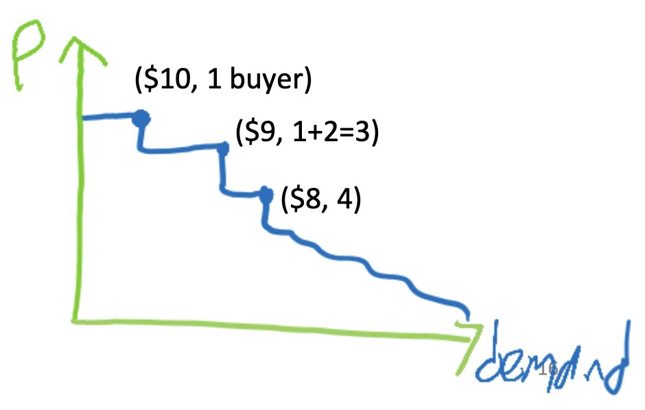
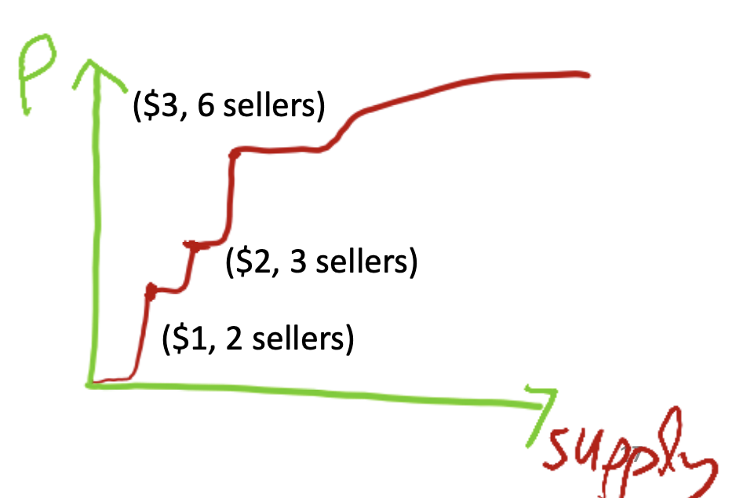
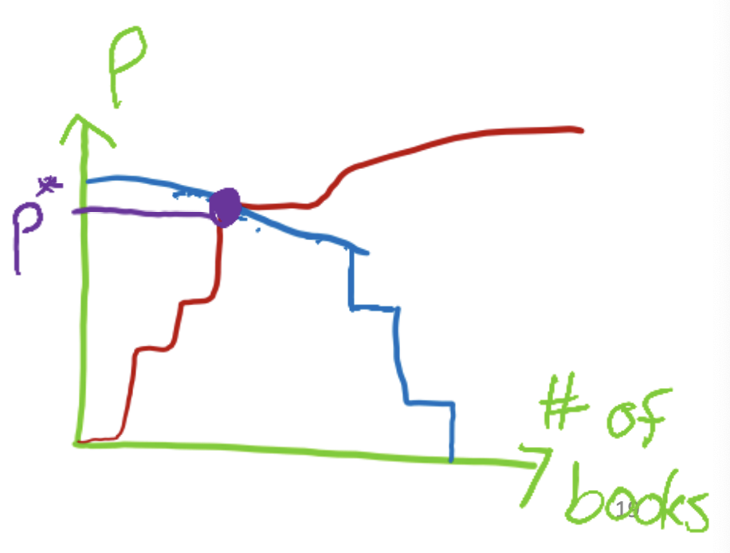
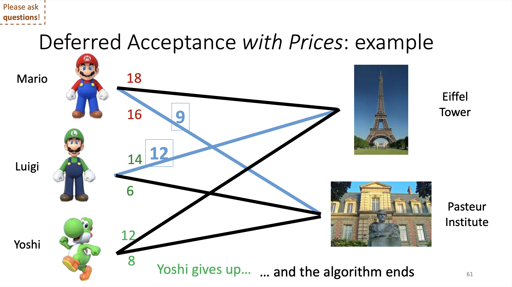

# Market Equilibrium
_April 16, 2025_

<strong>Definition: Market</strong>

_"A means by which the exchage of goods and services takes place as a result of buyers and sellers being in contact with one another, either directly or through mediating agents or situations."_ — Joan Violet Robinson, Britannica

Previously, we examined scenarios without monetary transfers. Issues with non-monetary markets include:

1. Limited to ordinal rather than cardinal preferences.
2. Emergence of underground markets.
3. Potential exploitation (bots manipulating donor lists).

Starting today, we want to measure utility with money:

- **Basic assumption:** How much I want something is equal to how much I am willing to pay for it.
- **Obvious caveat:** How much I am willing to pay depends on how much money I have.

## Modeling Buyers

<strong>Definition: Cardinal Utilities vs Ordinal Utilities</strong>

- **Cardinal utilities**: Assign numeric values to preferences.
- **Ordinal utilities**: Only rank preferences by order.

Is one type of utilities better than the other?

Cardinal utilities convey richer information (ordinal can be derived from cardinal), are intuitive in economic analysis, and typically monetarily measurable.

For example, in the kidney exchange program, we may not know whether we prefer one kidney over another, but we can compare two risky matches with one perfect match (one perfect match is definitely better than one risky match) with numbers by adding the happiness that the two risky patients may get and comparing it with the happiness of the one perfect match patient, which is harder to determine with only ordinal utilities.

In addition, we can think about probabilistic events, because when we have probabilities and numbers, we can check the expectation. If we can have a good kidney with \(50\%\) or an okay match with \(70\%\) (more likely), we can use expectation to compare those options, while with cardinal utilitie alone, comparison is more challenging.

Finally, let's note that we typically quantify cardinal utilities with money, which is good in some applications, but problematic in some other applications. There are alternatives, such as “quality-adjusted life years” in health economics, which measure how many additional years a patient may live with a kidney. It is not perfect either, but it is some way to help us make these decisions.

In other applications, where money is not a good idea, it is not clear what the right measure is. For instance, how do we quantify utility in education (e.g. how much utility do we get from taking CS269I?—a lot, for sure, but how much?) or in dating apps (e.g. how do we quantify how we are making better matches?)

In contrast, one disadvantage of cardinal utilities is that humans are better at comparing outcomes.

Introducing money changes market dynamics substantially:

- Stanford housing would differ if rooms were auctioned.
- Buying organs is illegal in most countries.
- Hospitals-student monetary matches face legal restrictions.

However, there are also some challenges in non-monetary transfers:

- Without monetary transfers, we are limited to ordinal preferences.
- When we force non-monetary transfers, people try to get their way under the table, which comes with legal issues (admissions scandal) and risks (illegal organ transplants, for both people who buy and sell organs)
- We need a permission systems (as opposed to a permission-less system, such as the Internet or Bitcoin), otherwise,
      - For instance in the Stanford housing lottery, you need a SUNet ID, so that applicants do not enter the draw with a bot and get a million lottery tickets.
      - With online reviews, we really have a problem with restaurants writing really good reviews for themselves and bad reviews for competing restaurants.

<strong>Definition: Fungible Goods vs Idiosyncratic Goods</strong>

- **Fungible goods**: Interchangeable units.
- **Idiosyncratic goods**: Unique goods.

In other words, goods are fungible when there lots of interchangeable copies of an item, such as copies of a new book. In contrast, goods idiosyncratic when they have intrinsic features. If you try to buy a house, every house is very different from the house down the street (problems with the roof, nicer garden, better location, etc.), so we need to understand the value of each house. In dating apps, it is similar: each person is very different. NFTs (Non-Fungible Tokens) by definition are idiosyncratic.

In practice, many things are a mix of fungible and idiosyncratic. For instance, in a ride-sharing app, we don’t really care who the driver is (the driver is fungible), but we really care where we go (the destination is idiosyncratic).

## Supply and Demand of Fungible Goods

<strong>Definition: Demand Curve</strong>

Consider a perfectly fungible good, e.g., copies of a book:

- 1 buyer is willing to pay $10 for the book.
- 2 additional buyers are willing to pay $9 for the book.
- 1 addition buyer is willing ti pay $8 for the book.
- Etc.

We can plot this aggregate **demand curve**, which is typically decreasing, as more buyers are interested when the price is lower:

**Note:** The demand curve represents how many buyers are willing to buy at each price. We plot the Price as the y-axis and the Demand as the x-axis, even though it is really the demand as a function of the price.

<strong>Definition: Supply Curve</strong>

Let's specifically talk about _used_ (but in identical conditions) books, which means that the books are still fungible:

- 2 sellers are willing to give their copies for $1.
- 1 addition seller is willing to give their copy for $2.
- 3 additional sellers are willing to give their copies for $3.
- Etc.

We can plot this aggregate **supply curve**, which is typically increasing, at least for _used_ books.

**Note:** The supply curve represents how many sellers are willing to sell at each price. We plot the Price as the y-axis and the Supply as the x-axis, even though it is really the supply as a function of the price.

**Side Note: Law of Supply vs. Digital Goods**

If the applies to _used_ books, then what about new books?

The Law of Supply says that the supply curve should be increasing, but sometimes, this does not hold.

For instance, for new books:

- There is a monopoly (the publisher is selling all the copies): increasing the price does not mean that they are willing to sell it more.
- Marginal cost of printing another book is negligible (most of the price is editorial work, promotion, etc.)

If we think of digital goods, the marginal cost of making another copy is zero, so the Law of Supply does not hold anymore:

- For ordinary physical goods, the supply curve slopes upward because each additional unit costs a little more to make. Producers only expand output when price at least covers that rising marginal cost.
- For a pure digital good—software, an e‑book, a music file—the marginal cost of copying and distributing one more unit is essentially zero, so a seller is already willing to supply any quantity at any price just above zero. Raising the price therefore doesn’t unlock extra output the way it does for physical goods. Instead, the constraint is usually legal (who owns the copyright) or strategic (how the seller wants to segment the market), not technological cost.

In the short run the supply curve is therefore flat (perfectly elastic) at roughly zero cost, and in the long run depends on covering the fixed cost of creating the first copy rather than on the per‑unit price, so the classic Law of Supply tied to marginal production cost doesn’t bite.

**Definition: Market Clearing Price**

The price where demand and supply curves meet is called the market clearing price or market equilibrium.

The vanilla assumption in classical economics is that buyers and sellers should naturally converge to the special price \(p^\star\), where the supply meets the demand. At market clearing price, the numbers of interested buyers and sellers are equal, so they can all transact (i.e. "clear the market").

This is _not complicated_ but **super important**. The reason we call this an equilibrium is because:

- At that price, all the buyers who want to buy for that price can buy exactly from all the sellers who want to sell at that price (the supply is exactly meeting the demand).
- There are some sellers who are willing to sell at a higher price, but they stay out of it.
- There are some buyers who are willing to buy at a lower price, but they stay out of it.

We are trying to think of a single price that works for the entire market. We will formalize it later, but this price \(p^\star\) maximizes the total happiness.

## Supply and Demand of Idiosyncratic Goods

**The Airbnb Market Model**

- \(m\) different (**idiosyncratic**) rooms for rent.
- \(n\) guests, each willing to stay in at most one room (**unit-demand**).
- Guest \(i\) has **value** \(v_{i,j}\) for staying in room \(j\).
- If guest \(i\) pays\(p_j\) to stay in room \(j\), their happiness is given by \(U_{i,j} = v_{i,j} - p_j\).
- If guest \(i\) doesn't stay in any room (e.g., camps outside), their happiness is given by \(U_{i,\emptyset} = 0\).

**The Airbnb Market Model (in Economics Jargon)**

- \(m\) different (**idiosyncratic**) goods for rent.
- \(n\) buyers, each willing to buy at most one good (**unit-demand**).
- Buyer \(i\) has **value** \(v_{i,j}\) for buying good \(j\).
- If buyer \(i\) pays\(p_j\) for good \(j\), their utility is given by \(U_{i,j} = v_{i,j} - p_j\).
- If buyer \(i\) doesn't buy any good (e.g., camps outside), their utility is given by \(U_{i,\emptyset} = 0\).

**Definition: Competitive Equilibrium**

A competitive equilibrium is the combination of a price vector \(\overrightarrow{p} = (p_1, ..., p_n)\) and a matching \(M\) of buyers to goods, such that:

- Each buyer is matched to their favorite good (given prices): 

\[
\forall i,j' v_{i,M(i)} - p_{M(i)} \geq v_{i,j'} - p_{j'}.
\]

- If no buyer is matched to good \(j\), then \(p_j = 0\).

There is one more condition for a competitive equilibrium. If a buyer is not matched, that means that they don’t want any good. This means that the utility for every good is negative (the value minus what it would cost them is negative). So, they stay unmatched (they have the option to remain unmatched).

This is an _important concept_ called **individual rationality**: no agent is strictly less happy after participating in the mechanism. In other words, every buyer is no worse after transacting than they were before. If they cannot find anything in their price range, they don’t get anything: they don’t lose money by just going to the site and checking all the options.

**Question 1: How is it possible that every buyer is matched to their favorite good? What if everyone wants the same good?**

The intuition to manage this is through prices, because if a good is over-demanded, we increase the price, until buyers leave it.

**Question 2: What if there are two buyers with the exact same utility?**

Because we have a weak inequality (rather than a strict inequality), it means that every buyer is matched until they do not have another good that they prefer, so if two buyers have the same utility, we can increase the price until they are indifferent between two rooms, and then we can give either room to either buyer and they will both be happy.

**Question 3: What if there are two people who are willing to pay $6B for the same room?**

We increase the price to \(\$6\)B, and at that point, they are indifferent between getting the room for \(\$6\)B and not getting any room (or getting another cheap room), so we can tie-break arbitrarily and give the room to one of them.

**Question 4: Does buying the room provide additional utility, such as the satisfaction of winning the auction and showing off?**
We are not modeling this here. It is just that every buyer has some value for each good, but they do not care about what everyone else is getting.

**Why is a competitive equilibrium an equilibrium?**

**Reminder:** In a competitive equilibrium:

1. Each buyer is matched to their favorit good (given prices) or no good if they don't want any.
2. If no buyer is matched to good \(j\), then \(p_j = 0\).

Therefore:

- By \((1)\), no buyer wants to deviate to a different room, they are given their favorite room given the prices.
- No good is over-demanded (we are matching each buyer to a room, but we are not matching two buyers to the same room), so no there is no pressure to increase prices.
- By \((2)\), under-demanded goods are priced at \(0\), so we can't decrease their price lower any more.

**Important Note**

Aviad pointed out a notion that is always confusing for students: A competitive equilibrium is the combination of prices and the assignment of guests to rooms **together** (all of that constitute the equilibrium, not just one or the other).

The last condition essentially says that there is always an empty room that is priced at \(0\). Buyers compare all available rooms at their respective prices, but they also compare those with the option of not getting a room and not paying any price (staying in a tent for instance).

**Question: What about seller’s utility?**

This already captures seller’s utility. What this does not capture is production cost. This definition makes sense if we assume that sellers have \(0\) cost, which we will pretend for now, which in practice is not true but we will hide it to keep things simpler.

**Question: Why if no buyer is matched to a good, then the price is 0?**

If a good is unpopular and no one wants it, we don’t know if it is because it is priced too high, or because it is bad (e.g. a room in a bad neighborhood). So, we lower the price, and we lower the price, until it reaches \(0\). If nobody wants it anyway, we know that the price is not too high.

## Competitive Equilibrium Properties

Anywhere in the world, we can go on Airbnb (from Brazil on a tablet, from India on a phone), and look up rooms in Paris. Once we have equilibrium prices, Airbnb can show all the rooms, with all the prices, to all the guests around the world, and there are not going to be conflicts (unlike when everyone is trying to “enroll now” in some classes with limited seats). The equilibrium prices coordinate things in such a way that no two people want the same room.

In practice, it is an approximate equilibrium, so there might be conflicts, but the main thing that makes Airbnb different from Stanford classes or Burning Man tickets (where prices are fixed and good are over-demanded) is that prices are an approximate equilibrium.

From a pure computer science system design perspective (leaving aside economics), equilibrium prices are great because the system is not going to crash (since people want different rooms).

<strong>Definition: Social Welfare</strong>

The social welfare of an allocation \(M\) is the total buyers' value: \(\underset{i}{\sum} v_{i,M(i)}\).

**Question: Why don't we include prices in the definition of social welfare?**

We did not include prices in the definition of social welfare, even though happiness is equal to the value minus the price, because we count the total utility of everyone, including sellers, so prices they cancel out.

The price goes from the buyers to the sellers, so it is zero-sum, it does not change the total happiness, while what changes the total happiness is the quality of the matching.

In contrast, if we wanted to calculate the total happiness of only the buyers, then we would subtract the prices, and if we wanted to calculate the total happiness of only the sellers, we would only care about the prices (this is called revenue maximization).

We are also abstracting a bunch of things, such as production costs (including cleaning fees), and taxes (which may make the government happy).

<strong>Theorem: First Welfare Theorem</strong>

If \((p,M)\) is a competitive equilibrium, then \(M\) is a matching that maximizes social welfare:

\[
\forall M' \; \underset{i}{\sum} v_{i,M(i)} \geq \underset{i}{\sum} v_{i,M'(i)}
\]

Another amazing aspect of competitive equilibrium prices is that they maximize the total happiness (social welfare). In any competitive equilibrium, the matching maximizes the total sum of values. If we compare the matching \(M\) to any other matching \(M'\), the welfare in \(M\) at least the welfare in \(M'\). Competitive equilibrium prices are making Airbnb happy (they are making a lot of money), the hosts happy (they rent their houses), and guests happy (they find rooms to stay in).

**Proof: A competitive equilibrium is optimal.**

Assume by contradiction that \(\exists M' \; \underset{i}{\sum} v_{i,M(i)} < \underset{i}{\sum} v_{i,M'(i)}\).

By \((1)\), \(\underset{i}{\sum} (v_{i,M(i)} - p_{M(i)}) \geq \underset{i}{\sum} (v_{i,M'(i)} - p_{M'(i)})\).

Therefore, \(\underset{i}{\sum} p_{M(i)} < \underset{i}{\sum} p_{M'(i)}\).

But, by \((2)\), \(\underset{i}{\sum} p_{M(i)} = \underset{j}{\sum} p_j \geq \underset{i}{\sum} p_{M'(i)}\).

We have reached a contradiction, so \(\forall M' \; \underset{i}{\sum} v_{i,M(i)} \geq \underset{i}{\sum} v_{i,M'(i)}\).

As a reminder, the First Welfare Theorem tells us that the total sum of values is maximized at the competitive equilibrium matching \(M\). It is helpful to remember that the statement about total happiness does _not_ include prices anywhere.

We assume that there is a matching \(M'\) that violates the inequality in the theorem statement, i.e. \(M'\) has some strictly higher total happiness. Every \(i\) maximizes their happiness (value minus price) at the equilibrium matching \(M\).

When we subtract both inequalities, it results that sum of prices in \(M\) is less than the sum of prices in \(M'\): these are the same prices, but summed over different instances (on the left, over goods that are assigned in \(M\), and on the right over the goods that are assigned in \(M'\)).

However, condition \((2)\) in the definition of the competitive equilibrium tells us that any good that is not assigned in \(M\) has a price of \(0\), so the sum of anything that is assigned in \(M\) is the same as the sum of all the prices in general. Thus, the sum of all the prices has to be at least the sum of everything that is assigned in \(M'\).

On one hand, we have an inequality that says that the sum of the prices of what is assigned in \(M\) is strictly less than in \(M'\), and on the other hand, we have the opposite inequality, so together, we get a contradiction.

What is interesting in this proof is how it uses the second condition of the definition of competitive equilibrium, which says that goods that are not assigned have a price of \(0\).

**Question: Why do we have this inequality where the prices of all the goods is greater than the prices of the goods matched in M’?**

There are more rooms than guests, so we are not necessarily matching all the rooms, but in \(M\) we are matching all the rooms that have a non-zero price. It is possible that something that is matched in \(M\) (with a positive price) is not matched in \(M'\) (so the price is \(0\)), because \(M'\) does not necessarily match all the goods, since it is _not_ a competitive equilibrium).

In the "Airbnb market model", a competitive equilibrium always exists.

This is non-trivial: We will see later a simple example where each buyer wants two goods and a competitive equilibrium does _not_ exist.

## Deferred Acceptance With Prices

Let's consider the following setting:

- **Assumption:** Prices are always in some finite range (e.g., \(\$0-\$1,000\)), with finite increments (e.g., \(\$1\)).
- **Ordinal Preferences:** For each buyer, we construct a list of all the \((good,price)\) options, ordered by utility. We can truncate the list a the \((receive \;nothing, pay \; nothing)\) option.
- **At each iteration of the algorithm**: The unmatched buyer whose next-favorite option is \((j,p)\) proposes price \(p\) to good \(j\). Good \(j\) tentatively accepts if price \(p\) is higher than the prices it was offered so far.

This is a twist on the DA we saw before because it is **DA with prices**. Here, ordinal preferences are not only established (like in the past) based on ordinarily over rooms, but over combinations of rooms and prices. We can truncate the list at the (receive nothing, pay nothing) option, which is like an outside option (e.g. sleep in a tent instead). Note that the room preferences (over buyers) are only based on prices (i.e. rooms are indifferent over buyers).

Let's consider the following scenario, when Mario, Luigi, and Yoshi are going to Paris and are looking for a place to stay near famous monuments:

- Mario is willing to pay \(18\) for the room near the Eiffel Tower, and \(16\) for the room near the Pasteur Institute.
- Luigi is willing to pay \(14\) for the room near the Eiffel Tower, and \(6\) for the room near the Pasteur Institute.
- Mario is willing to pay \(12\) for the room near the Eiffel Tower, and \(8\) for the room near the Pasteur Institute.

Here is the result:

This is an overview of what happened:

- When the prices are \(2\) for Eiffel Tower or \(0\) for Pasteur, Mario is indifferent between both rooms, so Mario proposes \(0\) to Pasteur.
- But Luigi and Yoshi still competing for Eiffel Tower, so they keep raising their prices, until the price for Eiffel Tower is \(4\), which means that Yoshi is now indifferent between the two rooms.
- Then, Yoshi is going to switch back and forth between Paster and Eiffel Tower as Mario and Luigi raise the price for Eiffel Tower (every time one place is over-demanded and Mario and Luigi raise the price, Yoshi switches to the other one)- …
- … until Yoshi gets priced out.

**Note:** For more details, refer to slides 37-61.

**Question: What causes Mario to become indifferent to the Eiffel Tower in the first place?**

When the Eiffel Tower costs \(2\) and Pasteur costs \(0\), the difference between both rooms is \(2\) more in favor of the Eiffel Tower. Mario’s preference for the Eiffel Tower over Pasteur is \(2\) more, which exactly balances the difference of \(2\).

Here is how to interpret the results:

- The price that Mario wants to pay for Pasteur (\(9\)) is higher than Yoshi’s (\(8\)), and similarly, the price Luigi wants to pay for Eiffel Tower (\(12\)) is equal than Yoshi’s (\(12\)).
- Mario could have also paid \(8\), but this is just due to how the tie-breaking worked out.
- This is the matching that maximizes the total values on the edges.
- This is not only a competitive equilibrium, it is also the unique buyer-optimal competitive equilibrium.

**Question: Does the order matter?**

Just like in DA, order does not really matter, except for when it comes to tie-breaking, which may only matter up to \(1\) (increment).

**Question: What is the total social welfare 16 +14?**

Yes. \(12+9\) are the prices that Mario and Luigi pay. The welfare is the value that Mario see in Pasteur (\(16\)) and Luigi sees in Eiffel Tower (\(14\)). In other words, it is not about how much buyers actually pay for the rooms, but how much they are willing to pay for the room.

**Question: Are Luigi and Mario determining the prices based on the maximum prices that Luigi is willing to pay?**

Yes, because these are the prices it takes to price Yoshi out (since there is one more buyer than room, we need to price out one buyer).

**Claim:** DA-with-prices always terminates.

The algorithm always terminates because every buyer is either matched to a good or they reach a point where they prefer to pay nothing and buy nothing.

The running time of DA with prices is in the order of \(O(n \cdot m \cdot i)\), where \(i\) is the number of increments.

The running time is at most the number of buyers (\(n\)) times the number of rooms (\(m\)) times the number of increments (\(i\)), i.e 1,000 increments of $1 our example. This is really fast when (\(i\)) is small (and there is a way to make it faster when (\(i\)) is not too small), so it is a really fast algorithm with nice economic properties.

The DA with prices algorithm finds a competitive equilibrium:

1. Each buyer is matched to their favorite \(\(good,price\)\). If there were any more preferred \(\(good,price\)\), the buyer would have already proposed and get kicked out, so the other goods raise the price higher.
2. If a good is unmatched, its price is zero. Once a buyer proposes to a good, a good is always matched, even if to another buyer (and its price is above \(0\)), so the only way a good is unmatched is if it is never proposed to (and its price is \(0\)).

Bonus Features (inherited from DA):

- Buyer-optimal among competitive equilibria.
- Buyer-strategyproof.

**Note:** This is not seller-strategy proof though, since they can set a reserve price, i.e. a minimum price that needs to be met.

**DA with Prices Recap**

At each iteration of the algorithm, the unmatched buyer whose next-favorite option is \((j,p)\) proposes price \(p\) to good \(j\). Good \(j\) tentatively accepts if price \(p\) is higher than the prices it was offered so far.

- Proves that a competitive equilibrium exists.
- Fast running time (for discretized prices).
- Buyer-optimal and buyer-strategyproof.

**Competitive Equilibrium Recap**

By definition:

- Each buyer is matched to their favorite good (given prices).
- If no buyer is matched to good \(j\), then \(p_j = 0\).

Properties:

- At equilibrium prices, buyers can independently choose their favorite goods without conflicts.
- A competitive equilibrium maximizes social welfare.
- A competitive equilibrium always exists and can be found efficiently (DA with prices).

## Recap

**Market Equilibrium Recap**

Modeling buyers

- Ordinal vs. cardinal utilities (expressivity, fairness, combining outcomes).
- Idiosyncratic vs. fungible goods (and unit-demand vs. combinatorial demand).

Competitive equilibrium (supply meets demand)

- Prices coordinate the allocation (i.e. each guest can book their favorite room without conflicts).
- Proof of existence with DA with prices algorithm (it is also a buyer-strategyproof mechanism).
- First Welfare theorem (social welfare maximized at equilibrium).

