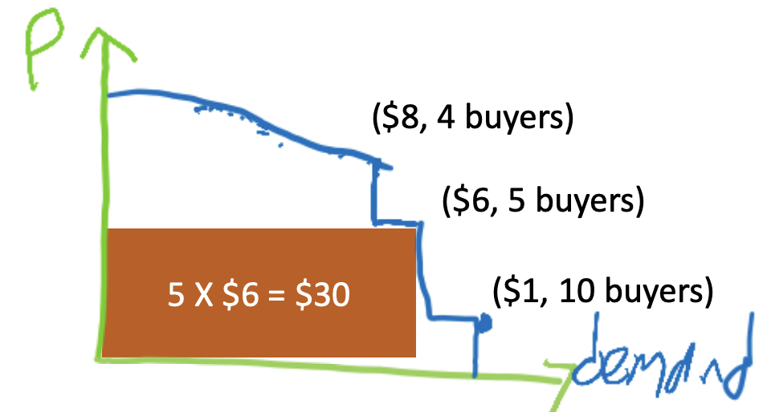
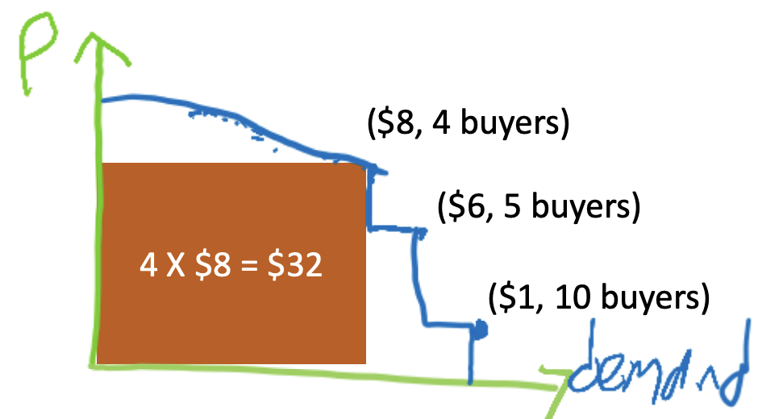
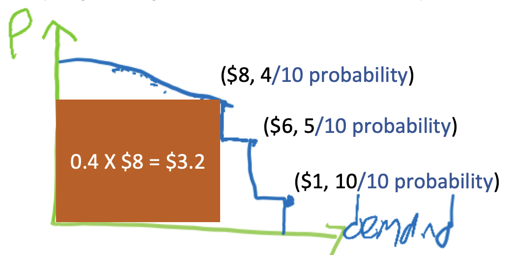

# Single-Unit Auctions
_April 23, 2025_

We have seen that, when supply meets demand, we reach a market clearing price. Equilibrium prices are amazing, because each guest independently chooses their favorite room, with no conflicts, and by the First Welfare Theorem, this allocation is optimal (it maximizes total happiness).

Now, we are switching from markets to auctions. We will mostly focus on auctions for selling goods, although procurement auctions to buy goods are also very important.

**Why do we need auctions?**

When we don’t know how to price what we sell:

- _Non-example:_ If we are selling a generic product, with lots of other sellers, and lots of buyers, and there is price discovery (the market figures out the right price), we don’t need an auction, since we already know how much our good should cost.
- Governments around the world, especially the US government, have a monopoly on the wireless spectrum, and they auction licenses to broadcast certain frequencies. At these auctions, the government buys some frequencies back from TV stations that don’t need as much any more, and sells them to cell phone companies. Auctions help set the price.
- If you have a nice product, such as a family heirloom, we may have no idea how much it should cost. An auction (such as eBay) helps discover the price.
- Products with specific attributes, such as ads. There is a search engine, and a user searching for pizza, at a specific time, in a specific town, so it is a very specific case, and we don’t know exactly how much it is worth to pizzerias next to this user. Ad auctions help determine the price.

When the buyers have the computational power and the patience to bid:

- When we we are selling something very expensive, auctions may be a good idea. For instance, in the wireless spectrum auctions, in 2021, the government auctioned $80 billion worth of spectrum, and the whole auction process took 3 months. The TV stations and cell phone companies were willing to spend this time to figure out exactly how to bid and participate in this long process, which makes sense since it is a very expensive product.
- Ad auctions are also a popular mechanism. These are super fast (split of a second): when you search something, by the time you get the result, there is already an auction happening behind the scenes. These are automated bids: it is all happening algorithmically, in a very short amount of time.
* _Non-example:_ If a child has some fever, their parents are not going to wait a week to win an auction on eBay (they just go to CVS and pay the price).

**Why do auctions matter for computer scientists?**

- Ad auctions fund many CS initiatives (research, product monetization, etc.).
- Fast auctions require algorithmic bidders (e.g., ad auctions).
- Complex auctions require algorithmic auctioneers (e.g., the 2017 FCC wireless spectrum auctions required solving 75,000 large-scale NP-hard problems).

## Auctions To Only One Buyer

**Motivation #1: Digital Goods**

Let's assume that we have a pool (or an "urn") of users subscribed to a free online product. We want to know how much to charge for the premium version of the product.

Digital goods are goods with unlimited supply and zero/negligible marginal cost to create another copy. We can estimate the demand curve based on historical data or based on a survey, for instance.

We want to determine how much to charge for this premium product, with the objective of maximizing revenue, which is the price we charge times the number of buyers. Revenue is represented by a rectangle under the curve.

At a price of \(\$8\), we lost one buyer (\(4\) vs. \(5\)), but the revenue is higher (\(\$32\) vs. \(\$30\)).

**Myerson's Theorem**

Given a demand curve \(D\), Myerson's theorem provides a formula to determine the price \(p(D)\) that maximizes revenue, i.e. the rectangle under the curve.

This is the revenue-optimal way to sell one item to one buyer: we fix the price and we charge the price from this one buyer.

_**Note:** This is non-trivial. There are many extensions of this simple setting where the theorem does not hold._

**Motivation #2: Ad Auctions**

In ad auctions, we tend to have a lot of data and very good machine learning, which enables very accurate targeting.

Let's consider the case of a user looking for pizza in a given town: there is only one possible buyer, and in the extreme case, we have only one advertiser (because there is only one pizza place in town).

To figure out how much to charge this advertiser, we can take a Bayesian approach: we don’t know the user’s value (otherwise we would just charge exactly the user’s value and make as much money as we can), but we can generate a model that is like a distribution of the possible values the user is likely to have.

If we have that distribution, it is like drawing a random buyer from that distribution, and for the seller, the cumulative distribution over the possible buyer values is going to be equivalent to the demand curve.

This works similarly as the previous example of a digital good auction. Instead of having the Price vs. the Demand (like we had in market demand curves), here we have the Price vs. the Probability that the buyer will buy:

From here, we apply Myerson’s theorem again, where the formula is going to give the best rectangle under the curve to maximize the expected revenue.

## Auctions With Many Buyers

In this lecture, we focus on the simplest kind of auction: **single-item auction**.

**Basic Model: Single-Item Auction**

- Each bidder \(i\) has a **value** (i.e. their willingness to pay") \(v_i\) for receiving the item. Bidder \(i\) know \(v_i\).
- The seller doesn't know \(v_i\). This is why we need an auction mechanism.
- The **utility** of a bidder who _receives_ the item and pays \(p_i\) for it is: \(u = v_i - p_i\).
- In contrast, the utility of a bidder who _doesn't receive_ the item and still pays \(p_i\) is: \(u = -p_i\).

_**Note:** We are still auctioning only one item. Auctioning multiple items is super complicated: this is where Myerson’s theorem completely breaks, as there is a lot of complicated math involved._

**Definitions: Types of Auctions**

_**Open-Cry Auctions**_

- Multi-round iterations.
- Ascending-price auctions (English/Japanese) vs. descending-price auctions (Dutch).
- The FCC spectrum was a very complicated auction: it was a mix of ascending-price and descending-price auctions, because they were both buying and selling frequencies.
- In this lecture, we are not discussing open-cry auctions: instead, we are focusing on...

_**Sealed-Bid Auctions**_

1. Each bidder sends a secret bid \(b_i\) to the auctioneer (in a "sealed envelope").
2. The auctioneer decides how to **allocate** the item and takes the **payment** from the bidder.

**Definition: First-Price Auction**

- Each bidder submits a bid \(b_i\).
- The highest bidder \(i\) receives the item.
- The highest bidder pays \(b_i\).

_**Note:** This definition is not complicated but it is **important**._

**Do we expect bidders to bid higher or lower than their true value \(v_i\)?**

We expect bidders to bid lower than their true value: if there is just one bidder, they are just going to bid \(0\) and still get the item, so everyone wants to bid as low as they can.

**Do we expect bids to go up or down as competition (i.e. the number of bidders) increases?**

We expect bids to go up when competition increases: in the extreme case, if there is just one bidder, they are just going to bid \(0\) and still get the item, but as there is more competition, the bids will approach each bidder’s true value (they cannot expect to get the item for much less than their true value).

**Definition: All-Pay Auction**

- Each bidder submits a bid \(b_i\).
- The highest bidder \(i\) receives the item.
- Every bidder \(j\) pays \(b_j\).

**Do we expect bidders to bid higher or lower than their true value?**

We expect bidders to bid lower than their true value.

**Do we expect bids to go up or down as competition (i.e. the number of bidders) increases?**

It is not obvious whether bidders should increase or decrease their bid when competition increases: on the one hand, if there is more competition, you want to bid higher to win, but on the other hand, you don’t want to bid too high and lose to a competitor.

**Do we expect the price to be higher or lower than wit first-price auctions?**

Intuitively, bids should be lower than with first-price auctions.

**What are some applications of all-pay auction in practice?**

In practice, all-pay auctions are rarely used. They are useful for modeling sunk-cost of losers in situations like political lobbying, where players are putting a lot of money to get people to vote yes/no on a ballot, and regardless of the outcome, the money for campaigning is gone. Another example will be covered in the last lecture of the quarter.

_**Note:** In general, all-pay auctions are very hard for bidders to determine how to bid. They are very not truthful._

**Definition: Second-Price Auction**

- Each bidder submits a bid \(b_i\).
- The highest bidder \(i^\star\) receives the item.
- The highest bidder pays the second-highest bid.

_**Note:** This is an important type of auction._

**Do we expect bidders to bid higher or lower than their true value?**

We expect bidders to bid exactly their true value: this is strategyproof.

**Theorem:** Second-price auction is strategyproof.

Formally, truthful bidding is a dominant strategy, i.e. for any fixed bids \(b_j\), for all \(j \neq i\), bidding \(b_i = v_i\) is optimal for bidder \(i\).

**Proof**

Let \(b^{(-i)} = \underset{j \neq i}{max} \; b_j\).

- If \(v_i < b^{(-i)}\):
    - Bidder \(i\) prefers to miss out on the item than to pay \(b^{(-i)}\).
    - So, any \(b_i < b^{(-i)}\) is optimal. In particular, \(b_i = v_i\) is an optimal bid.
- If \(v_i > b^{(-i)}\):
    - Bidder \(i\) prefers to pay \(b^{(-i)}\) and receive the item.
    - So, any \(b_i > b^{(-i)}\) is optimal. In particular, \(b_i = v_i\) is an optimal bid.

Truthful bidding is a dominant strategy: we don’t care what other bidders do (they can bid whatever they want), bidding our true value is always optimal.

- If our value is lower than the max of everyone else’s bid, we would rather pay nothing and get nothing, than pay over our value, so we might as well bid our true value.
- If our value is higher than the max of everyone else’s bid, we would rather pay the max and get the item, and again, we might as well bid our true value.
- If our value is exactly equal to the max of everyone else’s bid, then we are indifferent between getting the item or not, and we might as well bid my true value.

**Extreme case:** If there is no one else in the auction, the max of everyone else’s bid is \(0\), we could bid our true value, pay our true value, and have \(0\) utility, or we could shade our bid, pay \(0\), and still get the item.

**Theorem:** Second-price auction is individually rational.

As long as bidder \(i\) bids \(b_i = v_i\), the utility \((u = v_i - p)\) is non-negative.

In other words, as long as we bid our true value, we are never going to pay more than our true value. The utility is non-negative, unlike with all-pay auction where we can have negative utility.

**Proof**

Let \(b^{(-i)} = \underset{j \neq i}{max} \; b_j\).

- If \(v_i < b^{(-i)}\): \(b_i = v_i\) isn't maximal. No payment occurs, no item is received, so \(u = 0\).
- If \(v_i > b^{(-i)}\): \(u = v_i - b^{(-i)} \geq 0\).

**Theorem:** Second-price auction maximizes the social welfare (where social welfare is the total utility of all bidders and the seller).

When everyone bids their true value (which we expect, since it is a truthful auction), then second-price auction maximizes social welfare, i.e. the total happiness of the bidders and the seller, because the bidder with the bidder with the highest value gets the item.

**This type of auction sounds fantastic: why don't we use it all the time?**

Second-price auction it is not optimal for the seller, and usually, the seller sets the rules for the auction.

## Seller's Revenue

Which type of auction maximizes the seller's revenue: first-price auction, second-price auction, or all-pay auction?

- Maybe first-price auction because we charge the full bid?
- Maybe all-pay auction because we charge everyone?
- Maybe second-price auction because there is no incentives the shade bids?

**Example 1:** Full Information

Consider the case of a second-price auction, which is strategyproof, with two bidders:

- Alice: \(b_A = v_A = 1\).
- Bob: \(b_B = v_B = 2\).

Let’s pretend that everyone knows everyone else’s value. Alice bids \(1\) and Bob bids \(2\). Bob wins the auction: he pays Alice’s bid, so the revenue is \(1\).

Let's now look at the same example, but with first-price auction instead of second-price auction.

**Example 1:** Full Information

Consider the case of a first-price auction, with the same two bidders:

- Alice: \(b_A = 0.99\) and \(v_A = 1\).
- Bob: \(b_B = 1\) and \(v_B = 2\).

Assume bids in increments of \(0.01\), and random tie-breaking.

Alice bids \(0.99\), and Bob bids \(1\). Alice does not have incentives to increase her bid, because she does not want to pay more than \(1\). Bob neither wants to increase his bid (he would have to pay more) nor decrease his bid (otherwise he would not get the item). This is the unique\(^\star\) Nash equilibrium, and the revenue is \(1\).

_\(^\star\)A bid of \(1\) from Alice and a bid of \(1.01\) from Bob would also be a Nash equilibrium, and the revenue would be \(1.01\) instead of \(1\). The above solution is essentially the unique Nash equilibrium if we ignore this type of increments and tie-breaking (if both Alice and Bob bid \(0.99\), this is also an equilibrium)._

**Example 2:** Bayesian

Consider the case of a second-price auction, which is strategyproof, with two bidders:

- Alice: \(v_A \approx Uni[0,1]\).
- Bob: \(v_B \approx Uni[0,1]\).

\(b_A = v_A\) and \(b_B = v_B\) are dominant strategies.

So, in expectation, \(Revenue = E[min \; \{v_A,v_B\}] = \frac{1}{3} \)

This is a Bayesian example: Alice does not know Bob’s value, Bob does not know Alice’s value, and the auctioneer does not know any of their values.

We assume that we draw both Alice and Bob's values, respectively (independently), uniformly at random between 0 and 1. Because this is strategyproof, regardless of what Alice bids, Bob wants to bid their true value, and by symmetry, the same is true for Alice: we expect their bids to be their true values.

So, in expectation, the revenue is the expectation over the minimum of their true values, since the higher bid is going to win and pay the lower bid.

_**Note:** The expectation of the minimum of two independent random variables drawn uniformly between zero and one is \(\frac{1}{3}\), hence the result._

**Example 2:** Bayesian

Consider the case of a first-price auction, with the same two bidders:

- Alice: \(v_A \approx Uni[0,1]\).
- Bob: \(v_B \approx Uni[0,1]\).

The challenge is that Alice doesn't know "which" Bob she is bidding against. How should we model this situation?

**Definition: Bayesian Nash Equilibrium**

- \((Mixed = randomized)\) is the strategy for each Alice.
- \((Mixed = randomized)\) is the strategy for each Bob.

Alice and Bob are drawn at random from their distributions.

For each Alice, her strategy is optimal in expectation over the Bobs and their strategies.

Every possible Alice has some possibly mixed strategy and every possible Bob has some possibly mixed strategy.

We draw one Alice and one Bob from their distributions, and the Alice and the Bob that we draw play their respective strategies.

Why is this an equilibrium? Because no possible Alice that we can draw, given the strategy of all the possible Bobs, wants to deviate from their strategy.

**Example 2:** Bayesian (Cont'd)

Claim: In equilibrium, \(b_A = \frac{v_A}{2}\) and \(b_B = \frac{v_B}{2}\).

So, in expectation, \(Revenue = E[max \; \{b_A,b_B\}] = \frac{E[max \; \{v_A,v_B\}]}{2} =  \frac{1}{3}\).

The max of two random variable drawn uniformly between \(0\) and \(1\) is \(\frac{2}{3}\). Indeed, if the expectation of the min is \(\frac{1}{3}\), we know that the expectation must be \(1\), so we see that expectation of the max is \(\frac{2}{3}\). Therefore, we have \(\frac{2}{3}\) divided by \(2\), which is equal to \(\frac{1}{3}\).

Interestingly:

- In **Example 1**: Full Information, where \(v_A = 1\) and \(v_B = 2\), first-price auction and second-price auction both had \(Revenue = 1\).
- In **Example 2**: Bayesian, where \(v_A = Uni[0,1]\) and \(v_B = Uni[0,1]\), first-price auction and second-price auction (as well as all-pay auction) had \(Revenue = \frac{1}{3}\).

This is not a coincidence.

**Theorem: Revenue Equivalence Theorem**

At equilibrium, expected payments are fully determined by the auction's allocation rule.

In other words, in any auction that always gives the good to the max-value buyer, in expectation every buyer pays the same, and in particular, revenue is the same.

In all auction types seen so far, the allocation rule was that the bidder with the highest true value always got the item, which is why they all have the same revenue.

However, this is not always satisfied in real life, for example in the following cases:

- When a bidder overbids in a second-price auction: if Alice bids \(100\) and Bib bids \(0\), then Alice pays \(0\) and gets the item. This is an equilibrium, although not a stable one.
- If we do the math for the all-pay auction, Alice and Bob want to use randomized strategies at equilibrium, and it is not always true that Bob gets the item, even though Bob’s true value is higher.
- A seller may get more revenue by deciding to not allocate the item, so they set a reserve price accordingly.

## Bayesian Revenue Maximization: With \(n\) Buyers

**Theorem: Myerson's Theorem**

Given a distribution \(D\), where \(p(D)\) is given by the formula that maximizes the area under the curve and gives the revenue-optimal way to sell one item to one buyer, with \(n\) buyers, each drawing value from \(D\) independently (iid), the revenue-optimal auction is a second-price auction where the reserve price is \(p(D)\).

**Definition: Second-Price Auction With Reserve Price**

- Each bidder submits a bid \(b_i\).
    - Let \(i^\star\) be the bidder with the highest bid \(b_{i^\star}\).
    - Let \(b^{(-i)} = \underset{j \neq i^\star}{max}\) be the second-highest bid.
- If \(b_{i^\star} \geq p(D)\), then \(i^\star\) receives the items and pays \(max{b^{(-i)}, p(D)}\).
- If \(b_{i^\star} < p(D)\), then the seller keeps the item and no payment occurs.

What is a second-price auction with reserve price?

- Every bidder is still submitting a sealed bid (this is a sealed-bid auction).
- We start from the highest bid, and the second highest bid receives the item, if they beat the reserve price: what the bidder is paying is the max of the second bid and the reserve price.
- If the second highest bid does not beat the reserve price, then the seller keeps the item.

This generalizes the optimal auction for single buyers for n buyers. This also generalizes the second-price auction if we set the reserve price, i.e. \(p(D)\), to \(0\) or negative infinity. This is equivalent to the seller also participating in the auction, with the seller’s bid being the reserve price, i.e. \(p(D)\).

This means that it is strategyproof for the buyers, but it is not exactly strategyproof for the seller, because they have to figure out the optimal reserve price.

**Question: Do buyers know the reserve price?**

Since we usually analyze this in equilibrium, it is always a dominant strategy for the buyers to bid their true values.

**How does the seller determines the optimal reserve price?**

It is the same reserve price as with \(1\) buyer: even when there are \(n\) buyers, we still want to look at the area under the curve to set the reserve price and maximize revenue.

Interestingly, as the competition increases, the chance that the reserve price is relevant goes down, because the chance that there are two buyers with bids over the reserve price increases.

**Theorem: Bulow-Klemperer Theorem**

\(Revenue(Second-Price \; Auction \; with \; n+1 \; buyers) \geq Revenue(Second-Price \; Auction \; with \; Reserve \; Price \; and \; n \; buyers)\) 

Another way of formalizing this intuition (that as competition increases, we don’t need a reserve price) is this: the revenue with vanilla second-price auction (without a reserve price) but with one more bidder (i.e. \(n+1\) bidders) is at least the revenue with the optimal reserve price with \(n\) buyers.

In other words, with \(4\) buyers, we can maximize revenue if we set the right reserve price rather than without a reserve price at all. However, with \(5\) buyers without a reserve price, we will have at least as much revenue as if we set the right reserve price with \(4\) buyers.

In practice, we can either invest in the Machine Learning department to set the right reserve price, or invest in the recruiting department to get one more buyer, and the revenue from the latter will be at least the revenue from the former.

## Recap

**Auctions Recap**

_**First-Price Auction**_

- Each bidder submits a bid \(b_i\).
- The highest bidder \(i\) receives the item.
- The highest bidder pays \(b_i\).

_**Second-Price Auction**_

- Each bidder submits a bid \(b_i\).
- The highest bidder \(i^\star\) receives the item.
- The highest bidder pays the second-highest bid.

Secont-price auction is strategyproof, individually rational, and maximizes social welfare.

_**Revenue Equivalence Theorem**_

At equilibrium, expected payments are fully determined by the auction's allocation rule. In other words, in any auction that always gives the good to the max-value buyer, in expectation every buyer pays the same, and in particular, revenue is the same.

**Revenue Maximizing Auctions Recap**

_**Theorem: Myerson's Theorem**_

Given a distribution \(D\), where \(p(D)\) is given by the formula that maximizes the area under the curve and gives the revenue-optimal way to sell one item to one buyer, with \(n\) buyers, each drawing value from \(D\) independently (iid), the revenue-optimal auction is a second-price auction where the reserve price is \(p(D)\).

_**Theorem: Bulow-Klemperer Theorem**_

\(Revenue(Second-Price \; Auction \; with \; n+1 \; buyers) \geq Revenue(Second-Price \; Auction \; with \; Reserve \; Price \; and \; n \; buyers)\) 

