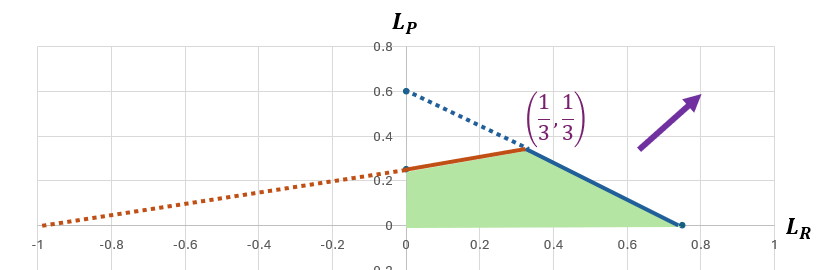

_April 30, 2025_

An important meta question in CS269I is: "How do we allocate stuff?" One answer is to let the market figure it out.

## Letting The Market Allocate Goods

<div class="definition" markdown="1">
**Definition: Competitive Equilibrium**

A competitive equilibrium is the combination of a price vector \(\overrightarrow{p} = (p_1, ..., p_n)\) and a matching \(M\) of buyers to goods, such that:

- Each buyer is matched to their favorite good (given prices).
- If no buyer is matched to good \(j\), then \(p_j = 0\).

</div>

A competitive equilibrium:

- Maximizes social welfare \(\underset{i}{\sum} v_{i,M(i)}\).
- Always exists, and can be found efficiently with DA-with-prices.

<div class="summary" markdown="1">
**Deferred Acceptance With Prices Recap**

- **Assumption:** Prices are always in some finite range (e.g., \(\$0-\$1,000\)), with finite increments (e.g., \(\$1\)).
- **Ordinal Preferences:** For each buyer, we construct a list of all the \((good,price)\) options, ordered by utility. We can truncate the list a the \((receive \;nothing, pay \; nothing)\) option.
- **At each iteration of the algorithm**:

    - The unmatched buyer whose next-favorite option is \((j,p)\) proposes price \(p\) to good \(j\).
    - Good \(j\) tentatively accepts if price \(p\) is higher than the prices it was offered so far.

- The **running time** of DA with prices is in the order of \(O(n \cdot m \cdot i)\), where \(i\) is the number of increments.

- DA-with-prices **always terminates**, and finds a competitive equilibrium, because every buyer is either matched to a good or they reach a point where they prefer to pay nothing and buy nothing.
</div>

Sometimes, letting the market allocate goods is a great answers. Somestimes, not so much. For instance:

- When we don't want to use money, such as in the case of a kidney exchange program or college dorm assignment. There is indeed a fundamental caveat when measuring welfare with money: one's value for something (i.e. how much they are willing to pay for it) also depends on how much money they have.
- When the market fails to converge to an optimal equilibrium.

## Market Failures

<div class="summary" markdown="1">
**Market Failures Recap**

A market failure occurs when a market fails to converge to an optimal outcome.

We have seen five types of market failures:

1. **Externalities and public goods**

    - An externality is a side-effect on someone other than the seller/buyer.
    - A public good is something that belongs to everybody but owned by nobody.
    - Examples: ecological damage, traffic congestion, underinvestment in public goods.
    - What can we do about it? Pigouvian Tax (tax proportionally to the externality) and Coasian bargaining (auction off public goods).

2. **Transaction costs**

    - Transaction costs are market frictions.
    - Examples: taxes, search costs.
    - What can we do about it? Use algorithms for matching buyers and sellers.

3. **Market thinness**

    - The market is thin when the flow of buyers and sellers is too small.
    - Examples: "failed" social networks, P2P platforms, marketsplaces.
    - Monopolies create incentive issues.
    - What can we do about it? Encourage more participants to join, merge markets, and batch transactions.

4. **Timing issues**

    - Examples: committing too early, exploding offers.
    - What can we do about it? Use a centralized matching mechanism, allow to accept and then renege exploding offers.

5. **Information asymmetry**

    - Example: adverse selection for lemons.
    - What can we do about it? Provide more information to both sides of the market or disallow the use of asymmetric information.
</div>

Given that the market may fail to converge to an optimal equilibrium, we want to know how to design mechanisms to allocate goods.

## Designing Mechanisms To Allocate Goods

<div class="definition" markdown="1">
<strong>Definition: Mechanism</strong>

A mechanism consists of three things:

1. A method of collecting inputs from agents,
2. An algorithm that acts on the inputs,
3. An action taken based on the output of the algorithm.
</div>

<div class="definition" markdown="1">
<strong>Definition: Strategyproofness/Truthfulness</strong>

A mechanism is strategyproof if it's in every agent's best interest to act truthfully, i.e., to report true preferences. In other words, an agent can never be worse off reporting their true preferences, regardless of what every other agent is doing.
</div>

<div class="definition" markdown="1">
<strong>Mechanism: Serial Dictatorship</strong>

1. Sort students in some fixed order (random, seniority, alphabetically, etc.).
2. Go through the list in *that* order and allow each student (the "dictator") to select their most preferred available dorm.
</div>

<div class="definition" markdown="1">
<strong>Mechanism: Deferred Acceptance</strong>

While there's an unmatched doctor \(i\):

- Doctor \(i\) proposes to their next-favorite hospital \(j\).
- If hospital \(j\) has no match, they accept doctor \(i\).
- Else, if hospital \(j\) prefers their current match over doctor \(i\), doctor \(i\) remains unmatched.
- Else, hospital \(j\) matches with doctor \(i\), releasing their previous match.

The algorithm stops when everyone is matched: it is strategyproof for buyers, but not for hospitals.
</div>

Some mechanisms are strategyproof, but some aren't (e.g., first-price auctions, prediction markets). What should we expect strategic agents to do in non-strategyproof mechanisms?

So, what should agents do when the mechanism isn't strategyproof, and possibly not even fully specified? From a **single agent perspective**, agents can learn good strategies by trial and error. Regret minimization is a good framework for doing that.

<div class="remark" markdown="1">
<strong>Key Ideas</strong>

- **Key Idea #1:** Use historical performance to forecast the future.
- **Key Idea #2:** Use regret to measure the success of algorithms.
</div>

<div class="summary" markdown="1">
<strong>Regret Recap</strong>

- **External Regret** is the difference between the algorithm's total reward and the reward from the single best-in-hindsight action, i.e. Regret = \( \underset{i}{\max} \underset{t}{\sum} r_{i,t} - \underset{t}{\sum} r_{ALG(t),t} \).

- **Swap-Regret** is the difference between the algorithm's total reward and the reward and the best-in-hindsight "swap function \Phi of the algorithm's choice, i.e. Regret = \( \underset{\Phi : [n] \to [n]}{\max} \underset{t}{\sum} (r_{\Phi(ALG(t)),t} - r_{ALG(t),t}) \).
</div>

How can we minimize regret?

<div class="remark" markdown="1">
<strong>Key Ideas</strong>

- **Key Idea #3:** Use randomness as safety against adversarial inputs.
- **Key Idea #4:** Balance randomness and optimization.
</div>

<div class="definition" markdown="1">
<strong>Algorithm: Follow The Regularized Leader (FTRL)</strong>

On day \(t\), choose distribution \(x\) maximizing \(\underset{t}{\sum} (r_{x,t} - \frac{1}{\eta}\varphi(x))\) where:

- \(r_{x,t}\) provides the historical performance,
- \(\eta\) balances randomness and history,
- \(\varphi\) is the regularizer, which penalizes unbalanced distributions.
</div>

<div class="definition" markdown="1">
<strong>Algorithm: Multiplicative Weight Update (MWU)</strong>

- Initialize weights \(z_{i,0} = 1\) for all \(i\).
- At day \(t\):
    - Choose action \(i\) with probability \(\frac{z_{i,t}}{\underset{j}{\sum} z_{j,t}}\).
    - Update weights: \(z_{i,t+1} \leftarrow z_{i,t} e^{\eta r_{i,t}}\).
</div>

<div class="theorem" markdown="1">
<strong>Claim:</strong> MWU = FTRL with entropy regularizer \(\varphi(x) = - \sum x_i \log(x_i) \).
</div>

How can we minimize regret when we can't see the rewards?

<div class="remark" markdown="1">
<strong>Key Ideas</strong>

- **Key Idea #5:** Balance exploration and exploitation.
- **Key Idea #6:** Use unbiased estimates of rewards.
</div>

<div class="definition" markdown="1">
<strong>Mechanism: Exp3 Algorithm</strong>

On day \(t\):

- MWU selects an arm.
- Define pseudo-rewards:
    - If arm \(i\) is not selected: \(\hat{r}_{i,t} = 0\).
    - If arm \(i\) is selected: \(\hat{r}_{i,t} = \frac{r_{i,t}}{Pr[\text{selecting } i]}\).
</div>

What should agents do when the mechanism isn't strategyproof, and possibly not even fully specified? From a **game theoretic perspective**, agents can leverage equilibrium solution concepts, such as Nash and Stackelberg equilibria to reason about other players, and (coarse) correlated equilibria to minimize regret.

<div class="summary" markdown="1">
<strong>Nash Equilibrium Recap</strong>

Each player samples independently from distribution, and nobody has an incentive to deviate from the distribution.

**The Good:**

- Theorem: A Nash equilibrium exists in every finite game.
- If the players play the Nash equilibrium, none of them want to deviate.

**The Bad:**

The Nash equilibrium...

- ... is not unique.
- ... is not equal to the max-min and the min-max.
- ... is not approached by Regret Minimization.
- ... is intractable to compute, even approximately.
- ... sometimes does not make sense (see below).

**The Ugly:**

Aviad wrote a 300+ page thesis on this topic, so we may get some long answers if we ask questions ;)

</div>

<div class="summary" markdown="1">
<strong>Correlated Equilibrium Recap</strong>

A correlated equilibrium is a distributuon of actions that every player would rather follow.

**Good News:**

- A correlated equilibrium can be computed efficiently (via both Linear Programming and Regret Minimization*).
- If every player runs a Regret Minimization aglorithm*, the play converges to the _set_ of correlated equilibria. _Note: The game cannot converge to a correlated equilibrium without a correlating device._

_*Depdending on the details of the Regret Minimization algorithm, agents may only converge to a Coarse correlated equilibrium." We will ignore this distinction in lecture._

**Bad News:**

- Just like a Nash equilibrium, a correlated equilibrium is not unique, and sometimes does not make sense (e.g., the CS269I grade game played in class).
- Without a correlating device, this is not an equilibrium, and players have an incentive to deviate.

**Observation:** Every Nash equilibrium is an (un)correlated equilibrium.

</div>

<div class="summary" markdown="1">
<strong>Stackelberg Equilibrium Recap</strong>

In a Stackelberg equilibrium, the Follower's strategy is optimal given the Leader's strategy, and the Leader's _commitment_ is optimal.

**Good:**

- The Leader's utility is no worse than in any correlated equilibrium.
- Without loss of generality, the Follower's strategy is deterministic. This implies an efficient algorithm using Linear Programming.

**Catch:**

The Leader's strategy may be a _sub-optimal_ response to the Follower's strategy. The Leader needs to be able to _commit_ to this sub-optimal stragegy.

</div>

<div class="example" markdown="1">
**Pessimistic Rock–Paper–Scissors (PRPS)**

|       | R            | P            | S            |
|-------|--------------|--------------|--------------|
| **R** | (0,0)        | (-2,1)       | (1,-2)       |
| **P** | (1,-2)       | (0,0)        | (-2,1)       |
| **S** | (-2,1)       | (1,-2)       | (0,0)        |

**Coarse Correlated Equilibrium (CCE)**

The signal is approximately uniform _on_ the diagonal.

The expected utility is:

- \(0\) for following the signal.
- \(-\frac{1}{3}\) for ignoring the signal.
- \(1\) for playing \(P\) whenever the signal is \(R\).

Following the signal is better than following it: this is why this is a CCE. However, this is not a correlated equilibrium (due to the last bullet point).
</div>

<div class="remark" markdown="1">
**What Is The Stackelberg Equilibrium In The Pessimistic Rock-Paper-Scissors (PRPS) Game?**

We want to compute the Stackelberg equilibrium in the Pessimistic Rock-Paper-Scissors (PRPS) game, which means that the Leader is going to commit to some strategy (some probability of Rock, Paper, Scissors, respectively), and then the Follower will have some best response.

Without loss of generality, we can think of the Follower’s best response as deterministic, i.e. one action. Since the game is symmetric, without loss of generality, we want the Follower to play Rock (\(R\)).

So, if we want the follower to play \(R\), we need to make sure that they don’t want to play Paper (\(P\)) instead, for example. Let \(L_R\), \(L_P\), \(L_S\) be the probabilities that the leader plays \(R\), \(P\), \(S\). With these probabilities, what is the Follower’s utility from playing \(R\)?

- If the follower plays \(R\), they get: \(0 \cdot L_R - 2 \cdot L_P + 1 \cdot L_S\) \((1)\)
- If the follower plays \(P\), they get: \(1 \cdot L_R + 0 \cdot L_P - 2 \cdot L_S\) \((2)\)
- If the follower plays \(S\), they get: \(-2 \cdot L_R + 1 \cdot L_P + 0 \cdot L_S\) \((3)\)

Since we want to force the follower to play \(R\), we want:

- \((1) \geq (2)\), i.e. \(- 2 \cdot L_P + 1 \cdot L_S \geq 1 \cdot L_R - 2 \cdot L_S\) (this is the first constraint that we have).
- \((3) \leq (1)\), i.e. \(-2 \cdot L_R + 1 \cdot L_P  \leq - 2 \cdot L_P + 1 \cdot L_S\) (this is the second constraint that we have).

With these constraints together, we want to make sure that the follower is going to play \(R\), i.e. that the probability that the follower is going to play \(R\) is higher than anything else.

Now, given that the Follower is going to play \(R\), what is the optimal/best strategy for the Leader (to get the Follower to play \(R\))?

Well, given that the follower is playing \(R\), the Leader wants to maximize their utility.
So, what is the Leader’s utility if the Follower is playing \(R\)?

The leader is getting \(0 \cdot L_R + 1 \cdot L_P - 2 \cdot LS\) , which we want to maximize, i.e. \(max (0 \cdot L_R + 1 \cdot L_P - 2 \cdot LS)\).

In other words, we want to find \(max (0 \cdto L_R + 1 \cdot L_P - 2 \cdot LS)\) _given_:

- \((1) \geq (2)\), i.e. \(- 2 \cdot L_P + 1 \cdot L_S \geq 1 \cdot L_R - 2 \cdot L_S\) (first constraint),
- \((3) \leq (1)\), i.e. \(-2 \cdot L_R + 1 \cdot L_P  \leq - 2 \cdot L_P + 1 \cdot L_S\) (second constraint), and
- \(L_R + L_P + L_S = 1\) (by definition).

Given \(L_R + L_P + L_S = 1\), let’s say that \(L_S = 1 - L_P - L_R\). So:

- \(max (0 \cdot L_R + 1 \cdot L_P - 2 \cdot LS) = max(L_P - 2 \cdot (1 - L_P - L_R))\) 
- \(-2 \cdot L_P + 1 \cdot (1 - L_P - L_R) \geq 1 \cdot L_R - 2 \cdot (1 - L_P - L_R)\)
- \(-2 \cdot L_R + 1 \cdot L_P \leq -2 \cdot L_P + (1 - L_P - L_R)\)

Let’s simplify things to solve this, and we get:

- \(max(L_P - 2(1 - L_P - L_R) = max 3 \cdot L_P + 2 \cdot L_R - 2\) (this is going to be the Leader’s utility, and since we want to find the best one, we can ignore the “\(-2\)”, because there is nothing the Leader can do about this “\(-2\)”).
- \(-2 \cdot L_P + 1 \cdot (1 - L_P - L_R) \geq 1 \cdot L_R - 2 \cdot (1 - L_P - L_R) \Leftrightarrow -5 \cdot L_P -4 \cdot L_R \geq -3\)
- \(-2 \cdot L_R + 1 \cdot L_P \leq -2 \cdot L_P + (1 - L_P - L_R) \Leftrightarrow L_R - 4 \cdot L_P \geq -1\).

Assuming we have simplified everything correctly, we want to maximize the \(3 \cdot L_P + 2 \cdot L_R - 2\) subject to the \(-5 \cdot L_P -4 \cdot L_R \geq -3\) and \(L_R - 4 \cdot L_P \geq -1\) constraints.

Since this is a problem with two variables, we can plot it:



We also have the constraint that all the probabilities are non-negative, so the feasible region is the green-shaded quadrilateral. And in this feasible region we want the feasible point that maximizes the objective function (Leader's utility), i.e. as far as possible in the direction of the purple arrow. 

This optimum for any linear program is always at some vertex of the polygon, and in this case in 2D we can eyeball and see that it's the \((\frac{1}{3},\frac{1}{3})\) vertex where the blue and brown constraints intersect.

So the Stackelberg equilibrium is basically the same as the Nash equilibrium: the Leader plays uniformly over all Rock, Paper, and Scissors, and the Follower could play Rock. But more generally any strategy of the Follower is best response, and the Leader is indifferent between them.


</div>

<div class="example" markdown="1">
**Crazy Rock–Paper–Scissors (CRPS)**

|       | R            | P            | S            |
|-------|--------------|--------------|--------------|
| **R** | (0,0)        | (2,1)        | (1,2)        |
| **P** | (1,2)        | (0,0)        | (2,1)        |
| **S** | (2,1)        | (1,2)        | (0,0)        |

**Correlated Equilibrium (CE)**

The signal is approximately uniform _off_ the diagonal.

The expected utility is:

- \(\frac{3}{2}\) for following the signal.
- \(1\) for playing \(P\) instead of \(R\).
- \(\frac{1}{2}\) for playing \(S\) instead of \(R\).

</div>

Solution concepts can be even more complicated, such as the Subgame Perfect Equilibrium (SPE) and the Bayesian Nash Equilibrium.

<div class="definition" markdown="1">
<strong>Definition: Subgame Perfect Equilibrium (SPE)</strong>

- On day \(n\), the agents play a Nash equilibrium.
- On day \(n-1\), the agents evaluate their actions assuming that they will play a Nash equilibrium on day \(n\). Then, they play a Nash equilibrium for this particular game.
- On day \(n-2\), we assume the agents will play an SPE in the future.
- Etc.
</div>

<div class="definition" markdown="1">
**Definition: Bayesian Nash Equilibrium**

- \((Mixed = randomized)\) is the strategy for each Alice.
- \((Mixed = randomized)\) is the strategy for each Bob.

Alice and Bob are drawn at random from their distributions.

For each Alice, her strategy is optimal in expectation over the Bobs and their strategies.

</div>

We can use these solution concepts to analyze strategic agents.

<div class="theorem" markdown="1">

**Theorem: Revenue Equivalence Theorem**

At equilibrium, expected payments are fully determined by the auction's allocation rule.

</div>

In other words, in any auction that always gives the good to the max-value buyer, in expectation every buyer pays the same, and in particular, revenue is the same.

However, beware: sometimes, equilibria are not great predictors.

<div class="example" markdown="1">
<strong>Example: The CS269I Grade Game</strong>

You and your partner submitted a wonderful project, but the instructor is not sure how much each of you contributed to it. So, they will assign your grades using the following game:

1. You send the instructor \(x \in \{2, ..., 99\}\), and your partner sends the instructor \(y \in \{2, ..., 99\}\).
2. Then the instructor assigns you grade as follows:

    - If \(x = y\), then your grade is \(x\).
    - If \(x < y\), then your grade is \(min\{x,y\}+2\).
    - If \(x > y\), then your grade is \(min\{x,y\}-2\).

**Which grade should you send to the instructor?**

The unique Nash equilibrium in this game is when both players play 2 (x = y = 2), which is not expected in practice with real players.
</div>

<div class="example" markdown="1">
**Experiment: Axelrod Games**

Around 1980, Professor Robert Axelrod invited friends to write computer programs for a tournament of iterated file-sharing dilemma with a fixed number of round \(n = 200\).

Out of 15 submissions, Tit-for-Tat won first place.

**Notes:**

- Tit-for-Tat can never win a head-to-head match, but encouraging cooperating leads to a higher score on average.
- You can always do better than Tit-for-Tat: you can play Tit-for-Tat during \(199\) rounds, and not upload in the last round, but in practice, no participant tried this strategy.

Later on, Professor Axelrod invited his friends to play again. Out of 62 submissions, Tit-for-Tat won first place again.
</div>

<div class="example" markdown="1">
**Top Strategy in CS269I Iterated File-Sharing Tournament:** The "Forgive, Don't Forget" Strategy

**Overview:** We will normally respond Tit-for-Tat, but add in a "forgiveness mechanism" to make sure we aren't killing our scores if we are playing a Tit-for-Tat agent. On the first run, we cooperate, to prevent the Grim Trigger and "defection detection" strategies from lowering our average score. We take advantage of agents with "always" types of actions.

```
If this is the last turn: defect.

If the user NEVER cooperates: defect.
If the user ALWAYS cooperates: defect.

If the user cooperated with us last time:
  If hasCooperated != TRUE, set hasCooperated = TRUE.
  Reset forgiveness counter to 3.

If the user defected last time:
  Is hasCooperated:
    If forgiveness counter > 0:
      Subtract one from the forgiveness counter
    If forgiveness counter == 0:
      Forgive them, and cooperate this once. Reset counter to 3.

Otherwise, play Tit-for-Tat!
```
</div>

## Recap

<div class="summary" markdown="1">
**Mid-Quarter Review Recap**

How Do We Allocate Goods?

- Let the market figure it out.
- Design mechanisms.

How do we evaluate these answers?

- Social welfare: The "sum of happiness."
- Revenue: The "mechanism designer's happiness."
- Pareto Optimality: "No other allocation can make everyone happier."
- Individual Rationality: "Nobody is sadder than they were before participating in the mechanism."
- Stability: "No pair/subset could be Pareto-better by matching outside." _Note: This generalizes individual rationality and Pareto optimality._

</div>

## Coming Up Next

We will address questions such as "Who knows what and when?" and "How does that impact incentives?".

We have already started talking about this in Lecture 9, when we discussed things that, empirically, "the crowd" seems to know well, including public opinion, progress on big projects, and the weight of an ox.

We also saw that we needed to exercise caution and set incentives properly, via the No-trade theorems, and examples of information cascades, including the 2010 stock market flash crash.

In upcoming lectures, we will welcome guest speakers, and discuss topics such as:

- Proper scoring rules.
- Blockchains: Proof-of-Work and Proof-of-Stake.
- Stock exchanges (centralized and decentralized).
- Fair allocation.

## Questions

Below are questions asked by some of the students who attended the lecture in person.

**How does regret converge to coarse correlated equilibrium?**

Reminder: In a coarse correlated equilibrium, I would rather follow the signal than ignore the signal. The regret is the sum, over time, of the difference between the reward of the overall best action and the reward from my algorithm.

If we use a regret-minimization algorithm, we expect this regret to approach or approximately approach zero.
In a candidate coarse correlated equilibrium CCE:

- Draw \(t\) at random.
- The signal is \(ALG(t)\).

So, each player is getting the action they took on day \(t\). Therefore, the expected utility from following the signal is the sum of the rewards the actual algorithm got. The utility from ignoring the signal is the sum of the rewards the best action got. The regret going to zero means that following the signal is almost as good as ignoring the signal and playing the overall best action.

**How does swap-regret converge to correlated equilibrium?**

Reminder: the definition of correlated equilibrium is that I am looking at the signal, and still after seeing the signal, I cannot do better than the signal. Swap-regret is harder to minimize, but if you get to minimize, it is better.

**Can we talk about Myerson’s theorem?**

Here is what Myerson’s theorem is saying:

- The first part is just that we have an auction selling one item to one buyer. In this case, how should we sell one item to one buyer? We can set the reserve price and ask the buyer if they want to buy the item for the price or not. The Myerson’s theorem also gives us a formula to calculate the best price, by looking at the area under the curve.
- The second part says that this is the best way to sell one item. It is not trivial but it is true: you can do a lot of complicated things, but none of this helps, you might as well just set one price.
- The third part says that if we have some fixed number of buyers \(n\), and we don’t know their values, but we assume that they are iid, they come from the same distribution \(D\). It turns out that the revenue-optimal auction to sell one item to these \(n\) buyers it to do a second-price with reserve price \(p(D)\) auction (where the reserve price is the same whether we have \(1\) buyer or \(100\) buyers).

Reminder: in a second-price auction, everyone submits their sealed bid, but to win the auction, you don’t need to only beat everyone else, but also the reserve price, and then you pay the maximum of everyone else and the reserve price.

As the competition increases, it becomes more likely that we have two buyers whose value exceed the reserve price, and as soon as that happens, we don’t need the reserve price anymore, because to win the auction, we don’t need to beat the reserve price, we need to beat the second highest bid.

**If the reserve price becomes irrelevant as the number of bidders increases, and the revenue equivalence holds, why is the second price auction revenue optimal and not also the first price auction?**

As competition increases, it does not matter whether we are doing second-price or first-price, because we are reaching this point where the market is setting the price. The advantage of second-price auction is that it is strategyproof, so it is easier to analyze, while first price auction is not.

The revenue equivalence theorem says that the different types of auctions are all going to get the same revenue, but it is assuming that we are always giving the good to the buyer with the maximum value and there are two complications here:

- When we have a reserve price, maybe we do not give the item at all.
- First-price auction is not truthful bidding, so buyers are going to shade their bid in a possibly-mixed strategy way, which makes it harder to keep track of who is going to get the item, but (Aviad thinks that) it is still true that if we run first-price with reserve price and the distribution of values is continuous, first-price and second-price are going to make the same allocation and they will get the same revenue.

**Why does the Bulow-Klemperer theorem hold?**

This theorem says that the revenue of second price with n+1 buyers is at least as great as the revenue of second price with reserve price with n buyers.
We can imagine two cases:

- One case when it is n+1 real buyers: the seller always makes money.
- Another case when it is n buyers and the seller that set the reserve price: sometimes, the seller does not make money (because the reserve price is not beat, and the seller keeps the item).

**Why is it a dangerous practice to learn the reserve price from historical bids?**

Let’s say that you are bidding to display ads on my website, and you know that next year I am going to set the reserve price based on what you do this year: what would you this year? You are going to start shading your bids this year, and I have no idea about what your real value is. Instead, what it better is to find another bidder with similar characteristics and try to use their bid to set the reserve price.