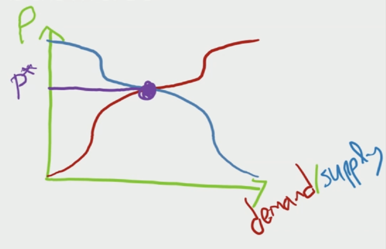
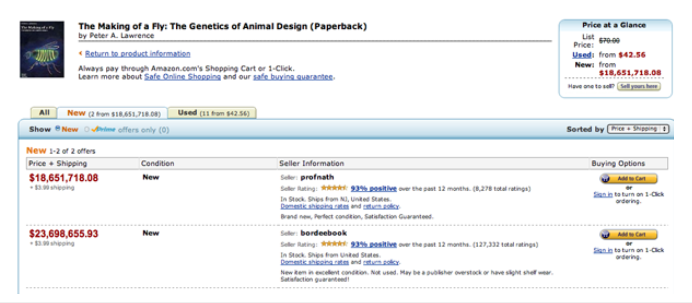

In the past few lectures, we discussed markets and auctions. Now, we are going to start talking about learning from the wisdom of the crowd and decentralization systems, as well as how to reason about who knows what and when. Today, in particular, we are discussing prediction markets and wisdom of the crowd.

## Wisdom of The Crowd

**Example: Wisdom of The Crowd**

What is the weight of this ox?

_**Note:** This is not the original ox from the 1903 county fair. This is an Arctic Musk ox._

Imagine that we are at a county fair, and everyone is taking a guess:

- 1903: The average of the guesses by the crowd fair fell only 1 Lb away from the true weight.
- 1907: Sir Galton publishes a paper about it. He actually advocated using the median instead of the mean to aggregate information from the crowd. The idea remains that crowds sometimes have better information that each individual person.
- 2004: Surowiecki publishes popular _The Wisdom of Crowds: Why the Many Are Smarter Than the Few and How Collective Wisdom Shapes Business, Economies, Societies and Nations_ book on this topic.
- 2014: Galton's calculations are proven wrong: the average of the crowd was not 1 Lb away from the weight, but was in fact exactly right.

If we have an ox, we can just ask the crowd what they think the weight of the ox is—or we can just weigh the ox. However, often, we want to know what will happen in the future.

There are a lot of questions we do not have an answer for. The nice advantage about using the wisdom of the crowd to predict the future is that, eventually, we will learn the answer.

This helps us set incentives. If we ask people about specific things, but have no way of paying them, they can say whatever they want. However, if we want to know what will happen in the future, and we pay them about how good their guess was, they have an incentive to guess as right as possible.

**Examples:** Applications of The Wisdom of The Crowd

Which questions is the crowd likely to have good answers for?

- Elections: We are actually trying to predict the crowd's behavior.
- The state of a big corporate project: We are aggregating distributed information.

**Setting incentives matters**

In 1982, Tom Bradley was the Mayor of Los Angeles, and lost the race to become the California Governor even though he was ahead in the polls. The theory is that people said they would vote for him because they did not want to appear racist, but they actually voted for the other candidate.

This is called the **Bradley Effect**, the **Shy Torry Effect**, or the **Social Desirability Bias**.

## Prediction Markets

> "If only HP knew what HP knows, we would be three times more productive." — Lew Platt

Prediction markets are a very popular way to aggregate information, for instance in big corporations such as HP, Ford, Firm X, Google, Ely Lily. Prediction markets help circumbent hierarchical organization structure, and it tends to outperform experts _despite_ optimism bias (prediction markets tend to be overly optimistic).

**Example of Prediction Market:** Iowa Electronic Market (IEM)

IEM is an academic research prediction market hosted by the University of Iowa. It is sometimes used to predict things outside of academia, such as elections.

Consider a winner-takes-all presidential elections market, with the following rules:

- D-contract pays \(\$1\) if the Democratic candidate wins.
- R-contract pays \(\$1\) if the Republican candidate wins.
- Zero-sum trade with the house: buy/sell a **contract bundle** (1 contract of each type) for \(\$1\). You pay \(\$1\) and you eventually get \(\$1\). Since you have a D-contract and an R-contract, you can trade them with other predictors. So, if you think that the Democratic is more likely to win, you can buy more D-contract and sell some R-contract.

Once a lot of predictors have contracts, they can buy and sell them, so we have a market, and we can see what happens to the prices. The way this is operated in the IEM is using something called the **continuous limit order book**.

**Definitions:** Continuous Limit Order Book

This is **continuous** because time is continuous and orders can arrive over time.

For example: 

- A buyer wants to buy a contract, and they are willing to pay \(\$1\) for it. This is called the **bid**: the bid is the highest buy order currently on the book.
- A seller wants to sell that contract, and they are willing to sell it for \(\$3\). This is called the **ask**: the ask is the lowest sell order currently on the book.
- Since the ask is higher than the bid, the buyer and the seller do not want to transact.
- However, buy and sell orders can arrive at any time: as soon as a trade is feasible, orders trade and they leave the book.
- A new buyer now wants to buy a contract for \(\$4\). So, the bid goes up, to \(\$4\), since the bid is the highest buy order.
- Given that the bid is higher than the ask, this new buyer and the seller are happy to trade with each other. We match them, they leave the marker, and the bid is again \(\$1\).
- Perhaps, later, a new seller wants to sell the contract for \(\$2\). So, the ask becomes \(\$2\).
- The buyer who previous bought the contract for \(\$3\) would have been better off trading with this new seller, but when they placed their buy order for \(\$4\), the seller with the ask order of \(\$2\) was not there, so they traded with the seller with the ask order of \(\$3\).
- After we clear out all the orders that can trade with each other, the ask is higher than the bid, and the difference is called the **spread**.

There are two kinds of orders in this book:

- **Marketable orders:** We already have a match in the book, so they can transact immediately, e.g., a buyer places a buy order for \(\$4\) when there is already a sell order for \(\$3\) on the market.
- **Resting (non-marketable) orders:** We are waiting to match , e.g., a buyer places a buy order for \(\$1\), but there is no sell order at all in the book, so it is resting in the book.

_**Note:** This is not very complicated, but these are a very useful definitions (which will come back later in the quarter)._

**Example of Prediction Market:** Iowa Electronic Market (IEM) (Cont'd)

All predictors have D-contracts and R-contracts. They look at the order book, and they see that R-contracts are trading for \(\$0.60\). If they think that there is less than a 60% probability that the Republican candidate is going to win, they should sell their R-contracts or buy more D-contracts.

There are some legal issues with prediction markets in the US (and beyond):

- Trading in prediction markets is essentially gambling, which is mostly illegal in the US, except in Las Vegas, Nevada.
- IEM was granted an exception ("no action letter") by the CFTC, but it is limited to 1,000 traders and \(\$500\) per trader (i.e. no one person can dominate the market.)
- Intrade operated from Ireland for a while but was shut down in 2012 by the CFTC.
- PredictIt, which is also operated by a university since 2014, namely Victoria University of Wellington, and has a similar status to IEM. The CFTC ordered it to shut down in 2022/2023, but PredictIt sued and won, so it is still operating.
- Some decentralized prediction markets exist, such as AUgur and Polymarket, but they are probably illegal to use for US residents.

Interestingly, meanwhile on Wall St, we can legally buy "naked shorts" for billions of dollars:

- A short is when someone believes a stock is going to go down, so they borrow some shares of it, and sell them immediately, with the intention of buying them back after the price has gone down.
- A "naked short" is when someone sells some shares of stock without first borrowing them (or without ensuring that they can be borrowed). This is done in the hopes that the price of the stock will fall, allowing the seller to buy back the shares at a lower price and profit from the difference. _**Important Note:** It is a type of securities fraud_.

**Example of Prediction Market:** Iowa Electronic Market (IEM) (Cont'd)

Given the rules of the market, we can interpret the price as a probability, aggregating the market's beliefs:

In theory (assuming the \(\$500\)-per-trader restriction), at equilibrium prices \((p_D, p_R)\): \(Number \; of \; D-contracts = Number \; of \; D-contracts\).

In other words: The total budget of the predictors who think that the Democratic candidate has a probability of winning greater than \(p_D\), divided by \(p_D\), is equal to the total budget of the predictors who think that the Republican candidate has a probability of winning greater than \(p_R\), divided by \(p_R\).

Although this has a sense of aggregate probability, it tends to be skewed towards making the seem a little more balanced than it really is, because each time we are dividing the total budget by the price per contract. So, if the price per contract is small (e.g., this is the contract for the underdog, i.e. the candidate least likely to win), then we are dividing by a smaller number, so we are giving it a higher weight. 

## Liquidity and No-Trade Theorems

In prediction markets, if there is a **large spread**, it reveals poor information aggregation.

**Example of Large Spread:** Will Lebron James Sign With The Chicago Bulls?

The bid for _Yes_ was \(5\%\), while the ask ask for _No_ was almost \(40\%\). This means that there was a large gap between the market aggregate belief in the Yes and the No. This was not very helpful to use this prediction market to predict what is going to happen, because it does not provide a very precise prediction.

Why was the spread so large?

**Definition:** Liquidity Providers

Liquidity providers buy low now and sell high later (or sell high now and buy low later). In other words, liquidity providers leave bid/ask **resting orders** on the book.

Other investors can buy/sell at any time by trading with liquity providers. When an investor buys from the resting order, and another investor sells from the resting order, the liquidity providers earn the spread, i.e. the gap between the sell order and the buyer order left in the book.

As competition between liquidity providers increases, the spread decreases. As liquidity providers have a great business model (they buy low and sell high), they tend to outbid each other, so more competition brings the ask and the bid closer to each other.

Providing liquidity sounds like a great deal, but what is the catch? Three is some risk involved.

**Theorem:** Public Information No-Trade Theorem

If the market already aggregated all available public information, there is no point in trading.

If we already thought of all the possible information, and we all agree that the probability that the Republican candidate will win is 60%, which means that it is worth \(\$0.60\) for everyone, why should anybody trade?

How would this be different if some investors have some private information?

**Examples of Private Information** 

- Alice know that the delivery of component X for product Y is delayed.
- Alice used the largest, deepest neural network and discovered a trend towards candidate Z.

If we believe that the Republican candidate has a very high probability of winning, we can buy a lot of R-contracts and make a lot of money. Is there any catch?

- Earning the profits actually depends on how reliable the private information is. If it is just a rumor, maybe there is some risk, but if it is correct most of the time, then on average, you will be better off.
- On a prediction market, even if a predictor has private information, they may only be able to sway the price by a \(\$500\) difference. In contrast, on the stock market, traders have more leverage options to trade stocks with more capital than they really have.
- When someone reveals their intention to make a trade for a different price, they are revealing that they may have some information, and _that_ may change the price. This is why, on the stock market, when large companies want to sell a big amount of stock, they have a lot of mechanisms to hide that fact to prevent the price from going down.

Yet, there is something even more surprising.

**Theorem:** Public _and Private_ Information No-Trade Theorem

Alice will only want to buy at the current price if she has private information.

In other words, we know that if there is no private information, no one wants to buy or sale. So, if Alice wants to buy at the current price, she must know something that Bob doesn't know. However, if Alice wants to buy (from Bob), then Bob does not want to sell (to Alice). Thus, even if Alice has some private information, she cannot use it, because Bob (i.e. no one) wants to trade with he—because she is too excited to trade based on the public information alone.

In prediction markets, if everyone is rational:

- No one should be trading. If no one is trading, then we don't know what the aggregate belief is.
- If a liquidity provider has some resting order on the book, and Alice wants to buy from them, they should be wary. There is a big risk for liquidity providers.
- If there is more risk for liquidity providers, there are fewer liquidity providers on the market, so we expect the spread to be large, and we cannot make a good prediction based on the prediction market.

**Example of Large Spread:** Will Lebron James Sign With The Chicago Bulls? (Cont'd)

This is the reason why the spread was so large to predict whether Lebron James would sign with the Chicago Bulls.

In practice, not everyone is rational, and not everyone thinks that everyone else is rational. This is why prediction markets work pretty well.

**Example of Prediction Market:** Iowa Electronic Market (IEM) (Cont'd)

Findings from research (2004) on IEM logs suggest that IEM predicted elections outcomes better than polls.

> "Traders are not a representative sample of likely voters. They are overwhelmingly male, well-educated, high-income, and young.

Women are also less likely to be liquidity providers.

So, most traders are highly biased, and they make irrational choices, but prices are mostly set by a core group of sophisticated liquidity providers, who on average have more capital, are more active, and generate more profits.

**Prediction Markets Recap**

Prediction markets:

- Allow participants to trade contracts, where the payout is based on the outcome of a predicted event.
- Incentivize participants to aggregate information and tend to outperform experts (corporations) and polls (IEM).

We can interpret the _**price as a (biased) proability**_, aggregating the market's beliefs.

The No-trade theorems tell us that, even if some traders have more information, it is irrational to trade.

## Information Cascades

Information cascades are different from prediction markets, but they are also about aggregating information.

**Information Aggregation Dynamics**

Information aggregation is a dynamic process. Agents learn what other agents think, and _that_ changes their own opinion.

What information is revealed in the pricess is very important, e.g., IEM traders see the last prices traded, but not the quantities.

In the rest of this lecture, we will focus on examples where information cascades go wrong.

**Wram-Up:** The Sky Experiment

You are walking down the street. Do you stop to look at the sky? Probably not.

Now, you keep looking down the street, and you see other people looking at the sky: do you also look at the sky?

Here is the model of this experiment:

- Each person makes a decision (to look up or not).
- Decisions are made sequentially: each person sees decisions made before them, and then they decide what to do.
- Before making a decision, each person leanrs:
    - A private signal (e.g., did something fall on their head or not?),
    - Other people's actions so far (did they look up or not?),
- However, before making a decision, no person learns other people's signals (e.g., did something fall on _their_ head or not?).

**Example** The Urn Experiment

This is an in-class experiment, with the following rules:

- Aviad printed many "balls" in an urn, either with \((66\% \; Blue, 33\% \; Red)\) or \((33\% \; Blue, 66\% \; Red)\).
- The goal is to decide if there are more blue balls or red balls in the urn.

The model of the experiment is similar to the Sky Experiment:

- Each person makes a guess (more blue or red balls).
- Decisions are made sequentially: each group sees guesses made before them, and then they make a guess themselves.
- Before making a guess, each group leanrs:
    - A private signal, i.e. they can see one random ball from the urn,
    - Previous groups' guesses so far (more blue or red balls),
- However, before making a guess, no group learns other groups' signals (e.g., the color of the random ball they saw).

Here are the guesses of the groups in class: Red, Red, Red, Red, Red, Blue.

**How does this work?**

- Player 1: Guesses the color of the ball they see. Let's assume it is Blue.
- Player 2: Guesses the color of the ball they see. Let's assume it is Blue again.
- Player 3: Guesses Blue—even if they see Red.
- Player 4: Guesses Blue—even if they see Red.
- Player 5: Guesses Blue—even if they see Red.

In other words, players 3, 4, 5, ... ignore the color of the ball they see and blindly trust players 1 and 2: this is an information cascade.

_**Conclusion:** Even when we have a lot of information, we may not be aggregating well._

**How to model this?**

Assume the urn contains two red balls:

- Correct cascade: \(Pr[Players \; 1+2 \; both \; see \; Red] = \frac{2}{3} \cdot \frac{2}{3} = \frac{4}{9}\).
- Wrong cascade: \(Pr[Players \; 1+2 \; both \; see \; Blue] = \frac{1}{3} \cdot \frac{1}{3} = \frac{1}{9}\).
- No cascade (yet): \(Pr[Players \; 1+2 \; see \; Blue \; and \; Red] = \frac{1}{3} \cdot \frac{2}{3} + \frac{2}{3} \cdot \frac{1}{3} = \frac{4}{9}\).

This means that, after two players:

- Correct cascade with \([Pr = \frac{4}{9}]\) \(\rightarrow\) All remaining players guess correctly.
- Wrong cascade with \([Pr = \frac{1}{9}]\) \(\rightarrow\) All remaining players guess incorrectly.
- No cascade (yet) with \([Pr = \frac{4}{9}]\) \(\rightarrow\) So far, Red and Blue are even: this is equivalent to restarting the experiment over.

More generally, after \(2t\) iterations:

- The correct cascade is four times more likely than the wrong cascade (\([Pr = \frac{4}{9}]\) vs. \([Pr = \frac{1}{9}]\)).
- A cascade will eventually happen, because the probability that a cascade has not happened yet decays exponentially: \(Pr[No \; cascade \; yet] = (\frac{4}{9})^t\).

This means that \(Pr[Correct \; cascade] = 80\%\) and \(Pr[Wrong \; cascade] = 20\%\). This is not _terrible_, but given that we have infinitely many samples, this is really bad information aggregation, because we still have a \(20\%\) chance of being completely wrong _even when we have infinitely many samples_.

## Two Stories of Information Cascades

**Stroy #1** Price Bubble

Why would a biology textbook be offered for over \(\$18M\) on Amazon?

Two pricing algorithms were mis-informing each other and updating their respective price every day based on the competitor's price the previous day. One algorithm was trying to be slightly lower than the other (to be cheaper), but the other was trying to be slightly (to be more prestigious). This spiraled into very big prices.

_**Moral:** Information cascades are even worse with algorithms that don't perform Bayesian reasoning very well._

**Stroy #2** 2010 Flash Crash

On May 6, 2010, stock values lost \(\approx \$1T\)... and then recovered within 36 minutes.

Why? There were several competing theories. In April 2015? a trader in London was arrested for allegedly causing a crash via a cascade of trading algorithms panic.

**Information Cascades Recap**

- Information cascades happen when agents are acting solely based on public information and are not contributing their private information, which causes information aggregation to fail.
- The agent action space (e.g., "red/blue" vs. \(Pr[Blue]\)) is important.
- Examples of information cascades: the Sky Experiment, the Urn experiment, the Price Bubble, and the Flash Crash.

## Recap

**Wisdom of The Crowd Recap**

Crowd often possess collective wisdwoms about:

- The crowd's opinions (election predictions).
- Large complicated processes (corporate projects).

We need to think carefully about incentives to extract these wisdoms, in particular to avoid:

- Information cascades.
- Biased polls.

Prediction markets are one popular option for learning from the crowds:

- Equilibrium price as a (biased) predicted probability.
- No-trade theorems: if everyone is rational, no one wants to trade.

